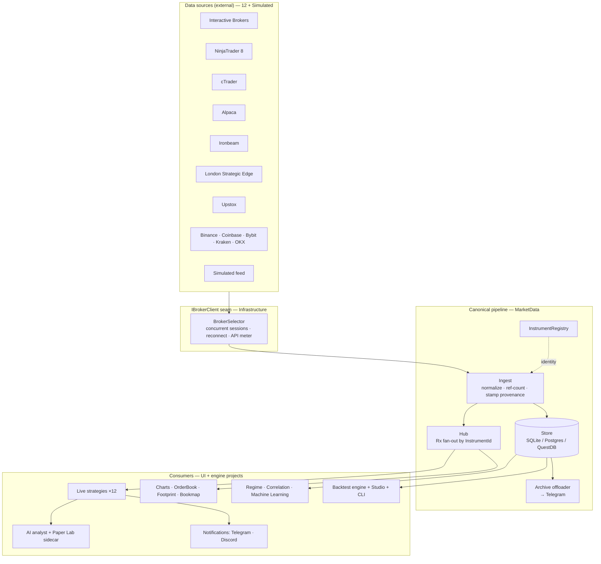
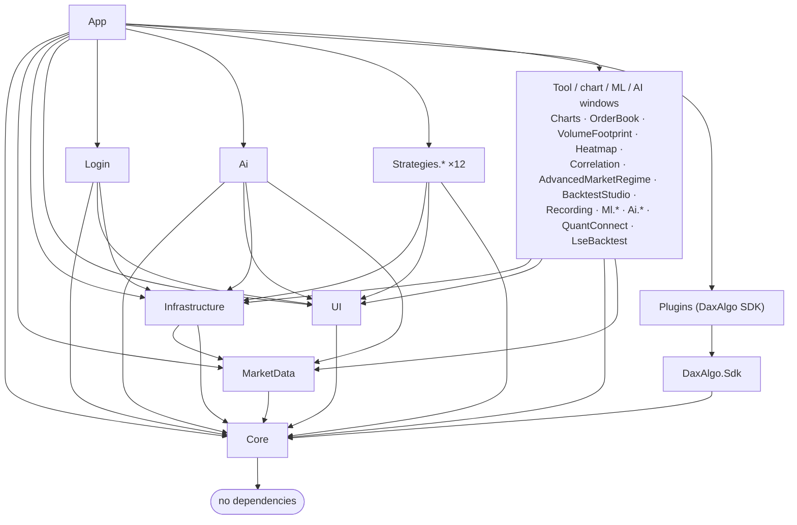

# DaxAlgo Terminal

> Last updated: 2026-06-30

[](https://dotnet.microsoft.com/)
[](LICENSE)
[](#two-builds-windows-and-linux)
[](#two-builds-windows-and-linux)
[](docs/brokers.md)
[](#-no-live-order-execution)

**DaxAlgo Terminal is a desktop "cockpit" for watching markets and running trading
strategies — a single, Bloomberg-style window that plugs into a dozen different brokers and
data feeds, draws the charts, computes the math, and tells you when a strategy thinks something
is happening.** It does **not** place real orders. It is built for studying market microstructure,
backtesting ideas, and generating signals — not for executing live trades.

> 🖼️ **Screenshot:** `images/shell-main.png` — the main window with the strategy catalog tiled and
> the activity-log drawer closed. *(Capture pending — see [docs/MEDIA-CHECKLIST.md](docs/MEDIA-CHECKLIST.md).)*

> 🎬 **Video:** `images/video/shell-tour.mp4` — 2–3 min walkthrough: launch → connect → open a
> strategy → activity log. *(Capture pending.)*

---

## In plain terms — what is this, really?

Imagine a car dashboard, but for financial markets. Most trading screens show you a price going
up and down. This one shows you the *machinery underneath* the price:

- **The order book** — the queue of people waiting to buy and sell, and how big each order is.
- **The tape** — every individual trade as it happens, and whether the buyer or the seller was
  the aggressor (who "crossed the spread" to get filled).
- **Regimes** — whether the market is calm or panicked, trending or stuck, risk-on or risk-off.
- **Strategies** — small programs that watch all of the above and raise a flag ("a signal") when
  their particular pattern shows up.

You connect it to a data source (some are **free and need no account at all** — the Binance crypto
feed streams live with one click), pick the windows you care about, and optionally let strategies
ping you on Telegram or Discord when they fire. Every number on screen is computed locally, in the
app, so what you see in a chart, a backtest, and a live signal always agree.

**You do not need to be a programmer, a mathematician, or a professional trader to use it.** The
documentation explains every feature and every formula from the ground up — see
[Documentation](#documentation).

### ⛔ No live order execution

This build is **data and signals only**. There is no code path that sends a real order to a real
broker. Strategies *describe* what they would do (enter/exit, long/short); they never *do* it with
real money. This is a deliberate safety boundary, not a missing feature.

---

## Contents

- [What ships](#what-ships)
- [Two builds: Windows and Linux](#two-builds-windows-and-linux)
- [The menus at a glance](#the-menus-at-a-glance)
- [System at a glance](#system-at-a-glance) — architecture diagram
- [Quick start](#quick-start)
- [Screenshots & media](#screenshots--media)
- [Documentation](#documentation)
- [Project graph](#project-graph)
- [License](#license)

---

## What ships

- **9 live strategies** behind one plug-in seam. From simple to advanced: a cumulative-delta
  scalper, a four-window 3D regime-cube family (Order-Flow Cube, Order-Flow Surface Spike,
  Imbalance Heat Front, Index K-Score Surface), an index regime *graph*, a multi-stock order-flow
  *pressure map*, a research-paper strategy (Filtered Order-Flow Imbalance), and the flagship
  **Σ⁻¹·IC Order-Flow Optimizer** — a tape-primary composite that fuses twelve microstructure
  signals with mean-variance optimal weights. Full catalog: [docs/strategies.md](docs/strategies.md).
- **12 broker / data backends** behind one `IBrokerClient` seam — Interactive Brokers (TWS API),
  NinjaTrader 8 (NTDirect), cTrader (Open API), Alpaca (REST + WebSocket), Ironbeam futures, London
  Strategic Edge (free multi-asset L1 + history), Upstox (Indian markets), and the keyless public
  crypto feeds Binance / Coinbase / Bybit / Kraken / OKX — **plus an always-available offline
  `Simulated` broker** so the app runs end-to-end with no account at all.
  [docs/brokers.md](docs/brokers.md).
- **Charts & order-flow windows** — TradingView-style charts (Windows), a live L2 order-book
  ladder, a bid/ask **volume footprint** with curve-fit POC predictors, and the combined
  **Bookmap + VolBook** liquidity-heatmap window. [docs/charts.md](docs/charts.md).
- **Strategy plugins (open-core)** — install third-party strategies as code-signed plugins from the
  **Plugins** menu, or build your own against the **DaxAlgo SDK**. [docs/plugins.md](docs/plugins.md).
- **Paper Lab** — turn a research paper (e.g. an arXiv link) into a sandboxed reproduction that
  bridges into the backtest engine as a paper-tagged strategy. [docs/paper-lab.md](docs/paper-lab.md).
- **Machine-Learning menu** (Windows) — a stationarity & differencing lab (ADF/KPSS/ACF, fractional
  differencing), ARIMA + GARCH forecasting with confidence bands, and Kalman filters.
  [docs/machine-learning.md](docs/machine-learning.md).
- **Market-regime suite** — a 0–100 risk-on / risk-off composite blended from free public data,
  plus an 18-indicator × 8-timeframe **Advanced regime** board. [docs/market-regime.md](docs/market-regime.md).
- **Canonical market-data pipeline** — a broker-neutral identity (`InstrumentId`), an Rx fan-out
  hub, tick-primary ingest, and a four-backend store (per-broker SQLite by default, single-file
  SQLite, PostgreSQL + TimescaleDB, or QuestDB), with an optional Telegram **archive offloader**.
  [docs/market-data.md](docs/market-data.md) · [docs/storage.md](docs/storage.md).
- **Tick-level backtest engine + Backtest Studio** — fee models, risk caps, an L1 fill model, a
  full statistics suite (Sharpe, Sortino, Calmar, Omega, Ulcer…), plus a headless CLI with
  `run` / `sweep` / `walkforward` / `mc` / `tca` / `features`. [docs/backtesting.md](docs/backtesting.md).
- **Notifications** — fan signals out to Telegram and Discord, with an optional local-LLM (Ollama)
  commentary enricher. [docs/notifications.md](docs/notifications.md).
- **AI Market Analyst** — a four-agent Python sidecar (indicator → pattern → trend → decision) over
  loopback HTTP/JSON that annotates charts and gives a plain-language read.
  [docs/ai-analyst.md](docs/ai-analyst.md).
- **Bloomberg-style shell** — black canvas, amber accent, monospace throughout. Every tool,
  strategy and chart opens as its own window; a live theme editor (**Theme Studio**) lets you
  recolour the whole app. [docs/theme-studio.md](docs/theme-studio.md).

---

## Two builds: Windows and Linux

The repository is split into **two fully independent codebases** so that work on the Linux port can
never destabilise the Windows build. They share no project files — a fix that should apply to both
is made twice, once per tree.

| | **Windows tree** | **Linux tree** |
|---|---|---|
| Source root | `src/windows/` | `src/linux/` |
| Solution | `TradingTerminal.Windows.slnx` | `TradingTerminal.Linux.slnx` |
| Target framework | `net9.0-windows7.0` | `net9.0` |
| UI toolkit | WPF + MahApps Metro | Avalonia |
| Runs on | Windows 10/11 | Linux, Raspberry Pi (ARM64), also Windows |
| Shell project | `Shell/TradingTerminal.App` | `Shell/TradingTerminal.App.Avalonia` |

Both trees carry their own copy of the backend (Core, MarketData, Infrastructure, the backtest
engine + CLI) and **all 9 strategies**, the order-flow tools, the regime board, the AI tool
windows, the brokers, and the canonical pipeline. A handful of features are **Windows-only** because
they depend on Windows-only components:

| Feature | Windows | Linux | Why |
|---|:---:|:---:|---|
| 9 strategies (incl. 3D regime cubes) | ✅ | ✅ | shared |
| Order Book · Volume Footprint · Bookmap + VolBook | ✅ | ✅ | shared |
| Correlation · Advanced regime · Recording · Backtest Studio | ✅ | ✅ | shared |
| AI tool windows (Analyst / Factor / ML / Backtest / Paper Lab) | ✅ | ✅ | shared |
| Brokers + canonical pipeline + backtest engine + CLI | ✅ | ✅ | shared |
| **TradingView-style Charts** | ✅ | ❌ | needs WebView2 (Windows) |
| **Machine-Learning menu** (Stationarity / ARIMA-GARCH / Kalman) | ✅ | ❌ | Windows-only windows |
| **Strategy plugins + DaxAlgo SDK** | ✅ | ❌ | plugin UI is WPF for now |

> Broker availability also depends on the OS — NinjaTrader's `NTDirect.dll` is Windows-only, for
> example. The full per-broker, per-OS matrix is in [docs/brokers.md](docs/brokers.md).

---

## The menus at a glance

Everything opens from the top menu bar. Here's the whole surface in one table (each item opens its
own window unless noted):

| Menu | Items |
|---|---|
| **File** | Reconnect to broker · Start QuestDB · Exit |
| **View** | Activity log (toggle) · Theme (Bloomberg Amber / Monochrome) · Customize theme… (Theme Studio) |
| **Tools** | Backtest Studio · Record live ticks · Advanced market regime · Correlation matrix · Live correlation matrix |
| **Plugins** | Manage strategy plugins… |
| **LSE Tools** | LSE backtester |
| **Charts** | Charts · Order book · Volume footprint · Bookmap + VolBook |
| **Machine learning** *(Windows)* | Stationarity & differencing · ARIMA & GARCH · Kalman filter |
| **QuantConnect / LEAN** | Backtest runner · Projects · Data sync · Settings & status |
| **AI tools** | Factor research · ML features · Backtest analysis · Market analyst · Paper Lab |
| **Data** | Market data archive · Archive history · Instant offload |
| **Settings** | Notifications · Research (Paper Lab) |
| **Help** | Support the developer · About |

A guided tour of every one of these lives in [docs/user-guide.md](docs/user-guide.md).

---

## System at a glance

The big idea: **brokers are interchangeable, and everything downstream speaks one canonical
language.** A quote from Interactive Brokers and a quote from Binance become the same kind of record
the moment they enter the app, so a strategy, a chart, or the database never has to care where the
data came from.



See [docs/architecture.md](docs/architecture.md) for the full design rationale, the threading
model, and the component + dependency diagrams.

---

## Quick start

You need the **.NET 9 SDK** and Git. No broker account is required to build or run — the
**`Simulated`** broker serves a synthetic feed offline, and the **`Binance`** tile streams real
live crypto data (bars, L1, **L2 depth**, trades) with **no API key and no account**.

### Windows (WPF)

```powershell
git clone https://github.com/dhruuvsharma/DaxAlgo-Terminal.git
cd "DaxAlgo Terminal"
dotnet build TradingTerminal.Windows.slnx
dotnet run --project src/windows/Shell/TradingTerminal.App
```

### Linux / Raspberry Pi (Avalonia)

```bash
git clone https://github.com/dhruuvsharma/DaxAlgo-Terminal.git
cd "DaxAlgo Terminal"
dotnet build TradingTerminal.Linux.slnx
dotnet run --project src/linux/Shell/TradingTerminal.App.Avalonia
```

> There is **no** bare `dotnet build` with no argument — two solutions exist, so always name one.
> The helper scripts `build-and-test.ps1` (Windows) and `linux/build-and-test.sh` /
> `linux/Dockerfile` (Linux) wrap each tree.

**Want to skip the login screen while developing?** The Windows shell ships dev launch profiles
(`Dev: Simulated (offline)`, `Dev: Replay (local DB)`, `Dev: Live (no login)`) that auto-connect and
go straight to the main window. See [docs/getting-started.md](docs/getting-started.md).

---

## Screenshots & media

> 📌 All screenshots and videos are being (re)captured. Until then you'll see clean
> `🖼️ _coming soon_` / `🎬 _coming soon_` placeholders throughout the docs — every one is reserved
> with an exact target filename in [docs/MEDIA-CHECKLIST.md](docs/MEDIA-CHECKLIST.md), so nothing
> renders as a broken image.

| Slot | Shows |
|---|---|
| `images/shell-main.png` | The shell — strategy catalog + menus |
| `images/login-window.png` | Multi-broker login |
| `images/strategy-sigmaicflow-window.png` | Σ⁻¹·IC Order-Flow Optimizer |
| `images/chart-bookmap.png` | Bookmap + VolBook liquidity heatmap |
| `images/chart-footprint.png` | Volume footprint |
| `images/tool-backteststudio.png` | Backtest Studio |
| `images/ai-marketanalyst.png` | AI Market Analyst |
| `images/tool-advancedregime.png` | Advanced market-regime board |

The full list (every strategy, tool, chart and window) is in
[docs/MEDIA-CHECKLIST.md](docs/MEDIA-CHECKLIST.md).

---

## Documentation

All documentation lives in **[docs/](docs/README.md)** and is written for two readers at once: a
plain-English explanation first (with analogies and worked examples), then the technical and
mathematical depth below it. Quick links:

| Audience | Start here |
|---|---|
| Brand-new user | [getting-started.md](docs/getting-started.md), [user-guide.md](docs/user-guide.md) |
| Setting up a broker | [brokers.md](docs/brokers.md), [ib-tws-setup.md](docs/ib-tws-setup.md) |
| Understanding the strategies | [strategies.md](docs/strategies.md) |
| The actual math (from scratch) | [math-reference.md](docs/math-reference.md) |
| Charts & order-flow windows | [charts.md](docs/charts.md) |
| Backtesting | [backtesting.md](docs/backtesting.md) |
| Plugins & the SDK | [plugins.md](docs/plugins.md) |
| Paper Lab (reproduce a paper) | [paper-lab.md](docs/paper-lab.md) |
| Storage & databases | [storage.md](docs/storage.md), [market-data.md](docs/market-data.md) |
| Tuning configuration | [configuration.md](docs/configuration.md) |
| Architecture & contributing | [architecture.md](docs/architecture.md), [contributing.md](docs/contributing.md) |
| Something broken | [troubleshooting.md](docs/troubleshooting.md) |

---

## Project graph

Each box is a project; arrows mean "depends on". The shape is deliberately a **layered fan**: a
dependency-free `Core` at the bottom, the data pipeline above it, then everything user-facing on
top. Adding a broker or a strategy is a new leaf + one registration line — the shell never changes.



`Core` has zero dependencies on UI, WPF/Avalonia, or any broker SDK. `MarketData` (the canonical
pipeline) sits just above it. Adding a **broker** = one `IBrokerClient` implementation in
`Infrastructure/<Broker>/` + one DI block. Adding a **strategy** = one
`TradingTerminal.Strategies.<Name>` project + one DI line. The same structure holds in both the
Windows and Linux trees.

---

## License

MIT — see [LICENSE](LICENSE). Built by **Dhruv Sharma**. If the project is useful to you, the
**Help → Support the developer** menu explains how to say thanks.
