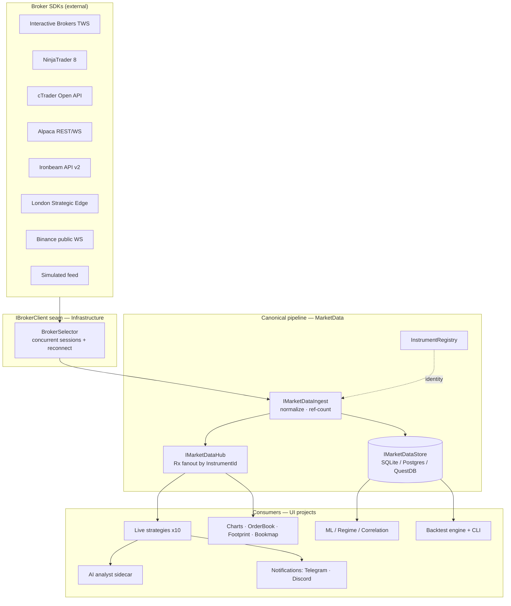
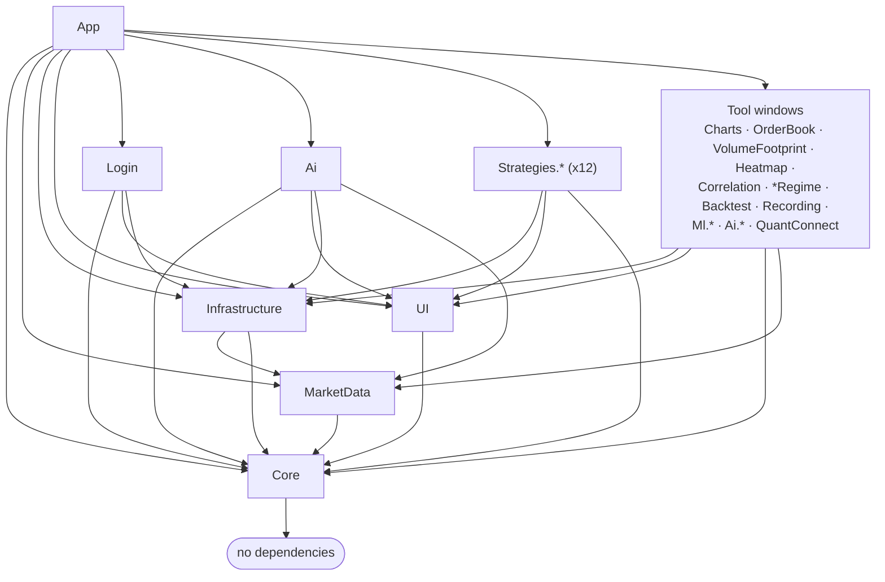

# DaxAlgo Terminal

> Last updated: 2026-06-18

[](https://dotnet.microsoft.com/)
[](LICENSE)
[](#)
[](#)

A modular **multi-broker** WPF trading terminal that hosts strategies and tools as plug-ins inside a Bloomberg-style shell. Connect one or more brokers at login (Interactive Brokers, NinjaTrader 8, cTrader, Alpaca, Ironbeam, London Strategic Edge, or the keyless Binance feed — sessions are concurrent, with an **Auto Connect** option) and everything downstream — historical bars, live ticks, depth, trade tape, connection state, reconnect logic — routes through a single `IBrokerClient` seam. **Data and signals only — no live order execution.**


> 🎬 _Video walkthrough — coming soon_

---

## Contents

- [What ships](#what-ships)
- [System at a glance](#system-at-a-glance) — architecture diagram
- [Quick start](#quick-start)
- [Screenshots & media](#screenshots--media)
- [Documentation](#documentation)
- [Project graph](#project-graph)
- [License](#license)

---

## What ships

- **10 live strategies** behind one `IBacktestStrategy` plug-in seam — the Σ⁻¹·IC Order-Flow Optimizer (tape-primary microstructure composite), Ornstein-Uhlenbeck mean reversion, volatility-targeted index baseline, L2/DOM order-flow (VPIN toxicity, cumulative delta with footprint clusters, order-flow pressure map over the S&P 100/500), the Filtered Order-Flow Imbalance research-paper strategy, and the 3D regime-cube family (Order-Flow Cube, Order-Flow Surface Spike, Imbalance Heat Front, Index K-Score Surface). Plus buy-and-hold / mean-reversion / Donchian demos in the backtester.
- **Multi-broker backends** behind one `IBrokerClient`: IB (TWS API), NT 8 (NTDirect P/Invoke), cTrader (Spotware Open API 2.0), Alpaca (REST + WebSocket), Ironbeam futures (REST + WebSocket API v2), London Strategic Edge (free multi-asset L1 + history), keyless Binance public data, and additional crypto venues (Coinbase / Bybit / Kraken / OKX) and Upstox (Indian markets) — plus the always-registered offline `Simulated` broker.
- **Charts & order-flow windows** — TradingView-style charts (WebView2), live L2 order-book ladder, a bid/ask **volume footprint** with toggleable POC regression fits and a virtual fit-consensus predictor, and the combined **Bookmap + VolBook** liquidity-heatmap window, plus live/static correlation matrices.
- **Machine Learning menu** — stationarity & differencing lab (ADF/KPSS/ACF, fractional differencing), ARIMA + GARCH forecasting with confidence bands, and Kalman filters (local level / trend / time-varying pairs hedge-β) — all over historical bars from the local store.
- **Canonical market-data pipeline** — broker-neutral `InstrumentId`, Rx fanout hub, ref-counted tick-primary ingest, and a four-backend store (per-broker SQLite by default, single-file SQLite, PostgreSQL + TimescaleDB via `docker compose`, or QuestDB for the high-rate surfaces). Postgres auto-falls-back to SQLite when unreachable. Optional Telegram archive offloader so the local store can prune safely.
- **Tick-level backtest engine** — `IFeeModel` (zero / maker-taker / bps), `IRiskManager` (per-symbol cap + daily PnL cap), L1 fill model, ParquetTick reader/writer, full stats suite (Sharpe, Sortino, Calmar, Omega, Ulcer, recovery, max consec losses). Headless CLI with `run` / `sweep` / `walkforward` / `mc` / `tca` / `features` subcommands.
- **Notifications** — bounded `Channel<>` + hosted dispatcher fans signals out to Telegram (Bot API) and Discord (channel webhook), with an optional Ollama LLM commentary enricher.
- **AI Market Analyst** — four-agent LangGraph (indicator → pattern → trend → decision) in a Python sidecar over loopback HTTP/JSON. Provider-agnostic (OpenAI / Anthropic / Qwen / MiniMax). Renders annotated candlestick + trend-channel charts; degrades gracefully when the sidecar isn't running.
- **Market regime suite** — a 0–100 risk-on / risk-off composite blended from sub-signals across Yahoo Finance / FRED / CNN Fear & Greed / AAII (with an optional signal gate), plus per-instrument, Markov transition-matrix, and an 18-indicator × 8-timeframe **Advanced regime dashboard**.
- **Bloomberg-style shell** — MahApps Metro chrome, Consolas monospace throughout, amber accent on pure-black canvas. Every tool, strategy and chart opens as its own window; the shell hosts the strategy catalog full-width with a collapsible activity-log drawer.

## System at a glance



See [docs/architecture.md](docs/architecture.md) for the full design rationale, threading model, and component diagrams.

## Quick start

```powershell
git clone https://github.com/dhruuvsharma/DaxAlgo-Terminal.git
cd "DaxAlgo Terminal"
dotnet restore
dotnet build -c Release
dotnet run --project src/TradingTerminal.App -c Release
```

You don't need any broker account to build and run. The **`Binance`** tile streams real, live crypto data (bars, L1, **L2 depth**, trades) over Binance's public WebSocket with **no API key and no account** — just click Connect. For a fully-offline run, the always-registered **`Simulated` broker** serves a synthetic random-walk feed (or replay of your local store); the dev launch profiles (`Dev: Simulated (offline)` etc.) even skip the login window.

For setup details (DLL resolution, port numbers, OAuth flow, API keys, the keyless Binance feed, dev launch profiles), see [docs/getting-started.md](docs/getting-started.md) and [docs/brokers.md](docs/brokers.md).

## Screenshots & media

> 📌 Screenshots and video walkthroughs are being filled in across the docs. Where a screenshot or video isn't in yet, you'll see a **_coming soon_** placeholder — these mark every tool, strategy and window so the media slots are reserved.

| | |
|---|---|
|  |  |
| Multi-broker login | Σ⁻¹·IC Order-Flow Optimizer |
|  |  |
| Imbalance Heat Front (3D) | Index K-Score Surface (3D) |
|  |  |
| Tick-level backtest | AI Market Analyst |
|  |  |
| Market-regime composite | Correlation matrix |

> 🎬 _Full video walkthroughs for the shell, each strategy and each tool — coming soon._

More screenshots are embedded throughout the focused docs (strategies, brokers, AI analyst, tools).

## Documentation

All documentation lives in [docs/](docs/README.md). Quick links:

| Audience | Start here |
|---|---|
| First-time user | [getting-started.md](docs/getting-started.md), [user-guide.md](docs/user-guide.md) |
| Setting up a broker | [brokers.md](docs/brokers.md), [ib-tws-setup.md](docs/ib-tws-setup.md) |
| Tuning configuration | [configuration.md](docs/configuration.md) |
| Adding a strategy / broker / notifier | [contributing.md](docs/contributing.md) |
| Backtesting | [backtesting.md](docs/backtesting.md) |
| Storage & databases | [storage.md](docs/storage.md), [market-data.md](docs/market-data.md) |
| Feature deep-dive | [docs/README.md](docs/README.md) (index of every focused doc) |
| Architecture | [architecture.md](docs/architecture.md) |
| Something broken | [troubleshooting.md](docs/troubleshooting.md) |

## Project graph



`Core` has zero deps on UI, WPF, or any broker SDK. The market-data pipeline (`MarketData`) sits below `Infrastructure`; the login flow (`Login`) and AI/ML tooling (`Ai`) are their own projects so the App shell stays thin. Adding a new broker = a new `IBrokerClient` implementation in `Infrastructure/<Broker>/` and one DI registration block. Adding a new strategy = a new `TradingTerminal.Strategies.<Name>` project + one DI line. The shell stays untouched.

## License

MIT — see [LICENSE](LICENSE).
