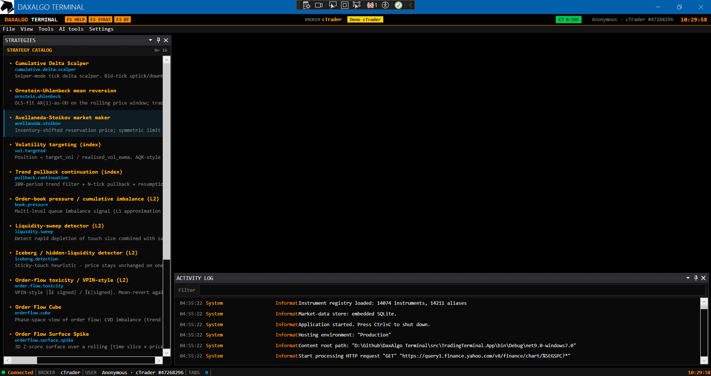
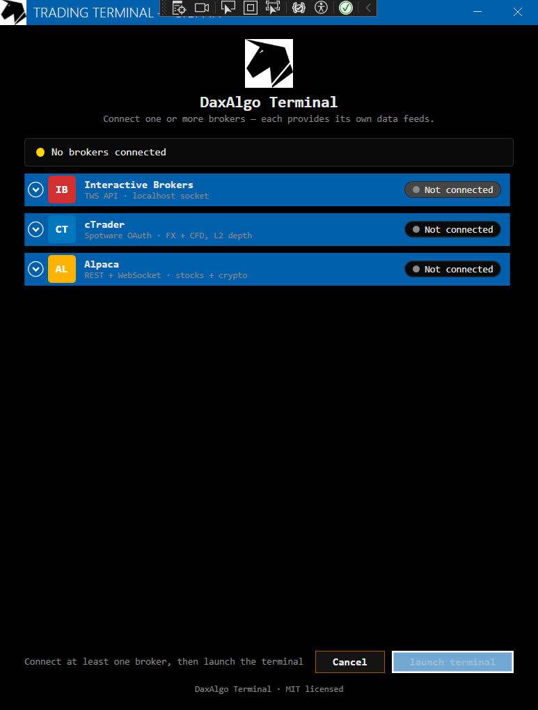
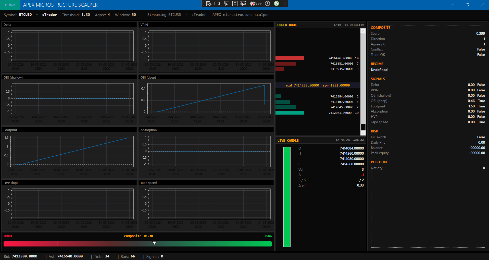
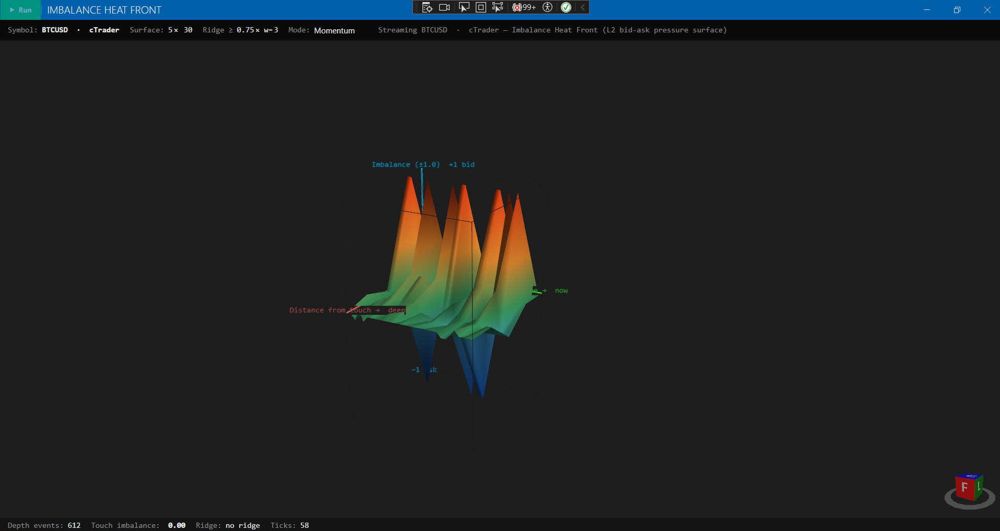
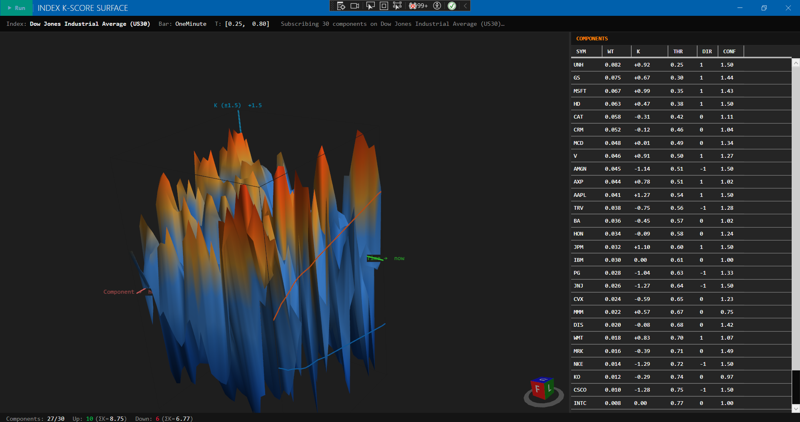
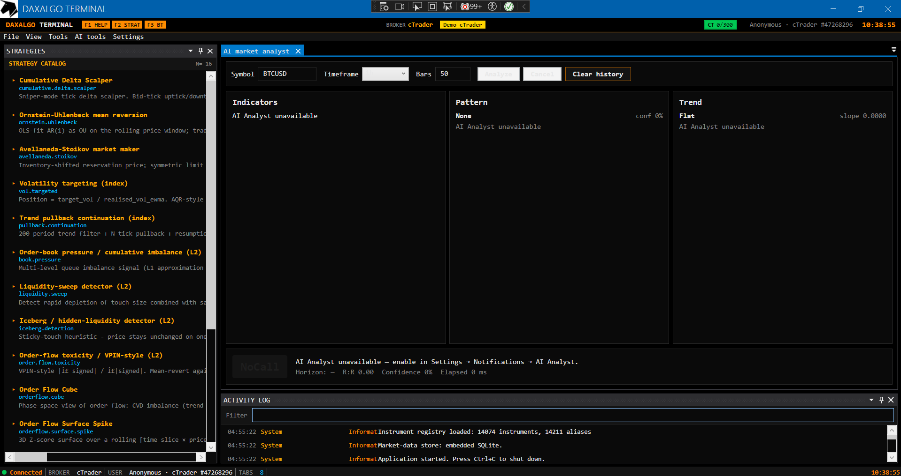

# DaxAlgo Terminal

> Last updated: 2026-05-31

[](https://dotnet.microsoft.com/)
[](LICENSE)
[](#)
[](#)

A modular **multi-broker** WPF trading terminal that hosts strategies as plug-ins inside a dockable Bloomberg-style shell. Picks a broker at login (Interactive Brokers, NinjaTrader, cTrader, or Alpaca) and routes everything downstream — historical bars, live ticks, depth, connection state, reconnect logic — through a single `IBrokerClient` seam.



## What ships

- **16 live strategies** behind one `IBacktestStrategy` plug-in seam — HFT/microstructure (Avellaneda-Stoikov, Ornstein-Uhlenbeck), index baselines (volatility targeting, trend-pullback continuation), L2/DOM order-flow (book pressure, liquidity sweep, iceberg detection, VPIN toxicity, thin-book filter, cumulative delta), 3D regime-cube family (Order-Flow Cube, Order-Flow Surface Spike, Imbalance Heat Front, Index K-Score Surface, APEX microstructure scalper), and ML (online-regression alpha). Plus buy-and-hold / mean-reversion / Donchian demos in the backtester.
- **Four broker backends** behind one `IBrokerClient`: IB (TWS API), NT 8 (NTDirect P/Invoke), cTrader (Spotware Open API 2.0), Alpaca (REST + WebSocket).
- **Canonical market-data pipeline** — broker-neutral `InstrumentId`, Rx fanout hub, ref-counted ingest, and a two-backend store (embedded SQLite by default, or PostgreSQL + TimescaleDB via `docker compose`). Postgres auto-falls-back to SQLite when unreachable.
- **Tick-level backtest engine** — `IFeeModel` (zero / maker-taker / bps), `IRiskManager` (per-symbol cap + daily PnL cap), L1 fill model, ParquetTick reader/writer, full stats suite (Sharpe, Sortino, Calmar, Omega, Ulcer, recovery, max consec losses). Headless CLI with `run` / `sweep` / `walkforward` / `mc` / `tca` / `features` subcommands.
- **Notifications** — bounded `Channel<>` + hosted dispatcher fans signals out to Telegram (Bot API) and Discord (channel webhook), with an optional Ollama LLM commentary enricher.
- **AI Market Analyst** — four-agent LangGraph (indicator → pattern → trend → decision) in a Python sidecar over loopback HTTP/JSON. Provider-agnostic (OpenAI / Anthropic / Qwen / MiniMax). Renders annotated candlestick + trend-channel charts; degrades gracefully when the sidecar isn't running.
- **Market regime composite** — 0–100 risk-on / risk-off score blended from 10 sub-signals across Yahoo Finance / FRED / CNN Fear & Greed / AAII. Optional signal gate that suppresses outbound alerts when risk-off.
- **Bloomberg-style shell** — MahApps Metro chrome, AvalonDock VS2013 Dark theme, Consolas monospace throughout, amber accent on pure-black canvas, full-height strategies pane, status-bar mode badge.

## Quick start

```powershell
git clone https://github.com/dhruuvsharma/DaxAlgo-Terminal.git
cd "DaxAlgo Terminal"
dotnet restore
dotnet build -c Release
dotnet run --project src/TradingTerminal.App -c Release
```

You don't need any broker installed to build and run — the synthetic `Fake*Client` random-walks run out of the box for IB, NT, and cTrader. Alpaca is the only broker that requires real credentials.

For setup details (DLL resolution, port numbers, OAuth flow, API keys), see [docs/getting-started.md](docs/getting-started.md) and [docs/brokers.md](docs/brokers.md).

## Screenshots

| | |
|---|---|
|  |  |
| Multi-broker login | APEX microstructure scalper |
|  |  |
| Imbalance Heat Front (3D) | Index K-Score Surface (3D) |
|  |  |
| Tick-level backtest | AI Market Analyst |
|  |  |
| Market-regime composite | Correlation matrix |

More screenshots are embedded throughout the focused docs (strategies, brokers, AI analyst, tools).

## Documentation

All documentation lives in [docs/](docs/README.md). Quick links:

| Audience | Start here |
|---|---|
| First-time user | [getting-started.md](docs/getting-started.md), [user-guide.md](docs/user-guide.md) |
| Setting up a broker | [brokers.md](docs/brokers.md) |
| Tuning configuration | [configuration.md](docs/configuration.md) |
| Adding a strategy / broker / notifier | [contributing.md](docs/contributing.md) |
| Backtesting | [backtesting.md](docs/backtesting.md) |
| Feature deep-dive | [docs/README.md](docs/README.md) (index of every focused doc) |
| Architecture | [architecture.md](docs/architecture.md) |
| Something broken | [troubleshooting.md](docs/troubleshooting.md) |

## Project graph

```
App            → MarketData, Infrastructure, UI, Login, Ai, Strategies.*, Core
Login          → Core, UI, Infrastructure
Ai             → Core, UI, Infrastructure, MarketData
Strategies     → Infrastructure, UI, Core
Infrastructure → MarketData, Core
MarketData     → Core
UI             → Core
Core           → (nothing)
```

`Core` has zero deps on UI, WPF, IB, NT, cTrader, or Alpaca. The market-data pipeline (`MarketData`) sits below `Infrastructure`; the login flow (`Login`) and AI/ML tooling (`Ai`) are their own projects so the App shell stays thin. Adding a new broker = a new `IBrokerClient` implementation in `Infrastructure/<Broker>/` and one DI registration block. Adding a new strategy = a new project + one DI line in `App.xaml.cs`. The shell stays untouched.

## License

MIT — see [LICENSE](LICENSE).
