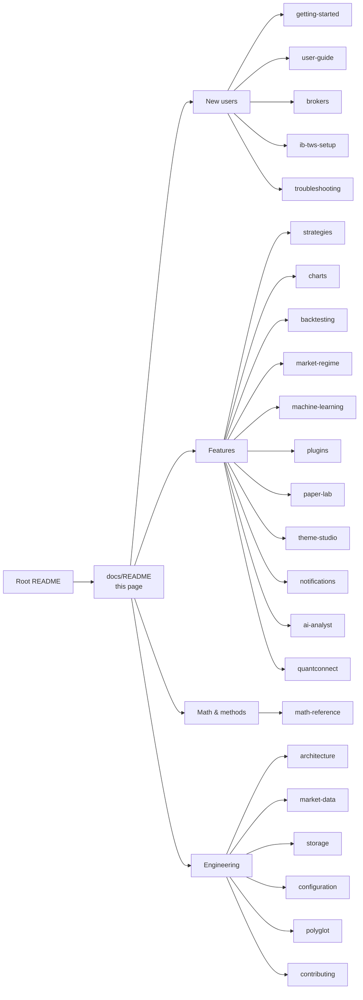

# DaxAlgo Terminal — Documentation

> Last updated: 2026-06-30

Focused documentation for the DaxAlgo Terminal. The repo-root [README](../README.md) is the
one-page landing; this folder is where the detail lives.

**Every doc is written for two readers at once.** First a **plain-English** explanation — what the
thing is, why it exists, an analogy, and a worked example you can follow without any background.
Then, below it, the **technical and mathematical depth** — formulas, derivations, interfaces, and
`file:line` source pointers for contributors. Read as far down as you need; nothing assumes you are
a programmer, a mathematician, or a professional trader.

## Documentation map

## For new users

| Doc | What it covers |
|---|---|
| [Getting started](getting-started.md) | Prereqs, clone, build, first launch — for **both** the Windows and Linux builds. The 10-minute path from zero to a running shell. |
| [User guide](user-guide.md) | A guided tour of the whole window: every menu, the header strip, the activity log, and a daily-use walkthrough. Start here if you just installed it. |
| [Broker setup](brokers.md) | Per-broker configuration: credentials, ports, OAuth, what data each one gives you, and common pitfalls. The keyless Binance feed needs nothing. |
| [IB / TWS setup](ib-tws-setup.md) | Interactive Brokers in depth — TWS/Gateway config, the API socket, and the DLL auto-discovery gate. |
| [Troubleshooting](troubleshooting.md) | A symptom → fix table across all subsystems. |

## Features in depth

| Doc | What it covers |
|---|---|
| [Strategies](strategies.md) | All 12 strategies — what each one looks for, in plain terms and then in math, the parameters you can tune, and the recipe for adding your own. |
| [Charts & order-flow windows](charts.md) | Every Charts-menu window and how to read it: TradingView-style charts, the L2 order book, the volume footprint, and the combined Bookmap + VolBook. |
| [Backtesting](backtesting.md) | Backtest Studio and the tick-level engine — fees, risk caps, fills, the full stats glossary, plus the `daxalgo-backtest` CLI. |
| [Strategy plugins & the SDK](plugins.md) | The open-core plugin system — installing a code-signed plugin from the **Plugins** menu, the trust model, and the SDK overview. *(Windows.)* |
| [Authoring a plugin](plugin-authoring.md) | The full build walkthrough: `dotnet new daxalgo-strategy` (headless or `--ui`), the kernel, parameters, pills, the test harness, packaging, the version policy, and signing. |
| [Plugin security](plugin-security.md) | The honest threat model — what the trust layers protect against, what they don't, the DEV badge, and what true isolation would take. |
| [Paper Lab](paper-lab.md) | Turn a research paper into a sandboxed reproduction that becomes a backtestable, paper-tagged strategy. The security model that runs untrusted code safely. |
| [Market regime](market-regime.md) | The 0–100 risk-on / risk-off composite and the 18-indicator × 8-timeframe Advanced regime board. |
| [Machine-Learning tools](machine-learning.md) | The Machine-learning menu — stationarity & differencing, ARIMA + GARCH, Kalman filters. *(Windows.)* |
| [QuantConnect / LEAN](quantconnect.md) | The optional LEAN backtest seam (subprocess + JSON). Experimental. |
| [Theme Studio](theme-studio.md) | The live colour editor — recolour every token in the app and save/share custom themes. |
| [Notifications](notifications.md) | Telegram and Discord transports, the Ollama commentary enricher, and adding a new transport. |
| [AI Market Analyst](ai-analyst.md) | The Python sidecar, the four-agent flow, provider/model selection, and per-signal enrichment. |

## Math & methods

| Doc | What it covers |
|---|---|
| [Methods & math reference](math-reference.md) | **The actual math** behind every strategy, tool, and chart — each formula with a plain-English meaning, labelled variables, a step-by-step derivation, and a worked numeric example. Start here to understand *what is computed* and *why*. |

## Engineering reference

| Doc | What it covers |
|---|---|
| [Architecture](architecture.md) | Design rationale, the **two independent trees** (Windows/WPF + Linux/Avalonia), key interfaces, the threading model, and the component + dependency diagrams. Read before adding abstractions. |
| [Market-data pipeline](market-data.md) | The canonical pipeline (hub, ingest, store), the four store backends, the ER diagram, and the Telegram archive offloader. |
| [Storage map](storage.md) | **Start here if the databases are confusing.** Every storage surface in one table — what each holds, where, and how to read it. |
| [Configuration reference](configuration.md) | Full `appsettings.json` key reference + persistence locations + secret storage. |
| [Polyglot architecture](polyglot.md) | The subprocess + JSON seam for the C++ tick backtester and the Python AI / Paper Lab sidecar. |
| [Contributing](contributing.md) | Adding a strategy, broker, or notifier without breaking the layering rules — in **both** trees. |

## Conventions used in this documentation

- **Two-layer writing.** A plain-English section first, the technical/math depth below. Skip down as
  far as your background needs.
- **Two builds.** Where something differs between the Windows (WPF) and Linux (Avalonia) trees, the
  doc says so explicitly. Windows-only features (TradingView Charts, the Machine-Learning menu, the
  plugin SDK) are flagged. See [architecture.md](architecture.md#two-independent-trees).
- **Diagrams** are written in [Mermaid](https://mermaid.js.org/), which GitHub renders inline.
  Flowcharts show component/data flow, sequence diagrams show call ordering, and `erDiagram` blocks
  show database structure.
- **Math** is written in GitHub-rendered LaTeX (`$…$` inline, `$$…$$` block). Every formula is
  paired with a plain-English meaning and, where it helps, a worked number.
- **Media slots.** Screenshots and videos are being (re)captured. Each is a clean text placeholder
  (`🖼️`/`🎬 _coming soon_`) with an exact target filename — nothing renders as a broken image. The
  master list is [MEDIA-CHECKLIST.md](MEDIA-CHECKLIST.md).
- **Timestamps** in docs are UTC; the store persists time as **epoch microseconds UTC**.
- **"Live mode"** means a real broker SDK is wired and connected; **"offline / simulated mode"**
  means the always-registered `Simulated` broker — a synthetic random-walk feed or a replay of your
  local store.
- **Data and signals only.** This build has no live order-execution path; nothing here places a real
  order.
- Source references use `file:line` so they stay valid in any editor. Paths are under
  `src/windows/…` (WPF) or `src/linux/…` (Avalonia); the two trees mirror each other.
