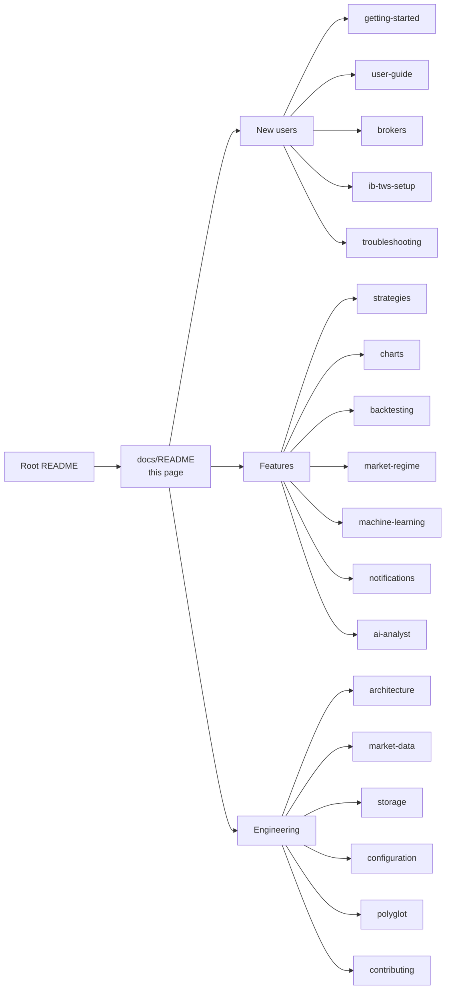

# DaxAlgo Terminal — Documentation

> Last updated: 2026-06-18

Focused documentation for the DaxAlgo Terminal. The repo-root [README](../README.md) is a one-page landing; this folder is where the detail lives. Every doc carries architectural context, diagrams where they help, and reserved media slots for screenshots and video walkthroughs.

## Documentation map

## For new users

| Doc | What it covers |
|---|---|
| [Getting started](getting-started.md) | Prereqs, clone, build, first launch. The 10-minute path from zero to a running shell. |
| [Broker setup](brokers.md) | Per-broker configuration: credentials, ports, OAuth, capabilities, common pitfalls. |
| [IB / TWS setup](ib-tws-setup.md) | Interactive Brokers in depth — TWS/Gateway config, API socket, the `HAS_IBAPI` DLL gate. |
| [User guide](user-guide.md) | Daily-use walkthrough — login, running strategies live, recording ticks, factor research, CLI cheat sheet. |
| [Troubleshooting](troubleshooting.md) | Consolidated symptom → fix table across all subsystems. |

## Features in depth

| Doc | What it covers |
|---|---|
| [Strategies](strategies.md) | The shipped strategies, their parameters, what each is good for. Plus the recipe for adding a new strategy. |
| [Charts & order-flow windows](charts.md) | Every Charts-menu window with its inputs and read-outs: TradingView-style charts, L2 order book, volume footprint (regression fits + virtual predictor), and the combined Bookmap + VolBook window. |
| [Backtesting](backtesting.md) | Tick-level engine, fees, risk caps, CLI (`run` / `sweep` / `walkforward` / `mc` / `tca` / `features`). |
| [QuantConnect / LEAN](quantconnect.md) | The optional LEAN backtest seam (subprocess + JSON) — runner / projects / data sync / settings. Experimental. |
| [Market regime](market-regime.md) | The 0–100 risk-on / risk-off composite — sources, weights, optional signal gate — plus the multi-timeframe Advanced regime dashboard. |
| [Machine Learning tools](machine-learning.md) | The Machine learning menu: Stationarity & differencing (ADF/KPSS/ACF), ARIMA & GARCH forecasting, Kalman filters (incl. pairs hedge-beta). |
| [Notifications](notifications.md) | Telegram and Discord transports, Ollama commentary enricher, adding a new transport. |
| [AI Market Analyst](ai-analyst.md) | Python sidecar setup, four-agent flow, provider/model selection, per-signal enrichment. |

## Engineering reference

| Doc | What it covers |
|---|---|
| [Architecture](architecture.md) | Design rationale, key interfaces, threading model, component + dependency diagrams. Read this before adding abstractions. |
| [Market data pipeline](market-data.md) | Canonical pipeline (hub, ingest, store), the four store backends, the ER diagram, the Telegram archive offloader. |
| [Storage map](storage.md) | **Start here if the databases are confusing.** Every storage surface in one table — canonical store, archive manifest, tick recorder, Parquet lake, Telegram archive, DuckDB reader — what each holds, where, and how to read it. |
| [Configuration reference](configuration.md) | Full `appsettings.json` key reference + persistence locations + secret storage. |
| [Polyglot architecture](polyglot.md) | The subprocess + JSON seam for the C++ tick backtester and the Python AI sidecar. |
| [Contributing](contributing.md) | Adding a strategy, broker, or notifier without breaking the layering rules. |

## Conventions used in this documentation

- **Diagrams** are written in [Mermaid](https://mermaid.js.org/), which GitHub renders inline. Flowcharts show component/data flow, sequence diagrams show call ordering, and `erDiagram` blocks show database structure.
- **Media slots.** Screenshots and video walkthroughs are still being produced. Each tool, strategy and window reserves its media with one of:
  - an existing screenshot followed by `🎬 _Video walkthrough — coming soon_`, or
  - `🖼️ _Screenshot — coming soon_` + `🎬 _Video walkthrough — coming soon_` where no screenshot exists yet.
- All timestamps in docs are UTC; instrument bar timestamps are UTC unless explicitly stated. The store persists time as **epoch microseconds UTC**.
- All paths assume Windows (`%LOCALAPPDATA%\…`); the project is `net9.0-windows` and not cross-platform.
- "Live mode" means a real broker SDK is wired and connected; "offline / simulated mode" means the always-registered `Simulated` broker — a synthetic random-walk feed or replay of the local store, wired up by the dev launch profiles.
- Code references use `file:line` so they remain valid when read in any editor.
- **Data and signals only.** This build has no live order-execution path; nothing here places real orders.
