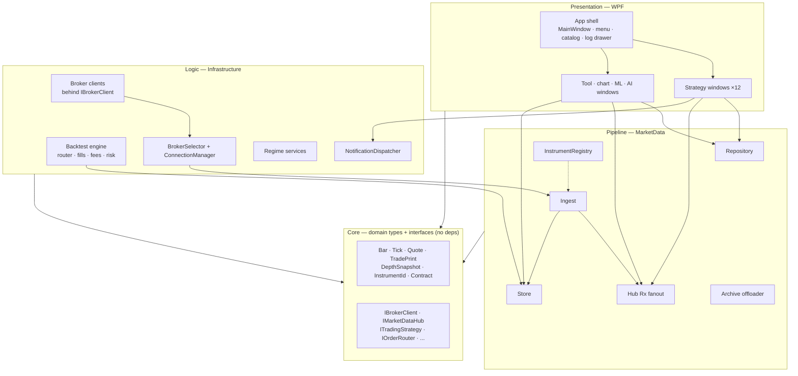
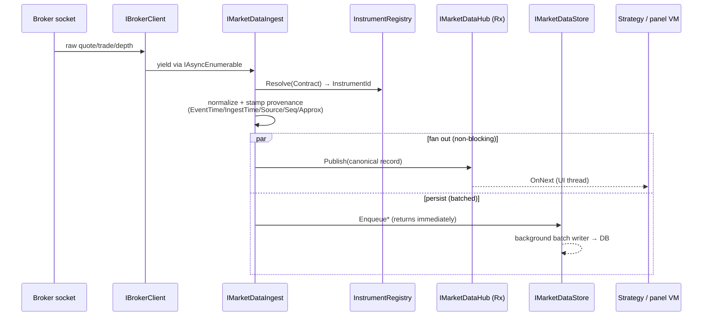
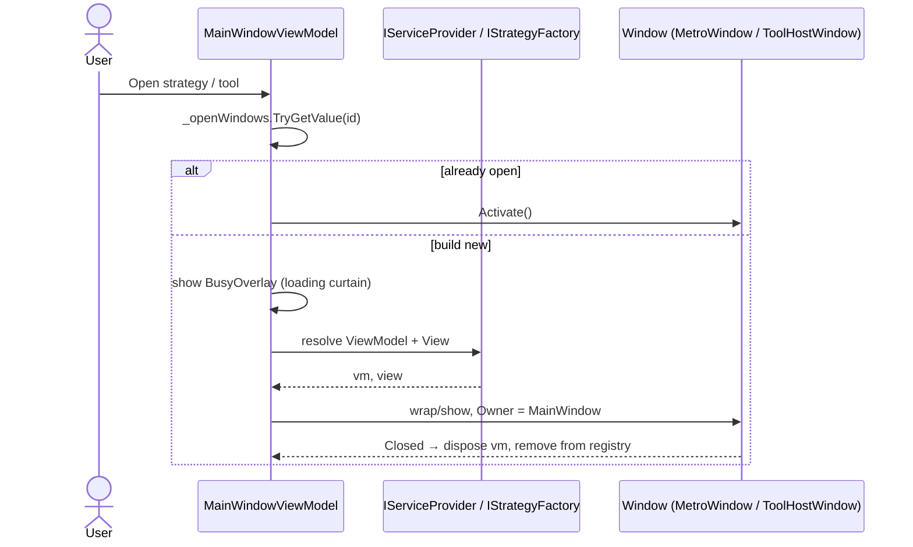

# Architecture

> Last updated: 2026-07-22

The design rationale, key interface signatures, and constraints that the rest of the codebase honors. For installation and runtime setup, see [getting-started.md](getting-started.md). For per-broker quirks, see [brokers.md](brokers.md). For feature-level deep dives, see [market-data.md](market-data.md), [market-regime.md](market-regime.md), [backtesting.md](backtesting.md), [notifications.md](notifications.md), [ai-analyst.md](ai-analyst.md).

## In plain terms

Think of the app as a **newsroom**. Brokers are foreign correspondents — each one reports in its own
language and format (Interactive Brokers speaks one protocol, Binance another, NinjaTrader a third).
You don't want every desk in the newsroom learning twelve languages, so there's a **translation
desk** (the *ingest* layer) that rewrites every incoming report into one house style and stamps it
with where it came from and when it arrived. A **distribution desk** (the *hub*) then hands each
translated report to whoever asked for that topic — a chart, a strategy, the database. Because
everything past the translation desk is in the house style, a new correspondent (a new broker) can
be hired without retraining a single desk, and a new desk (a new strategy or tool) can be opened
without caring which correspondent the news came from.

That single idea — **translate once at the edge, then everything downstream speaks one language** —
is the backbone of the whole system. The rest of this document is the precise version of it.

## Repository boundary

This repository contains the Windows/WPF product only. Its source lives under `src/windows/`, and
`TradingTerminal.Windows.slnx` is the complete shared-core solution. The former Linux/Avalonia tree
was extracted to a separate private repository on 2026-07-22; it is not part of this repository's
build, maintenance, parity, or review scope. Paths in this document therefore refer only to the
Windows implementation.

## Goal

A modular trading terminal that:

- Hosts strategies and tools as plug-ins inside a single WPF shell — each opens as its own window.
- Talks to **multiple brokers** through a single seam — picked by the user at login, run concurrently, swapped without any consumer noticing.
- Adds new strategies with one DI-registration line, no shell edits.
- Adds new brokers with one new `IBrokerClient` implementation + one DI block, no consumer changes.

The shipped brokers (Interactive Brokers, NinjaTrader 8, cTrader, Alpaca, Ironbeam, London Strategic Edge, Binance, plus additional crypto venues and Upstox) exercise very different transports on purpose — P/Invoke, protobuf-over-TLS, REST+WebSocket, keyless public feeds — to prove the abstraction holds. If it holds for all of them, it holds for whatever comes next (Tradovate, Rithmic, dxTrade, etc.). The capability matrix lives in [brokers.md](brokers.md).

### Component architecture



## Core principles

1. **Strict MVVM** — view-models hold all logic; code-behind is for view-only concerns.
2. **Strategies are plug-ins** — discovered via DI, never `new`'d by the shell.
3. **Brokers are plug-ins too** — every broker call goes through `IBrokerClient`. View-models never see `EClientSocket`, `NTDirect`, `OpenClient`, or `IAlpacaTradingClient`.
4. **One layer owns threading** — broker callbacks are marshalled to the UI dispatcher inside the repository. Everything above stays single-threaded from its perspective.
5. **Async streaming via `IAsyncEnumerable<T>`** — natural cancellation, easy to consume, easy to fake in tests.
6. **Reactive connection state** — `IObservable<ConnectionState>` flows from the connection manager up. Nothing polls.
7. **Canonical market-data identity** — `InstrumentId` is the surrogate key; broker symbology resolves through `IInstrumentRegistry`. Strategies and persistence key on the canonical id.
8. **Store writes are non-blocking** — the ingest hot path enqueues; a background batch writer flushes on size or interval.

## Project graph

```
App            → MarketData, Infrastructure, UI, Login, Ai, Strategies.*, <tool projects>, Core
Login          → Core, UI, Infrastructure
Ai             → Core, UI, Infrastructure, MarketData   (analyst seam only)
Ai.<Tool>      → Ai, UI, Infrastructure, MarketData, Core   (5 AI tool windows incl. Paper Lab)
<Tool>         → UI, Infrastructure, MarketData, Core   (Charts/OrderBook/VolumeFootprint/Heatmap/
                                                          Correlation/AdvancedMarketRegime/
                                                          BacktestStudio/Backtest/Recording/
                                                          LseBacktest/QuantConnect/Ml.*)
Strategies     → Infrastructure, UI, Core   (live VM wraps an engine-side IBacktestStrategy)
Plugins        → DaxAlgo.Sdk(.Wpf)  →  Core   (external strategy plugins; Windows only)
Infrastructure → MarketData, Core
MarketData     → Core
UI             → Core
Core           → (nothing)
```

`UI` is `TradingTerminal.UI` (WPF); toolkit-free MVVM bits live in `UI.Core`.

The App shell only *references* the tool/AI-tool projects and opens them via `IServiceProvider`; it contains none of their views. Each tool project exposes one `Add…Surface` DI extension that `App.xaml.cs` calls during composition.

**Edition shells.** The repository ships **three fully independent shell exes** — `TradingTerminal.App` (Professional), `TradingTerminal.App.Basic` and `TradingTerminal.App.Intermediate` — with **no shared shell library** between them. Each project carries its own complete copy of the shell code (MainWindow + inline menu, view-model, `AppDependencyInjection`, window-host machinery, settings/archive/support views, manifest, icons, plugin-staging targets). The copies keep identical `TradingTerminal.App.*` namespaces — the three exes never reference each other, so nothing clashes — and a shell fix must be applied to each copy. Tier gating is purely compositional: Basic's csproj never references the Pro-only tool projects (its exe output physically excludes those DLLs), its composition root registers `AddKeylessBrokers()` without `AddCredentialedBrokers()` (which also removes the credentialed tiles from the login screen, since the form factory filters on `IBrokerSelector.IsAvailable`), and `AddLogin()` carries only the keyless login forms — `AddCredentialedLoginForms()` must pair with `AddCredentialedBrokers()` because resolving `IEnumerable<IBrokerLoginForm>` instantiates every registered form. `AppEdition` + `BrokerEditionPolicy` (in `Core/Configuration`) name the tiers; each shell pins its edition as a DI constant. The Simulated broker ships in every edition, flagged by the persistent amber “SIMULATED DATA” banner (`SimulatedDataState` / `SimulatedDataBanner` in `TradingTerminal.UI`) on the shell and every tool/strategy window.

`Core` knows nothing about WPF, MahApps, IB, NT, cTrader, or Alpaca. The canonical market-data pipeline lives in its own `MarketData` project below `Infrastructure` (it depends only on `Core`); the login flow (`Login`) and the AI analyst seam (`Ai`) are separate projects so the App shell stays thin. Each tool window and AI tool window is now its own flat `TradingTerminal.<Name>` project (Charts, OrderBook, VolumeFootprint, Heatmap, Correlation, AdvancedMarketRegime, BacktestStudio, Backtest, Recording, LseBacktest, QuantConnect, the `Ml.*` windows, plus `Ai.MarketAnalyst` / `Ai.FactorResearch` / `Ai.MlFeatures` / `Ai.BacktestAnalysis` / `Ai.PaperLab`); each ships its own `Add…Surface` DI extension that the shell's `App` startup calls, and `App` only references them — it hosts none of their views. New abstractions go into `Core`; new SDK calls go into `Infrastructure`.

The per-strategy projects under `TradingTerminal.Strategies.<Name>/` are thin live-UI wrappers — they hold the `MetroWindow`, view-model, and `ITradingStrategy` descriptor, but the actual signal logic (which they instantiate inside `BuildStrategy(contract)`) lives in `Infrastructure/Backtest/Strategies/`. That split keeps the same `IBacktestStrategy` reusable from both the backtest engine and the live signal mode.

## Solution layout

The Windows solution groups its projects into the following folders.

```
TradingTerminal.Windows.slnx                       (src/windows/…)
├── Core/
│   └── TradingTerminal.Core                        Domain models + interfaces — zero deps on UI/brokers
├── Pipeline/
│   ├── TradingTerminal.MarketData                  Canonical pipeline: hub, ingest, repository, store, archive, registry
│   └── TradingTerminal.Infrastructure              Broker clients, backtest engine + strategies, notifications, regime, sidecar, research
├── Shell/
│   ├── TradingTerminal.UI                          ViewModelBase, themes, activity-log sink, LiveSignalStrategyViewModelBase, param controls
│   ├── TradingTerminal.Login                       Sign-in window, credential store, per-broker login forms (AddLogin = keyless forms; AddCredentialedLoginForms pairs with AddCredentialedBrokers)
│   ├── TradingTerminal.App                         Professional-edition shell: entry, DI bootstrap, MainWindow + full menu, factories, notifications + archive + support UI
│   ├── TradingTerminal.App.Basic                   Basic-edition shell — independent full copy of the shell code; keyless brokers only, core charts/tools, no Pro project refs
│   └── TradingTerminal.App.Intermediate            Intermediate-edition shell — independent full copy; all brokers + full login, same tools as Basic
├── UI/
│   ├── TradingTerminal.UI.Core                     Toolkit-free MVVM bits (UiThread/UiFile seams)
│   └── TradingTerminal.Settings                    Settings surface (notifications / research / archive tabs)
├── Charts/
│   ├── TradingTerminal.Charts                      TradingView-style chart window (WebView2)
│   ├── TradingTerminal.OrderBook                   L2 depth ladder window
│   ├── TradingTerminal.VolumeFootprint             Volume footprint cluster chart (fits + predictor)
│   └── TradingTerminal.Heatmap                     Bookmap + VolBook (liquidity heatmap + profile/VWAP/CVD/DOM)
├── Tools/
│   ├── TradingTerminal.BacktestStudio              Tools → Backtest Studio (the full backtest workbench)
│   ├── TradingTerminal.Backtest                    Backtest engine host (Quick backtest from the catalog)
│   ├── TradingTerminal.Recording                   Tick recorder window
│   ├── TradingTerminal.AdvancedMarketRegime        18-indicator × 8-timeframe regime board
│   ├── TradingTerminal.Correlation                 Correlation matrix (historical + live)
│   ├── TradingTerminal.LseBacktest                 LSE Tools → backtester (pulls history from the LSE broker)
│   └── TradingTerminal.QuantConnect                QuantConnect / LEAN polyglot backtest window
├── MachineLearning/
│   ├── TradingTerminal.Ml.Stationarity             Stationarity & differencing (ADF/KPSS/ACF)
│   ├── TradingTerminal.Ml.ArimaGarch               ARIMA + GARCH forecasting
│   └── TradingTerminal.Ml.KalmanFilter             Kalman filters (local level / trend / pairs hedge-β)
├── AI/
│   ├── TradingTerminal.Ai                          AI analyst seam only (IAiAnalystClient Null/Http, enricher, AddAiAnalyst)
│   ├── TradingTerminal.Ai.MarketAnalyst            AI market analyst window
│   ├── TradingTerminal.Ai.FactorResearch           Factor research window
│   ├── TradingTerminal.Ai.MlFeatures               ML features window
│   ├── TradingTerminal.Ai.BacktestAnalysis         Backtest analysis window
│   └── TradingTerminal.Ai.PaperLab                 Paper Lab (paper → sandboxed repro → strategy)
├── Strategies/
│   └── TradingTerminal.Strategies.*                12 per-strategy live projects
├── Backtest/
│   ├── TradingTerminal.Backtest.Engine             Shared backtest engine assembly
│   └── TradingTerminal.Backtest.Cli                Headless runner — run / synth / sweep / walkforward / mc / tca / features
└── Sdk/
    ├── DaxAlgo.Sdk                                 Public plugin contract (refs Core only)
    └── DaxAlgo.Sdk.Wpf                             WPF helpers for custom-UI plugins

tests/
├── TradingTerminal.Tests            xUnit + FluentAssertions + NSubstitute (WPF; [WpfFact] for UI-touching)
└── TradingTerminal.Tests.Headless   non-UI fast suite
```

## Key interfaces

### Broker abstraction

```csharp
// The enum has grown well past the original four; the seam below is unchanged.
public enum BrokerKind { InteractiveBrokers, NinjaTrader, CTrader, Alpaca, Ironbeam,
                         LondonStrategicEdge, Binance, Coinbase, Bybit, Kraken, OKX,
                         Upstox, Simulated }

public interface IBrokerClient : IAsyncDisposable
{
    BrokerKind Kind { get; }
    IObservable<ConnectionState> ConnectionState { get; }

    Task ConnectAsync(CancellationToken ct = default);
    Task DisconnectAsync(CancellationToken ct = default);

    Task<IReadOnlyList<Bar>> RequestHistoricalBarsAsync(
        Contract contract, BarSize barSize, TimeSpan duration,
        CancellationToken ct = default);

    IAsyncEnumerable<Bar> SubscribeBarsAsync(
        Contract contract, BarSize barSize, CancellationToken ct = default);

    IAsyncEnumerable<Tick> SubscribeTicksAsync(
        Contract contract, CancellationToken ct = default);

    IAsyncEnumerable<DepthSnapshot> SubscribeDepthAsync(
        Contract contract, int levels = 10, CancellationToken ct = default);
}

public interface IBrokerSelector
{
    BrokerKind ActiveKind { get; }
    IBrokerClient Active { get; }
    BrokerConnectionMode ActiveMode { get; }
    event EventHandler? ActiveChanged;
    void SetActive(BrokerKind kind);
}

public sealed record BrokerConnectionMode(
    BrokerKind Broker, bool IsLive, string DisplayName, string Description);
```

`ConnectAsync` takes no host/port/clientId — each implementation reads its own configured options (`IOptions<InteractiveBrokersOptions>` / `IOptions<NinjaTraderOptions>` / `IOptions<CTraderOptions>` / `IOptions<AlpacaOptions>`). This keeps the interface broker-agnostic.

### Repository

```csharp
public interface IMarketDataRepository
{
    IObservable<ConnectionState> ConnectionState { get; }
    Task ConnectAsync(CancellationToken ct = default);
    Task DisconnectAsync(CancellationToken ct = default);

    Task<IReadOnlyList<Bar>> GetHistoricalBarsAsync(
        Contract contract, BarSize barSize, TimeSpan duration,
        CancellationToken ct = default);

    IAsyncEnumerable<Bar> SubscribeBarsAsync(
        Contract contract, BarSize barSize, CancellationToken ct = default);

    IAsyncEnumerable<Tick> SubscribeTicksAsync(
        Contract contract, CancellationToken ct = default);
}
```

`MarketDataRepository` resolves `IBrokerSelector.Active` for every call and marshals every yielded bar / tick onto the UI dispatcher before handing it back. View-models stay single-threaded.

### Canonical market-data pipeline

`IMarketDataRepository` is the broker-facing seam — one selector lookup per call, raw `Bar` / `Tick` records, no persistence. Sitting in front of it is a **broker-neutral pipeline** that resolves canonical identity, normalizes provenance, fans out live, and writes through to a local store.

```
broker socket          ┌── canonical record ──► IMarketDataHub (Rx, in-memory fanout) ──► strategies / panels
   │                   │                                                                       (subscribe by InstrumentId)
   ▼                   │
IBrokerClient ──► IMarketDataIngest ── normalize ──► canonical Quote / TradePrint / OhlcvBar
                       │
                       └── batched async writes ──► IMarketDataStore ──► SQLite | Postgres/Timescale
                                                                         (warm-up, replay, research)
```

A single live tick, end to end:



The four Core seams:

```csharp
public readonly record struct InstrumentId(int Value);

public sealed record Instrument(InstrumentId Id, string CanonicalSymbol,
    AssetClass AssetClass, string Exchange, string Currency,
    double TickSize, double Multiplier);

public interface IInstrumentRegistry
{
    Instrument? Get(InstrumentId id);
    InstrumentId? Resolve(BrokerKind broker, string brokerSymbol);
    InstrumentId ResolveOrCreate(Contract contract, BrokerKind broker);
    string? ToBrokerSymbol(InstrumentId id, BrokerKind broker);
    void RegisterAlias(InstrumentAlias alias);
}

public interface IMarketDataHub
{
    IObservable<Quote>          Quotes(InstrumentId id);
    IObservable<TradePrint>     Trades(InstrumentId id);
    IObservable<OhlcvBar>       Bars(InstrumentId id, BarSize size);
    IObservable<DepthSnapshot>  Depth(InstrumentId id);
    void PublishQuote(Quote q);
    void PublishTrade(TradePrint t);
    void PublishBar(OhlcvBar b);
    void PublishDepth(InstrumentId id, DepthSnapshot s);
}

public interface IMarketDataStore
{
    void EnqueueQuote(Quote q);
    void EnqueueTrade(TradePrint t);
    void EnqueueBar(OhlcvBar b);
    Task FlushAsync(CancellationToken ct = default);

    Task<IReadOnlyList<OhlcvBar>> GetRecentBarsAsync(
        InstrumentId id, BarSize size, int count, CancellationToken ct = default);
    IAsyncEnumerable<Quote>      ReadQuotesAsync(InstrumentId id, DateTime fromUtc, DateTime toUtc, ...);
    IAsyncEnumerable<TradePrint> ReadTradesAsync(InstrumentId id, DateTime fromUtc, DateTime toUtc, ...);
}

public interface IMarketDataIngest
{
    InstrumentId Resolve(Contract contract);
    IDisposable  Subscribe(Contract contract);
    IDisposable  SubscribeBars(Contract contract, BarSize size);
}
```

Every record carries `EventTimeUtc + IngestTimeUtc + Source + Sequence + EventTimeApproximate` — full provenance. See [market-data.md](market-data.md) for the operational view.

### Connection management

```csharp
public sealed class ConnectionManager : IAsyncDisposable
{
    public ConnectionManager(IBrokerSelector selector, ILogger<ConnectionManager> logger);
    public IObservable<ConnectionState> ConnectionState { get; }
    public Task StartAsync(CancellationToken ct);
    public Task StopAsync(CancellationToken ct);
    public Task RequestReconnectAsync(CancellationToken ct);
    public void ConfigureBackoff(TimeSpan initial, TimeSpan max);
}
```

The manager subscribes to `IBrokerSelector.ActiveChanged` and re-wires its underlying `IBrokerClient` when the user switches brokers — the reconnect loop continues seamlessly. Backoff is exponential (1 s → 30 s cap by default).

### Strategies

```csharp
public interface ITradingStrategy
{
    string Id { get; }              // e.g. "rsi.overbought-oversold"
    string DisplayName { get; }
    string Description { get; }
}

public interface IStrategyFactory
{
    IReadOnlyList<ITradingStrategy> All { get; }
    StrategyHost Create(string strategyId);
}

// View/ViewModel are typed `object` so Core stays WPF-free; callers cast. Most
// strategies ship a MetroWindow (StrategyWindowBase); a few expose a UserControl
// that the shell wraps in a generic ToolHostWindow.
public sealed record StrategyHost(string StrategyId, string DisplayName,
                                  object View, object ViewModel);
```

Each strategy assembly registers itself via `services.AddXxxStrategy()`. The shell never references concrete strategy types. See [strategies.md](strategies.md) for the catalog and the recipe.

### Backtest engine

```csharp
public interface IBacktestStrategy
{
    Task OnStartAsync(IClock clock, IOrderRouter router, CancellationToken ct);
    Task OnTickAsync(Tick tick, IClock clock, IOrderRouter router, CancellationToken ct);
    Task OnOrderEventAsync(OrderEvent evt, CancellationToken ct);
    Task OnEndAsync(IClock clock, IOrderRouter router, CancellationToken ct);
}

public interface IOrderRouter
{
    Task<OrderResult> PlaceOrderAsync(OrderRequest request, CancellationToken ct = default);
    Task CancelOrderAsync(string clientOrderId, CancellationToken ct = default);
    IObservable<OrderEvent> OrderEvents { get; }
}
```

Strategies are router-only — they never see `IBrokerClient`. `LiveOrderRouter` (Infra) delegates to the active broker; `BacktestOrderRouter` (Infra) routes into a `SimulatedOrderBook` evaluated by `L1FillModel` on every tick, after consulting an optional `IRiskManager`. See [backtesting.md](backtesting.md).

### Notifications

```csharp
public interface INotificationPublisher
{
    ValueTask PublishAsync(StrategyNotification notification, CancellationToken ct = default);
}

public interface INotificationTransport
{
    string Name { get; }
    bool IsEnabled { get; }
    Task SendAsync(StrategyNotification notification, CancellationToken ct);
}

public interface ISignalGate
{
    (bool Allowed, string? Reason) ShouldDispatch(StrategyNotification notification);
}
```

Strategies inject `INotificationPublisher` and call `PublishAsync` whenever a signal fires. The publisher writes to a bounded `Channel<StrategyNotification>` (drop-oldest on overflow). A single hosted background worker (`NotificationDispatcher : IHostedService`) drains the channel, runs the enricher chain, consults the `ISignalGate`, and fans each message out to every transport that reports `IsEnabled`. See [notifications.md](notifications.md).

### Cross-pane events

```csharp
public interface IEventBus
{
    IDisposable Subscribe<T>(Action<T> handler);
    void Publish<T>(T evt);
}
```

Used for cross-cutting events ("strategy opened", "connection state changed") where the originator and the listeners shouldn't know about each other.

### Market regime

```csharp
public interface IMarketRegimeProvider
{
    MarketRegimeSnapshot Current { get; }
    IObservable<MarketRegimeSnapshot> Updates { get; }
    Task<MarketRegimeSnapshot> RefreshAsync(CancellationToken ct = default);
}
```

Pure-math composite in `Core/Regime/MarketRegimeCalculator`. Inputs from four free public endpoints. The optional `RegimeSignalGate` implements `ISignalGate` to suppress signals while the composite is risk-off. See [market-regime.md](market-regime.md).

## Domain models

```csharp
public sealed record Bar(DateTime TimestampUtc, double Open, double High,
                         double Low, double Close, long Volume);

public sealed record Tick(DateTime TimestampUtc, double Bid, double Ask,
                          long BidSize, long AskSize);

public sealed record DepthLevel(double Price, long Size);

public sealed record DepthSnapshot(
    DateTime TimestampUtc,
    IReadOnlyList<DepthLevel> Bids,  // sorted descending
    IReadOnlyList<DepthLevel> Asks); // sorted ascending

public sealed record Contract(string Symbol, string SecType, string Exchange,
                              string Currency, string PrimaryExchange);

public enum BarSize { OneMinute, ThreeMinutes, FiveMinutes, FifteenMinutes,
                      OneHour, OneDay }

public enum ConnectionState { Disconnected, Connecting, Connected, Reconnecting, Failed }
```

Records, sealed by default, all in `Core`. No broker-specific fields leak in.

## Threading model

| Source | Thread | Marshalling |
|---|---|---|
| `EWrapper` callbacks (IB) | IB reader thread | Per-request channels → repository → `Dispatcher.InvokeAsync` |
| `NTDirect` polling loop (NT) | Background `Task` | Same channel + dispatch path |
| `OpenClient` `IObservable<IMessage>` (cTrader) | Library worker | Same channel + dispatch path |
| `IAlpacaDataStreamingClient` events (Alpaca) | SDK worker | Per-subscription `Channel<Tick>` → repository → dispatcher |
| Reconnect loop | Background `Task` | State pushed via `BehaviorSubject<ConnectionState>` |
| `IMarketDataStore` writes | Background `Channel<>` consumer per backend | Ingest hot path never blocks on disk; batched flush on size or interval |
| `RegimeRefreshLoop` polls | `IHostedService` worker | Snapshots pushed via `IObservable<MarketRegimeSnapshot>` |
| View-model updates | UI thread | All `[ObservableProperty]` writes happen here |
| Tests | Caller's thread | Synthetic `IBrokerClient` substitutes run synchronously; `ImmediateDispatcher` skips the marshal |

## Login flow

```
                   ┌──────────────────────────────────────────────┐
                   │              LoginWindow shows               │
                   │ ┌─────────┐ ┌─────────┐ ┌────────┐ ┌────────┐│
                   │ │   IB    │ │   NT    │ │cTrader │ │ Alpaca ││
                   │ └────┬────┘ └────┬────┘ └────┬───┘ └────┬───┘│
                   └──────┼───────────┼───────────┼──────────┼────┘
                          ▼           ▼           ▼          ▼
                  one form per broker, conditional on SelectedBroker
                                       │
                                       ▼
                       user clicks "Sign in"
                                       │
                                       ▼
        ┌──────────────────────────────────────────────────────┐
        │ LoginViewModel.ConnectAsync:                         │
        │  1. Push form values into the active broker's        │
        │     IOptions<XxxOptions>                             │
        │  2. brokerSelector.SetActive(SelectedBroker)         │
        │     → ConnectionManager re-wires                     │
        │  3. repository.ConnectAsync(ct)                      │
        │  4. Wait on ConnectionState observable for Connected │
        │     or Failed (15 s timeout)                         │
        └──────────────────────────────────────────────────────┘
                                       │
                                       ▼
                          ┌────────────────────────┐
                          │ MainWindow takes over. │
                          │ ConnectionManager owns │
                          │ reconnect loop.        │
                          └────────────────────────┘
```

The user's selection persists in `connection.json` under `%LOCALAPPDATA%\DaxAlgoTerminal\` so the next launch reopens to the same broker form. IB password, cTrader OAuth secrets, and the Alpaca API secret are DPAPI-encrypted under `DataProtectionScope.CurrentUser`.

## Shell layout

> The shell **no longer uses a docking framework.** Every tool, strategy and chart opens as its own `Window` (most ship a `MetroWindow`; the handful that expose a `UserControl` view are wrapped in a generic `ToolHostWindow`). The `MainWindow` is now a single full-width **strategy catalog** with a header strip, the top menu, an optional disconnect banner, and a collapsible **activity-log drawer** pinned at the bottom.

```
+--------------------------------------------------------------+
| DAXALGO TERMINAL · F1 HELP · API meter · sessions · UTC clock|
| File  View  Tools  Plugins  LSE Tools  Charts  Machine ...   |
| [Disconnect banner — only when not Connected]                |
+--------------------------------------------------------------+
|  STRATEGY CATALOG            (double-click to open)   N=12   |
|  ┌────────────┐ ┌────────────┐ ┌────────────┐               |
|  │ Sigma-IC   │ │ Cum. Delta │ │ OU          │  …  (cards    |
|  │ tags/pills │ │ tags/pills │ │ tags/pills  │     tiled,    |
|  └────────────┘ └────────────┘ └────────────┘     full width)|
|                                                              |
+--------------------------------------------------------------+
| ▴ ACTIVITY LOG   (collapsible drawer — closed by default)    |
+--------------------------------------------------------------+
| ●Connected      LIVE 2 brokers                  12:34:56     |
+--------------------------------------------------------------+
```

- **Header strip** — amber wordmark, an `F1 HELP` tile, the live API-call meter (per-broker rate-cap breakdown dropdown), approximate market-session badges (CRYPTO / NYSE / LSE), and UTC + local clocks.
- **Strategy catalog** — a `WrapPanel` of strategy cards filling the whole central area. Each card shows the display name, id, description, and the data-requirement + classification pills (and a research-paper link where applicable). Double-click or right-click → Open launches the strategy window.
- **Activity-log drawer** — the one universal log (Serilog `System` + per-strategy/window appends) in a bottom drawer that slides up from a toggle strip; **closed by default**, also toggled from View → Activity log. There are no per-window log panels.
- **Status bar** — aggregate connection state, the count of live brokers, and the local clock.
- **Window registry** — `MainWindowViewModel._openWindows` keeps each tool/strategy single-instance and disposes its view-model on close.

### Window-opening flow



## Per-broker integration notes

The per-broker quirk list (callbacks, threading subtleties, depth-event reconstruction, OAuth refresh, asset-class routing) lives in [brokers.md](brokers.md) and the `broker-gotchas` skill. The summaries below are the abridged engineering view.

### Interactive Brokers — `RealIbClient` (gated by `#if HAS_IBAPI`)

- Wraps `IBApi.EClientSocket`/`EWrapper`. Inherits `DefaultEWrapper` for free no-ops on the 170+ callbacks we don't care about.
- `eConnect` is async-by-callback: `nextValidId` resolves the connect TCS.
- An `EReader` thread pumps incoming messages; `processMsgs` dispatches them to our overridden callbacks.
- Per-request state lives in `Dictionary<int, …>` keyed by `reqId`, guarded by a single `lock`.
- L1 quote stream synthesizes `Tick` records from `tickPrice`/`tickSize` callbacks. Field IDs 1/2/0/3 (live) and 66/67/75/76 (delayed) both honored.

### NinjaTrader 8 — `RealNinjaClient` (gated by `#if HAS_NTAPI`)

- Pure P/Invoke into `NTDirect.dll`. Functions are ANSI C exports: `Connected`, `SubscribeMarketData`, `Bid`, `Ask`, `LastPrice`, `Volume`, `Command(...)` for orders.
- NT must be running first — `NTDirect.Connected(0)` returns 0 only when NT 8 is up with the AT Interface enabled.
- No callback API. Tick stream polls `Bid`/`Ask` at 200 ms; bar stream aggregates polled `LastPrice` over the bar window.
- No historical-data export. `RequestHistoricalBarsAsync` synthesizes a series anchored on the current `LastPrice`.

### cTrader — `RealCTraderClient` (always wired)

- Uses the `cTrader.OpenAPI.Net` package's `OpenClient` — TLS socket, protobuf framing, internal heartbeat.
- Connect → `ProtoOAApplicationAuthReq` → `ProtoOAAccountAuthReq` → one-shot `ProtoOASymbolsListReq` to populate the symbol catalog.
- Per-call request/response correlation via per-call `clientMsgId` + `Dictionary<string, TaskCompletionSource<IMessage>>`.
- Spot events (`ProtoOASpotEvent`) bypass the request/response router — each `SubscribeTicksAsync` filters the stream by `SymbolId`.
- Wire prices are `ulong` scaled by `10^Digits` per symbol. We learn `Digits` lazily via `ProtoOASymbolByIdReq` on first subscribe.
- **L2 depth** wired via `ProtoOASubscribeDepthQuotesReq` + `ProtoOADepthEvent`. Incremental new / deleted quotes → local book reconstruction → top-N `DepthSnapshot`s.

### Alpaca — `RealAlpacaClient` (always wired)

- Uses the `Alpaca.Markets` SDK against `Environments.Paper` or `Environments.Live`. Same `SecretKey(ApiKey, ApiSecret)` works for trading, stock data, crypto data, and streaming — one credential pair, no OAuth.
- One client instance multiplexes asset classes by `Contract.SecType` (`STK` / `CRYPTO`).
- Both streaming clients are connected and authenticated eagerly inside `ConnectAsync` so the first tick subscription doesn't pay the auth round-trip.
- Live bars are aggregated from the tick stream so the bar cadence (`BarSize`) stays configurable.
- **No L2 depth** — Alpaca's WebSocket API only emits NBBO-style L1 quotes.
- **Credentials are mandatory** — like every real client, no synthetic fallback (use the `Simulated` backend instead).

### Simulated — `SimulatedBrokerClient` (always registered)

- In-process `IBrokerClient` with no broker and no network, in `Infrastructure/Simulation/`. Backs `BrokerKind.Simulated` for the offline dev launch profiles (`DevSim` / `DevReplay`).
- Two feed modes (`SimulatedBrokerOptions.Mode`): **Synthetic** — a deterministic seeded random walk needing zero recorded data; **Replay** — streams recorded data out of `IMarketDataStore` on a speed-scaled clock, re-emitting it as if live (synthetic fallback per instrument/stream where the store is empty).
- Supports **both trade tape and L2 depth**, unlike the NT/cTrader/Alpaca backends. Not wrapped in `MeteredBrokerClient` (no external API calls to count).
- Everything downstream (ingest → hub → strategies/tools) consumes it exactly like a real broker — it's a full peer in the DI graph, not a test double.

## Testing strategy

Tests live in `tests/TradingTerminal.Tests` and use xUnit + FluentAssertions + NSubstitute:

- **`StrategyFactory` tests** — registers a strategy, resolves it by id, sets the `DataContext`. Throws on unknown ids. Uses `[WpfFact]` STA test for the WPF-touching part.
- **`MarketDataRepository.SubscribeBarsAsync`** — propagates the underlying `IBrokerClient`'s "not connected" error.
- **`ConnectionManager`** — reconnects after the underlying client drops, observable transitions through `Connecting → Connected → Reconnecting`.
- **Backtest engine** — buy-then-sell across a synthetic tick window produces one trade with the expected price / PnL; parquet round-trip preserves byte-for-byte content; `StatisticsCalculator` returns expected ratios on a known curve.
- **Fee model** — Maker/Taker per-unit and Bps-on-notional charges; ending cash drops by exactly the fee amount; `BacktestResult.TotalFees` matches.
- **Risk manager** — per-symbol cap rejects accumulating positions; daily loss cap rejects after threshold and resets at UTC midnight; duplicate fills are idempotent.
- **Microstructure** — microprice leans toward the thinner side, equals mid when sizes are equal, falls back to mid when sizes are zero; queue imbalance is bounded and signed.
- **Indicators** — SMA, EMA recursion, Wilder-RSI saturation, ATR mean-of-|Δ|, rolling stdev with Bessel correction.
- **Canonical pipeline** — `InstrumentRegistry` is idempotent, `MarketDataHub` fans one publish out to multiple subscribers, `MarketDataIngestService` sets `EventTimeApproximate` for brokers that only report arrival time. Store backends: `SqliteMarketDataStoreTests` always runs; `NpgsqlMarketDataStoreTests` self-skips when Docker isn't reachable.
- **Market regime** — `MarketRegimeCalculator` produces the expected composite + band on hand-built `RegimeInputs`.

The `SimulatedBrokerClient` (synthetic + replay feed) is covered by `SimulatedBrokerClientTests` and also doubles as an offline smoke test for the full DI graph.

## Code-style preferences

- File-scoped namespaces.
- `internal` by default; `public` only at module boundaries.
- No comments unless the *why* is non-obvious. Identifiers should explain the *what*.
- No defensive null-checks on internal calls — trust the type system. Validate at boundaries (config load, broker callbacks, user input).
- No `ConfigureAwait(false)` in WPF view-model code (we *want* to resume on the UI thread). Use it in pure-library code if any is added.
- Records for value types (`Bar`, `Tick`, `Contract`). Sealed by default.
- Prefer `IReadOnlyList<T>` over `List<T>` in public signatures.

## Assumptions

- **`net9.0-windows`.** Only the .NET 9 SDK is installed on the dev box. WPF works identically.
- **Offline run is always possible.** The always-registered `Simulated` broker (synthetic random-walk or local-store replay) means the build runs end-to-end with zero broker setup — the dev launch profiles wire it up and skip login.
- **Per-broker SDK delivery.**
  - IB: `CSharpAPI.dll` sideloaded; auto-discovered from `lib/`, an MSBuild prop, or the standard `C:\TWS API\…` path.
  - NT: `NTDirect.dll` sideloaded; auto-discovered from `lib/`, an MSBuild prop, or `%USERPROFILE%\Documents\NinjaTrader 8\bin64\`.
  - cTrader: `cTrader.OpenAPI.Net` from NuGet — always restored, no gate.
  - Alpaca: `Alpaca.Markets` from NuGet — always restored, no gate.
- **Single account per broker, signals-only.** Every live strategy (Cumulative Delta, the Σ⁻¹·IC optimizer, the regime cubes, …) is read-only — it draws charts and raises signals, never orders. There is no live order-execution code path in this build at all.
- **Backtest is router-first.** Backtest and live share `IOrderRouter`; backtest strategies execute against `BacktestOrderRouter` + `SimulatedOrderBook`, live strategies will execute against `LiveOrderRouter` + the active broker. Same `IRiskManager` / `IFeeModel` slots both sides of the seam.

## Polyglot tools

Some workloads outgrow the managed C# engine — a 50M-tick backtest is awkward in .NET, and the Python ML ecosystem (sklearn, pandas, torch) is not realistically replaceable. The plan keeps the WPF build hermetic by isolating other languages behind a **subprocess + file/JSON seam**, never via P/Invoke or embedded interpreters. See [polyglot.md](polyglot.md) for the full design, the layout under `tools/`, the migration order, and why each language earns its keep.
