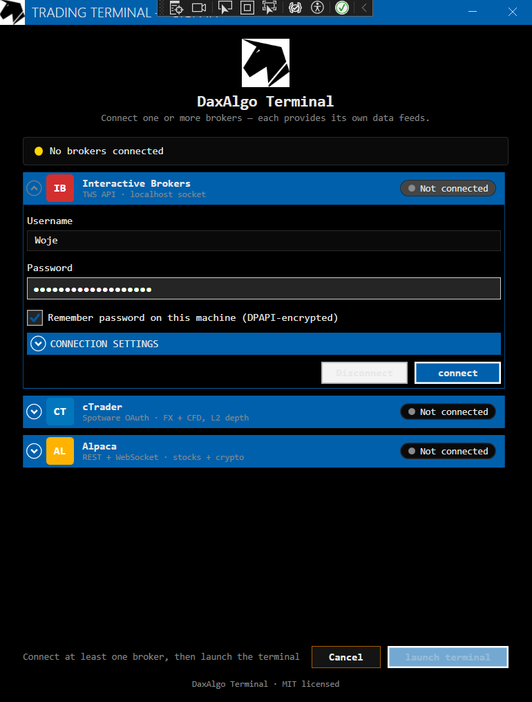
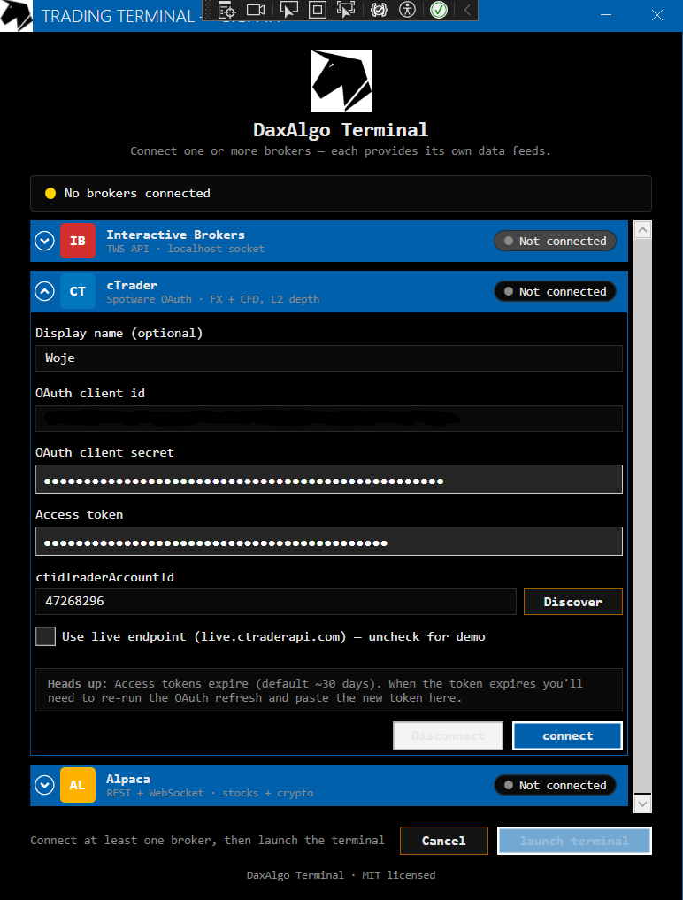
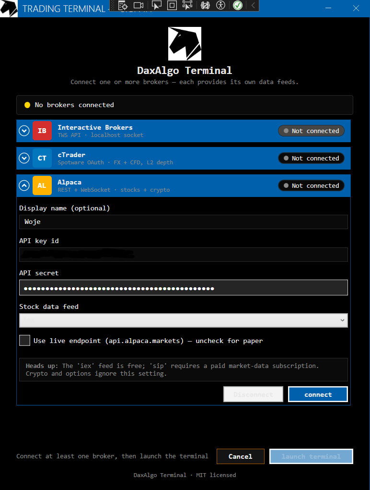

# Broker setup

> Last updated: 2026-06-19

The terminal speaks to seven account-based broker backends behind one `IBrokerClient` seam: **Interactive Brokers** (TWS API), **NinjaTrader 8** (`NTDirect.dll` P/Invoke), **cTrader** (Spotware Open API 2.0 over TLS+protobuf), **Alpaca** (REST + WebSocket via `Alpaca.Markets`), **Ironbeam** (futures FCM, REST + WebSocket API v2 — see [below](#ironbeam-futures-rest--websocket)), **London Strategic Edge** (free multi-asset data, API key only — see [below](#london-strategic-edge-free-multi-asset-data)), and **Upstox** (Indian markets, OAuth2, REST + WebSocket API v2/v3 — see [below](#upstox-indian-markets-oauth2)). It also ships five **keyless public crypto feeds** — **`Binance`** (see [below](#binance-public-market-data-no-key)) plus **Coinbase**, **Bybit**, **Kraken**, and **OKX** (see [below](#additional-crypto-venues-coinbase--bybit--kraken--okx)) — all real, live crypto data over each exchange's public WebSocket/REST with **no API key and no account** — and an in-process **`Simulated`** backend for fully-offline development (see [below](#simulated-offline-development)).

This doc covers how to set each one up. For the architectural rationale and per-broker quirks (callback shapes, threading, depth-of-market support), read [architecture.md](architecture.md). For symptoms / fixes when something goes wrong, see [troubleshooting.md](troubleshooting.md).

## Screenshots


| Interactive Brokers | cTrader | Alpaca |
|---|---|---|
|  |  |  |

> 🖼️ _Login-tile screenshots for NinjaTrader · Ironbeam · LSE · Upstox · Binance · Coinbase · Bybit · Kraken · OKX — coming soon_
> 🎬 _Video walkthrough (multi-broker login + Auto Connect) — coming soon_

## Capability matrix

| Broker | Transport | Real client status | Historical | Live ticks | L2 depth | Order routing |
|---|---|---|---|---|---|---|
| Interactive Brokers | TCP socket → `EClientSocket` | Wired when `CSharpAPI.dll` is found at build time | Real (`reqHistoricalData`) | Real (`reqMktData` L1) | `reqMktDepth` exists — not yet wired, throws | Not yet wired |
| NinjaTrader 8 | `NTDirect.dll` P/Invoke (ANSI) | Wired when `NTDirect.dll` is found at build time | Synthesized (NTDirect has no historical export) | Real, polled at 200 ms | Not exposed by NTDirect — out of scope | Real, via `NTDirect.Command(...)` |
| cTrader | TLS + protobuf to Spotware cloud | Always wired (NuGet package always restores) | Real (`ProtoOAGetTrendbarsReq`) | Real, push (`ProtoOASpotEvent`) | Real, push (`ProtoOASubscribeDepthQuotesReq`) | Real, via `ProtoOANewOrderReq` |
| Alpaca | REST (history) + WebSocket (live) | Always wired (NuGet package always restores) | Real (`HistoricalBarsRequest` / `HistoricalCryptoBarsRequest`) | Real, push (`IAlpacaDataStreamingClient`) | Not exposed by Alpaca — throws | Not yet wired |
| Ironbeam | REST + WebSocket API v2 (no SDK) | Always wired (plain HTTP/WS) | Not exposed by API v2 — returns empty | Real, push (`q` stream events) | Real, push (`d` stream events) | n/a (data/signals only) |
| London Strategic Edge | WebSocket (live) + PostgREST-style REST (history), no SDK | Always wired (plain HTTP/WS) | Real (`x_candles_{tf}` / `candles_{slug}` tables) | Real, push (`tick` messages) | Not in the feed — throws | n/a (data/signals only) |
| Binance | Public WebSocket + REST (no SDK) | Always wired — **no key, no account** | Real (`/api/v3/klines`) | Real, push (`@bookTicker`) | Real, push (`@depth{5\|10\|20}@100ms`) | n/a (data/signals only) |
| Coinbase / Bybit / Kraken / OKX | Public WebSocket + REST (no SDK) | Always wired — **no key, no account** (unverified against live) | Real (per-venue klines REST) | Real, push (per-venue ticker stream) | Real, push (per-venue book stream) | n/a (data/signals only) |
| Upstox | REST + WebSocket API v2/v3 (no SDK) | Always wired (plain HTTP/WS) | Real (`/v2/historical-candle/…`) | Real, push (V3 protobuf feed, `full` mode) | Real, push (5-level book from the same feed) | n/a (data/signals only) |
| Simulated | In-process, no SDK, no network | Always registered | Replay from local store | Synthetic random-walk **or** store replay | Supported (synthetic + replay) | n/a (data/signals only) |

There are **no per-broker synthetic fallbacks** — each real client is registered only when its SDK is available (IB/NT gated on a resolved DLL; cTrader/Alpaca always restore from NuGet), and a connect simply fails if the broker isn't reachable. To run with no broker at all, use the always-registered **`Simulated`** backend instead (see [below](#simulated-offline-development)).

## Interactive Brokers

### Prerequisites

- TWS or IB Gateway installed and signed in (paper or live).
- The TWS API package installed. The standard installer drops `CSharpAPI.dll` at `C:\TWS API\source\CSharpClient\client\bin\Release\net8.0\` and the build auto-discovers it from there.

### DLL resolution order

The `Infrastructure` csproj searches, in order:

1. `lib/CSharpAPI.dll` (or `lib/IBApi.dll` for older copies) at the repo root.
2. `$(TwsApiClientDll)` MSBuild property — `dotnet build -p:TwsApiClientDll="D:\path\CSharpAPI.dll"`.
3. `C:\TWS API\source\CSharpClient\client\bin\Release\net8.0\CSharpAPI.dll` — the standard installer location.

If any resolves, the build prints `IB CSharpAPI resolved from: <path>` and `RealIbClient` is compiled in (`HAS_IBAPI`). Otherwise IB simply isn't registered — there's no synthetic IB fallback; use the `Simulated` backend for an offline feed.

### TWS configuration

In **TWS → File → Global Configuration → API → Settings**:

- Enable ActiveX and Socket Clients.
- Read-Only API (recommended; the included strategies are read-only).
- Socket port: 7497 (TWS Paper) / 7496 (TWS Live) / 4002 (Gateway Paper) / 4001 (Gateway Live).
- Trusted IPs: add `127.0.0.1`.

### `appsettings.json` keys

```json
"InteractiveBrokers": {
  "Host": "127.0.0.1",
  "Port": 7497,
  "ClientId": 1,
  "AccountType": "Paper",
  "MarketDataType": 1
}
```

> The real IB client is wired purely at build time by DLL resolution (`HAS_IBAPI`); there's no longer a `UseRealClient` switch. To run without IB, use the `Simulated` backend (see [below](#simulated-offline-development)). The legacy `UseRealClient` key still present in `appsettings.json` is ignored.

`MarketDataType` accepts `1` (Live), `3` (Delayed, free, ~15 min lag), `4` (Delayed-Frozen). Switch to `3` if you see IB error 10089 ("requires additional subscription").

`ClientId` must be unique across every client connected to the same TWS (Excel sheets, Bookmap, another terminal instance). Pick something unlikely to collide if you run multiple clients.

### 2FA

TWS handles 2FA itself at sign-in time. The API socket has no separate 2FA step — once TWS is signed in, the terminal can connect freely. **Do not** wire 2FA into the terminal's login form.

## NinjaTrader 8

### Prerequisites

- NinjaTrader 8 installed and running.
- **Tools → Options → AT Interface → AT Interface enabled** ticked.
- `NTDirect.dll` available. The standard install puts it at `%USERPROFILE%\Documents\NinjaTrader 8\bin64\NTDirect.dll`.

### DLL resolution order

1. `lib/NTDirect.dll` at the repo root.
2. `$(NinjaTraderApiDll)` MSBuild property.
3. `%USERPROFILE%\Documents\NinjaTrader 8\bin64\NTDirect.dll`.

If any resolves, the build prints `NTDirect resolved from: <path>` and copies the DLL next to the output assembly so P/Invoke finds it.

### `appsettings.json` keys

```json
"NinjaTrader": {
  "AccountName": "Sim101",
  "DefaultFuturesContractMonth": "06-26"
}
```

`AccountName` is the NT account the client drives (default sim is `Sim101`). `DefaultFuturesContractMonth` is appended to bare futures symbols, e.g. `ES` becomes `ES 06-26`. Like IB, the NT client is wired purely by DLL resolution at build time (`HAS_NTAPI`) — the legacy `UseRealClient` key is no longer read.

### Known limitations

- **No historical bar API in NTDirect.** `RequestHistoricalBarsAsync` synthesizes a series anchored on the current `LastPrice` so charts have a baseline.
- **No L1 sizes via `Bid`/`Ask`.** `Tick.BidSize` and `Tick.AskSize` always come back as 0.
- **No L2.** NinjaTrader's depth-of-market lives behind NinjaScript SuperDOM, which isn't reachable from the AT Interface.

## cTrader

### Prerequisites

- A cTrader-compatible broker account (FXCM, Pepperstone, IC Markets, etc.).
- An OAuth app registered at [connect.spotware.com/apps](https://connect.spotware.com/apps).

### One-time OAuth setup

1. Register an app at [connect.spotware.com/apps](https://connect.spotware.com/apps). Note the **Client ID** and **Client Secret**.
2. Run the OAuth flow ([Spotware docs](https://help.ctrader.com/open-api/account-authentication/)) to get an **access token** for your trading account.
3. Find your **ctidTraderAccountId** by sending `ProtoOAGetAccountListByAccessTokenReq` with the access token (or check the Spotware portal).
4. Paste the four values into the cTrader form on the login screen.

### `appsettings.json` keys

```json
"CTrader": {
  "Host": "demo.ctraderapi.com",
  "Port": 5035,
  "IsLive": false
}
```

The credentials themselves are not in `appsettings.json` — they are entered on the login form and stored DPAPI-encrypted at `%LOCALAPPDATA%\DaxAlgoTerminal\connection.json`.

### Token expiry

Access tokens expire after ~30 days. The first sign that this has happened is a `ProtoOAErrorRes` immediately on connect — re-run the OAuth refresh and paste the new token into the login form.

## Alpaca

### Prerequisites

- An Alpaca account (paper is free at [app.alpaca.markets](https://app.alpaca.markets); live needs a funded account at [/live](https://app.alpaca.markets/live)).

### Minting the API key

- Paper: dashboard → *Paper trading → API keys → Generate*. Key id starts with `PK…`.
- Live: dashboard → *API keys → Generate*. Key id starts with `AK…`.

Paste both into the Alpaca tile on the login screen. Tick **Use live endpoint** for the funded environment; leave unticked for paper. Pick the stock data feed (`iex` is free; `sip` requires a paid market-data subscription).

### `appsettings.json` keys

```json
"Alpaca": {
  "ApiKey": "",
  "ApiSecret": "",
  "IsLive": false,
  "StockDataFeed": "iex"
}
```

`ApiSecret` is DPAPI-encrypted on disk — the login form is the normal entry path; the `appsettings.json` value is only there as a fallback for headless setups.

### Asset-class routing

`Contract.SecType` drives routing inside `RealAlpacaClient`:

- `STK` / `STOCK` / `EQUITY` → stock REST + streaming clients.
- `CRYPTO` / `CRYPTOCURRENCY` → crypto REST + streaming clients.
- Anything else → `NotSupportedException`. Alpaca options are not yet wired (the SDK's options surface is still stabilising); route options through IB.

### Limitations

- **No L2 depth.** Alpaca only exposes L1 NBBO quotes; `SubscribeDepthAsync` throws `NotSupportedException`. Use IB (when wired) or cTrader for L2.
- **Credentials are mandatory.** Like every real broker, Alpaca has no synthetic fallback — to run without credentials, use the `Simulated` backend below.

## Ironbeam (futures, REST + WebSocket)

`BrokerKind.IronBeam` (`RealIronBeamClient`, in `Infrastructure/IronBeam/`) talks to the Ironbeam
FCM's **API v2** — plain REST + WebSocket, no SDK (just `HttpClient` + `ClientWebSocket` +
`System.Text.Json`, like Binance). Docs: <https://docs.ironbeamapi.com/>.

**Connection flow:** `POST {base}/auth` (`username` + API key as the `password` field) → JWT token →
`GET {base}/stream/create` → one multiplexed WebSocket at
`wss://{host}/v2/stream/{streamId}?token={token}`. Quotes / depth / trades are then enabled per
symbol via REST `GET /market/{quotes|depths|trades}/subscribe/{streamId}?symbols=…`
(**max 10 symbols per stream**). On a drop the client re-auths, creates a fresh stream, re-issues
every active subscription, and backs off 1 s → 30 s — live `IAsyncEnumerable` consumers keep
streaming across reconnects.

| Channel | Ironbeam endpoint / event |
|---|---|
| L1 quotes | `q` events on the stream |
| L2 depth | `d` events (bid/ask level arrays) |
| **Trade tape** | `tr` events — per-print price/size/direction (the second tape-capable broker after IB) |
| Historical bars | not exposed by API v2 REST — returns empty (bars aggregate downstream from ticks) |
| Order routing | n/a (data/signals only) |

**Symbols** use Ironbeam's `EXCHANGE:SYMBOL.MonthCodeYY` format (e.g. `XCME:ES.U16`). A
`Contract.Symbol` containing `:` passes through verbatim; otherwise the client composes
`{Exchange|XCME}:{Symbol}` — supply the fully-qualified symbol for a specific expiry.

```jsonc
"IronBeam": {
  "Username": "",
  "ApiKey": "",                       // sent as the auth "password" (non-Enterprise accounts)
  "IsLive": false,                    // false → demo.ironbeamapi.com, true → live.ironbeamapi.com
  "BaseUrlOverride": "",              // pin a different host/version without a rebuild
  "ReconnectInitialDelaySeconds": 1,
  "ReconnectMaxDelaySeconds": 30
}
```

The login tile takes Username + API key (DPAPI-encrypted on disk, like Alpaca's secret) and a
demo/live toggle.

## London Strategic Edge (free multi-asset data)

`BrokerKind.LondonStrategicEdge` (`RealLondonStrategicEdgeClient`, in
`Infrastructure/LondonStrategicEdge/`) streams free multi-asset market data — US/intl stocks, 80+
FX pairs, crypto, commodities, indices, ETFs (~16,000 instruments) — from
<https://londonstrategicedge.com>. No SDK (plain `ClientWebSocket` + `HttpClient`); the only
credential is a free API key from <https://londonstrategicedge.com/websockets>.

**Connection flow:** open `wss://data-ws.londonstrategicedge.com`, send
`{"action":"auth","api_key":…}`, wait for `{"type":"authenticated"}`, then
`{"action":"subscribe","symbol":…}` per instrument — every update arrives as a
`{"type":"tick", symbol, price, bid, ask, volume, ts, replay}` message on the one socket. A
keepalive `{"action":"ping"}` goes out every 25 s (server idle timeout 600 s). On a drop the
client reconnects with 1 s → 30 s backoff, re-auths, and re-subscribes; **fatal** errors
(`INVALID_KEY` / `MISSING_KEY` / `QUOTA_EXCEEDED`) stop the pump and surface as `Failed` instead
of retry-looping — `QUOTA_EXCEEDED` means the 50 GB/month free tier is exhausted for the month.

| Channel | LSE endpoint / message |
|---|---|
| L1 ticks | `tick` messages on the socket (bid/ask nullable — degrades to last-price-as-both-sides) |
| Historical bars | PostgREST-style REST at `api.londonstrategicedge.com/iso` — shared `x_candles_{5m,15m,1h,4h,1d}` tables (`symbol=eq.…` filter), per-symbol `candles_{slug}` tables for 1m (`d_candles_{slug}` fallback), key in `x-api-key`, 5,000 rows/call |
| L2 depth | not in the feed — throws `NotSupportedException` |
| Trade tape | **deliberately not wired** — the tick stream carries price+volume but is unverified as true per-print trades; verify against IB tape on a liquid symbol before enabling |
| Instrument discovery | keyless `feed-catalog.json` (`{symbol,name,category}`) → `ListInstrumentsAsync` |
| Order routing | n/a — the provider has no order path at all |

**Symbols** are LSE-native: plain tickers for stocks/ETFs (`AAPL`), slash pairs for FX/crypto
(`EUR/USD`, `BTC/USD`). A bare 6-letter `CASH` contract is auto-split (`EURUSD` → `EUR/USD`);
everything else passes through verbatim.

```jsonc
"LondonStrategicEdge": {
  "ApiKey": "",                       // lse_live_… — free, from londonstrategicedge.com/websockets
  "WsUrl": "wss://data-ws.londonstrategicedge.com",
  "RestBaseUrl": "https://api.londonstrategicedge.com/iso",
  "CatalogUrl": "https://londonstrategicedge.com/feed-catalog.json",
  "PingIntervalSeconds": 25,
  "ReconnectInitialDelaySeconds": 1,
  "ReconnectMaxDelaySeconds": 30
}
```

The login tile takes just the API key (DPAPI-encrypted on disk, like the other secrets). Mind the
shared quota: streaming many symbols all day plus heavy history pulls draw from the same
50 GB/month allowance (REST is additionally capped at 100 calls/min).

## Binance (public market data — no key)

`BrokerKind.Binance` (`RealBinanceClient`, in `Infrastructure/Binance/`) streams real, live crypto market data from Binance's **public** WebSocket + REST endpoints. These need **no API key and no account**, so it's the zero-credential way to run the terminal against a real feed — ideal for demos and first-run evaluation. It's always registered (no SDK or NuGet dependency — just `ClientWebSocket` + `HttpClient` + `System.Text.Json`).

On the login screen it shows as a **Binance (no login)** tile with no fields — just click **Connect**. It carries the full data surface for crypto pairs:

| Channel | Binance stream / endpoint |
|---|---|
| L1 ticks | `<symbol>@bookTicker` |
| L2 depth | `<symbol>@depth{5\|10\|20}@100ms` (partial-book snapshots — no reconstruction needed) |
| Trade tape | `<symbol>@trade` (the `m` maker flag maps to the aggressor side) |
| Live bars | `<symbol>@kline_<interval>` |
| Historical bars | REST `GET /api/v3/klines` |

So unlike the equity backends, Binance gives the order book / footprint / 3D cube strategies real depth + trade flow with zero setup.

### `appsettings.json` keys

```json
"Binance": {
  "RestBaseUrl": "https://api.binance.com",
  "WsBaseUrl": "wss://stream.binance.com:9443",
  "Instruments": [ "BTCUSDT", "ETHUSDT", "SOLUSDT", "BNBUSDT", "XRPUSDT" ],
  "SizeScale": 1000.0
}
```

- **`Instruments`** — curated symbols (Binance native form, no slash) shown in the picker. Subscriptions accept any valid Binance symbol regardless.
- **`SizeScale`** — crypto quantities are fractional but the canonical size fields are integers (`long`); every size (quote/depth/bar volume) is multiplied by this and rounded so the order-book / footprint views stay non-zero and comparable. Purely a relative-size scale.

### Geo-blocking

The global `api.binance.com` / `stream.binance.com` hosts are unavailable in some regions (notably the US). If `Connect` fails with a reachability error, point the two base URLs at an accessible host:

- **Binance.US**: `https://api.binance.us` + `wss://stream.binance.us:9443`
- **Data-only mirror**: `https://data-api.binance.vision` + `wss://data-stream.binance.vision`

### Limitations

- **Crypto only.** Binance is a crypto exchange — no equities/futures/FX. For real equity data use IB or Alpaca; for FX/CFD with L2 use a free cTrader demo.
- **Data only.** No order path (the whole build is data/signals only). Live bars come from the kline stream; `RequestHistoricalBarsAsync` pulls up to 1000 klines per call.

## Additional crypto venues (Coinbase / Bybit / Kraken / OKX)

Alongside Binance, the terminal ships four more **keyless public crypto feeds** — **Coinbase**, **Bybit**, **Kraken**, and **OKX** — each behind its own `IBrokerClient` in `Infrastructure/{Coinbase,Bybit,Kraken,Okx}/`. Like Binance they need **no API key and no account**: each connects to the exchange's public WebSocket for live ticks / L2 depth / trade tape and its public REST endpoint for historical klines. They're registered as ordinary brokers, so everything downstream (ingest → hub → strategies/tools/store) treats them identically.

> ⚠️ **Unverified against live.** These four were added quickly to broaden crypto coverage; their endpoint paths, symbol formats, and message decoding have **not yet been verified against each exchange's live feed**. Treat them as experimental until confirmed — Binance is the battle-tested keyless path.

- **Crypto only**, **data/signals only** (no order path), same as Binance.
- Per-venue symbol formats differ (e.g. `BTC-USD` on Coinbase, `BTCUSDT` on Bybit/OKX, `XBT/USD` on Kraken); the curated picker entries use each venue's native form.
- Geo-availability and rate limits are the exchange's own; a connect simply fails if the venue is unreachable.

> 🖼️ _Screenshots — coming soon_
> 🎬 _Video walkthrough — coming soon_

## Simulated (offline development)

`BrokerKind.Simulated` is an in-process `IBrokerClient` (`SimulatedBrokerClient`, in `Infrastructure/Simulation/`) with **no broker and no network** — it's always registered, alongside the four real backends. It exists so the whole app (ingest → hub → strategies/tools) can run fully offline. Unlike the real backends it supports **both trade tape and L2 depth** in either mode.

It's not shown as a login tile; it's wired up by the dev launch profiles (`DOTNET_ENVIRONMENT` = `DevSim` / `DevReplay`), which skip login and auto-connect it. Two feed modes, set by `SimulatedBroker:Mode`:

| Mode | What it does |
|---|---|
| `Synthetic` (default) | Deterministic seeded random-walk generated in-process. Needs no recorded data. Lists the instruments in `SimulatedBroker:Instruments`. |
| `Replay` | Streams recorded data out of the local market-data store on a speed-scaled clock (`SpeedMultiplier`), re-emitting it as if live. Lists whatever the store holds; falls back to the synthetic feed for any instrument/stream with no data, so a window is never empty. |

See [configuration.md](configuration.md#simulatedbroker) for the full key reference and [getting-started.md](getting-started.md#dev-launch-profiles-skip-login-run-offline) for the launch profiles.

## Upstox (Indian markets, OAuth2)

`BrokerKind.Upstox` (`RealUpstoxClient`, in `Infrastructure/Upstox/`) streams Indian-market data —
NSE/BSE equities and indices — from the Upstox API v2/v3. No SDK (plain `ClientWebSocket` +
`HttpClient`); auth is OAuth2 authorization-code. Docs:
<https://upstox.com/developer/api-documentation/>.

**Auth flow (in the login tile):** **Authorize** opens
`/v2/login/authorization/dialog?client_id=…&redirect_uri=…&response_type=code` in the browser; after
signing in, paste the one-time `code` from the redirected URL and click **Get access token**, which
`POST`s `/v2/login/authorization/token` (`IUpstoxAuthService`) to obtain the token. Tokens **expire
daily (~03:30 IST)**, so the Authorize → Get token step repeats each trading day.

**Live feed:** `GET /v3/feed/market-data-feed/authorize` returns an authorized `wss://` URL; the
client connects, sends a **binary** JSON subscribe (`{method:"sub",data:{mode:"full",instrumentKeys:[…]}}`),
and decodes the binary **protobuf `FeedResponse`** frames with `UpstoxFeedDecoder` (a hand-rolled
wire-format walker over the already-referenced `Google.Protobuf` runtime — no `Grpc.Tools` build
step). On a drop the single pump re-authorizes, reconnects, and re-subscribes with 1 s → 30 s
backoff.

| Channel | Upstox endpoint / message |
|---|---|
| L1 ticks | top-of-book from the V3 protobuf feed (`full` mode); falls back to LTP-as-both-sides for indices |
| L2 depth | 5-level book from the same feed (`MarketLevel.bidAskQuote`) |
| Historical bars | REST `GET /v2/historical-candle/{key}/{interval}/{to}/{from}` (1minute / 30minute / day) |
| Trade tape | **not available** — the feed carries LTP + book, not per-print flow; throws `NotSupportedException`, ingest falls back to the synthetic L1 tick rule |
| Instrument discovery | downloadable NSE master (`assets.upstox.com/.../NSE.json.gz`), filtered to cash equities + indices, cached per session |
| Order routing | n/a — data/signals only |

**Symbols** are Upstox **instrument keys** (`segment|identifier`, e.g. `NSE_EQ|INE002A01018`,
`NSE_INDEX|Nifty 50`). Picker rows carry the full key in `Contract.Symbol`; a bare symbol is
best-effort composed as `NSE_EQ|{symbol}`.

```jsonc
"Upstox": {
  "ApiKey": "",        // app API key (client id) from developer.upstox.com
  "ApiSecret": "",     // app API secret (code→token exchange only)
  "RedirectUri": "",   // must match the app's registered redirect URI exactly
  "AccessToken": "",   // filled by the login form's Get-token step; expires daily ~03:30 IST
  "BaseUrl": "https://api.upstox.com",
  "ReconnectInitialDelaySeconds": 1,
  "ReconnectMaxDelaySeconds": 30
}
```

> **Protobuf field-number caveat:** `UpstoxFeedDecoder` targets the field numbers from Upstox's
> published V3 schema; they haven't been verified against a live session in this build. Unknown
> fields are skipped (so a partial mismatch degrades gracefully rather than throwing). If the feed
> ever decodes to empty L1/depth despite traffic, re-check the numbers against the current
> `MarketDataFeedV3.proto`.

## Secrets and persistence

| Secret | Where it lives |
|---|---|
| IB password | DPAPI-encrypted in `%LOCALAPPDATA%\DaxAlgoTerminal\connection.json`. |
| cTrader OAuth secret + access token | Same file. |
| Alpaca API secret | Same file. |
| Upstox API secret + access token | Same file (API key + redirect URI in plain text alongside). |
| AI Analyst provider API key | DPAPI-encrypted in `%LOCALAPPDATA%\DaxAlgo Terminal\notifications.json` (different folder — see [ai-analyst.md](ai-analyst.md)). |
| Notification tokens (Telegram bot, Discord webhook URL) | Plain text in `%LOCALAPPDATA%\DaxAlgo Terminal\notifications.json`. These are low-trust secrets — the bot can only post to one chat, the webhook to one channel. |

DPAPI scope is `DataProtectionScope.CurrentUser` — secrets are only readable by the same Windows user on the same machine. Copying the file to another user / machine renders the ciphertext unusable.
