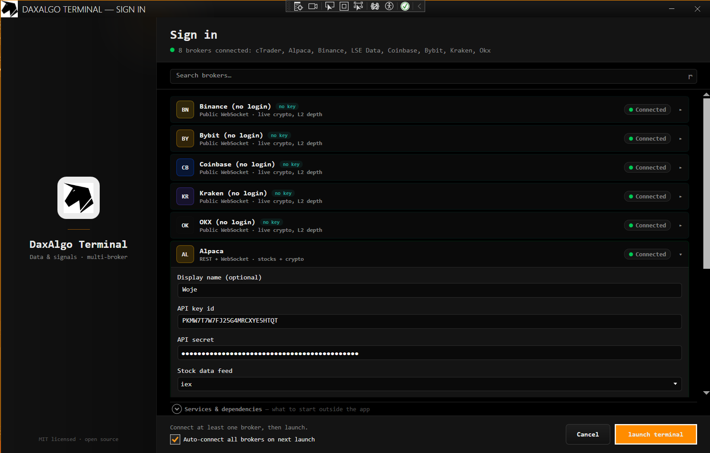
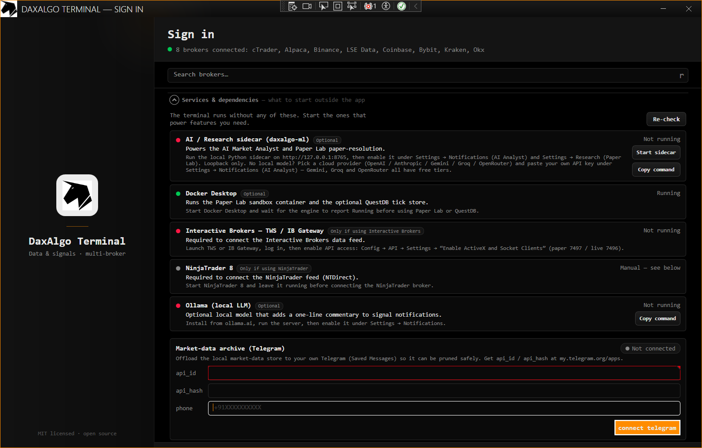

# Getting started

> Last updated: 2026-06-30

The shortest path from a clean clone to a running shell — on **either** build (Windows/WPF or
Linux/Avalonia). For broker-specific configuration after the first launch, see
[brokers.md](brokers.md). For the daily-use walkthrough, see [user-guide.md](user-guide.md).

## Prerequisites

| Tool | Version / notes |
|---|---|
| **.NET SDK** | 9.x. (Only the .NET 9 SDK is needed — no .NET 8.) |
| **Git** | any recent version |
| **OS** | **Windows 10/11** for the WPF build, **or** Linux / Raspberry Pi (ARM64) for the Avalonia build. The Avalonia build also runs on Windows. |

You do **not** need any broker account to build and run. Two zero-credential paths give you data out
of the box:

- **`Binance` (real, live data)** — the **Binance (no login)** tile streams real crypto bars / L1 /
  **L2 depth** / trades over Binance's public WebSocket with no API key and no account. Just click
  Connect. (Crypto only; geo-blocked regions repoint the host — see
  [brokers.md](brokers.md#binance-public-market-data-no-key).)
- **`Simulated` (fully offline)** — an in-process synthetic random-walk feed, or replay of your local
  store; no network, no Docker. The quickest offline launch is the **`Dev: Simulated (offline)`**
  profile below, which skips login entirely.

The account-based broker tiles (IB, NinjaTrader, cTrader, Alpaca, Ironbeam, London Strategic Edge,
Upstox, and the other crypto venues) connect once their credentials are filled in — see
[brokers.md](brokers.md).

Optional, only if you want the matching feature:

- **Docker Desktop** — for the PostgreSQL + TimescaleDB or QuestDB market-data backends, and for
  **Paper Lab**'s sandbox. SQLite is the default and needs nothing.
- **TWS API** (`CSharpAPI.dll`) — for the real Interactive Brokers client. Auto-discovered from
  `C:\TWS API\…`.
- **NTDirect.dll** — for the real NinjaTrader 8 client (Windows only). Auto-discovered from
  `%USERPROFILE%\Documents\NinjaTrader 8\bin64\`.

## Clone and build

```powershell
git clone https://github.com/dhruuvsharma/DaxAlgo-Terminal.git
cd "DaxAlgo Terminal"
```

There are **two solutions** — always name the one you want (there is no bare `dotnet build`).

**Windows (WPF):**

```powershell
dotnet build TradingTerminal.Windows.slnx
```

**Linux / Raspberry Pi (Avalonia):**

```bash
dotnet build TradingTerminal.Linux.slnx
```

A successful Windows build prints, when applicable, `IB CSharpAPI resolved from: <path>`
(`HAS_IBAPI`) and `NTDirect resolved from: <path>` (`HAS_NTAPI`) — confirming the real IB / NT clients
compiled in. cTrader and Alpaca are always compiled in (NuGet packages, no DLL gate).

## Run

**Windows (WPF)** ships as **three editions** — three fully independent shell exes over the same
platform libraries. There is **no shared shell code** between them (same philosophy as the
Windows/Linux tree fork): each project carries its own complete copy of the shell, so lower tiers
physically exclude the higher-tier feature DLLs from their output.

| Edition | Project | Brokers | Tools |
|---|---|---|---|
| **Basic** | `TradingTerminal.App.Basic` | Keyless only — Binance / Coinbase / Bybit / Kraken / OKX / Simulated (no credential forms on the login screen) | Full strategies catalog, core charts (Charts / Order book / Footprint / Bookmap), core tools (Backtest Studio / Recorder / Correlation / Advanced regime), archive, notifications, Theme Studio |
| **Intermediate** | `TradingTerminal.App.Intermediate` | **All 12** + Simulated, full credentialed login (IB / NT / cTrader / Alpaca / Ironbeam / LSE / Upstox) | Same tool set as Basic |
| **Professional** | `TradingTerminal.App` | All | Everything — adds the Machine Learning menu, AI tools (incl. Paper Lab + managed Python sidecar), LSE Tools, QuantConnect / LEAN, 3D Surface Lab and the experimental bubble chart |

```powershell
dotnet run --project src/windows/Shell/TradingTerminal.App                # Professional
dotnet run --project src/windows/Shell/TradingTerminal.App.Basic         # Basic
dotnet run --project src/windows/Shell/TradingTerminal.App.Intermediate  # Intermediate
```

The `Simulated` broker ships in **every** edition; whenever it is connected, every window shows a
persistent amber **“SIMULATED DATA — not a live feed”** banner so a synthetic feed is never mistaken
for a live one.

**Linux / Raspberry Pi (Avalonia):**

```bash
dotnet run --project src/linux/Shell/TradingTerminal.App.Avalonia
```

The **login window** opens with broker tiles. Connect one or more (sessions are concurrent), and the
main shell opens. Tick **Auto Connect** to have every broker with saved credentials connect
automatically on future launches.



The **Services & external dependencies** expander lists every optional external launch (Python
sidecar, Docker, IB TWS, NinjaTrader, Ollama) and probes whether each is running, with a copy-command
and re-check button — so you know exactly what's needed before you connect.



🎬 **Video walkthrough:** [`images/video/login-window.mp4`](../images/video/login-window.mp4) —
all available brokers, the services panel, and launching the terminal.

### Dev launch profiles (skip login, run offline) — Windows

For development the fastest path is a launch profile that bypasses login and auto-connects the
`Simulated` broker. Each edition shell defines its own profiles in its
`Properties/launchSettings.json`; each is selected by `DOTNET_ENVIRONMENT`, which layers an
`appsettings.{Env}.json` (repo root) over `appsettings.json`. The Professional profiles:

| Profile | `DOTNET_ENVIRONMENT` | Behaviour |
|---|---|---|
| `App (Login)` | *(none)* | Normal — login window shown. |
| `Dev: Simulated (offline)` | `DevSim` | No login; `Simulated` broker, **Synthetic** random-walk. Fully offline (SQLite, no Docker/network). |
| `Dev: Replay (local DB)` | `DevReplay` | No login; `Simulated` broker, **Replay** of the local store (10× clock), synthetic fallback where no data. |
| `Dev: Live (no login)` | `DevLive` | No login; auto-connects a real broker (default IB) using saved credentials. |

Basic and Intermediate carry the same profiles prefixed with their edition name — except Basic has
no `DevLive` (the credentialed brokers it would auto-connect are not registered in that edition).

Pick one from the Visual Studio debug-target dropdown, or set the environment from the shell:

```powershell
$env:DOTNET_ENVIRONMENT = "DevSim"; dotnet run --project src/windows/Shell/TradingTerminal.App
```

Then double-click any strategy card in the catalog to open it and watch ticks flow. These dev files
are off in the shipped build. See [configuration.md](configuration.md#dev-launch-profiles) for the
`Dev` / `SimulatedBroker` keys.

## Repo layout (at a glance)

The repo holds **two independent trees** (see
[architecture.md](architecture.md#two-independent-trees)):

```
DaxAlgo Terminal/
├── src/
│   ├── windows/                      Windows / WPF tree  (TradingTerminal.Windows.slnx, net9.0-windows7.0)
│   │   ├── Core/ Pipeline/ Shell/    Core · MarketData + Infrastructure · UI + Login + App
│   │   ├── Charts/ Tools/ AI/        tool, chart, regime, AI and QuantConnect windows
│   │   ├── MachineLearning/          the ML windows (Windows-only)
│   │   ├── Strategies/               12 per-strategy projects
│   │   └── Sdk/                      DaxAlgo SDK for plugins (Windows-only)
│   └── linux/                        Linux / Avalonia tree (TradingTerminal.Linux.slnx, net9.0)
│       └── …                         same layout, App.Avalonia shell, no Charts(WebView2)/ML/SDK
├── tests/                            Windows tests + tests/linux/ for the Avalonia tree
├── tools/
│   ├── cpp-backtester/               C++ tick backtester (subprocess sidecar)
│   └── python-ml/                    Python AI / Paper Lab sidecar (FastAPI)
├── docs/                             this folder
├── images/                          screenshots (see docs/MEDIA-CHECKLIST.md)
├── scripts/                          boilerplate generators
└── appsettings.json                 default configuration
```

The full project graph and layering rules are in [architecture.md](architecture.md).

## What to read next

- New user wanting to use the app → [user-guide.md](user-guide.md) (the full menu tour).
- Configuring a real broker → [brokers.md](brokers.md).
- Understanding the strategies → [strategies.md](strategies.md) and [math-reference.md](math-reference.md).
- Tuning configuration → [configuration.md](configuration.md).
- Adding a feature → [contributing.md](contributing.md), then [architecture.md](architecture.md) for
  the constraints you must not break.
