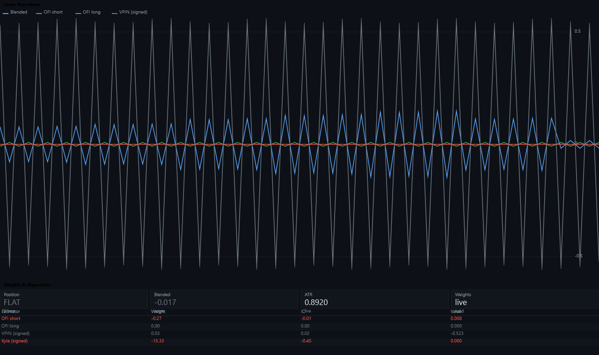
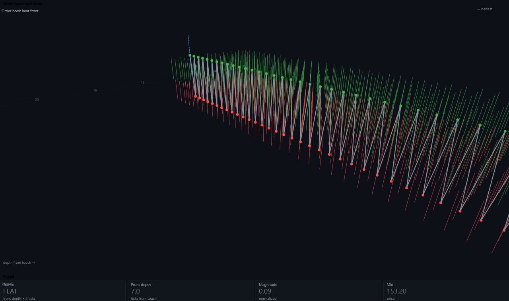
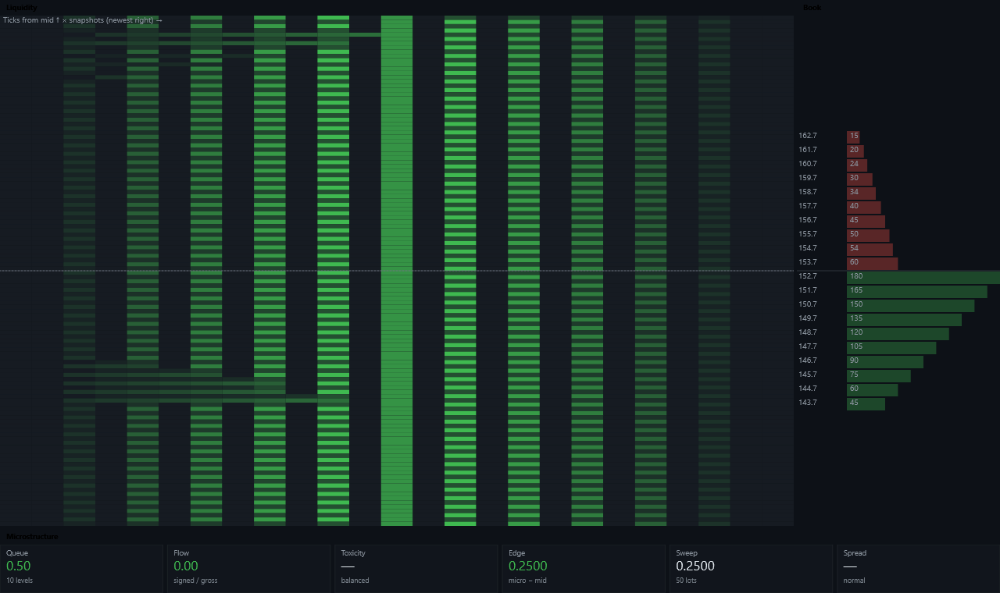
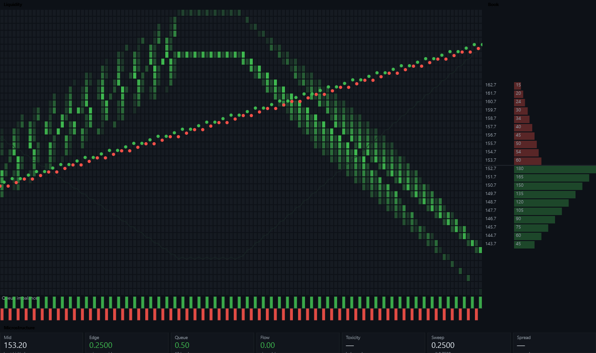
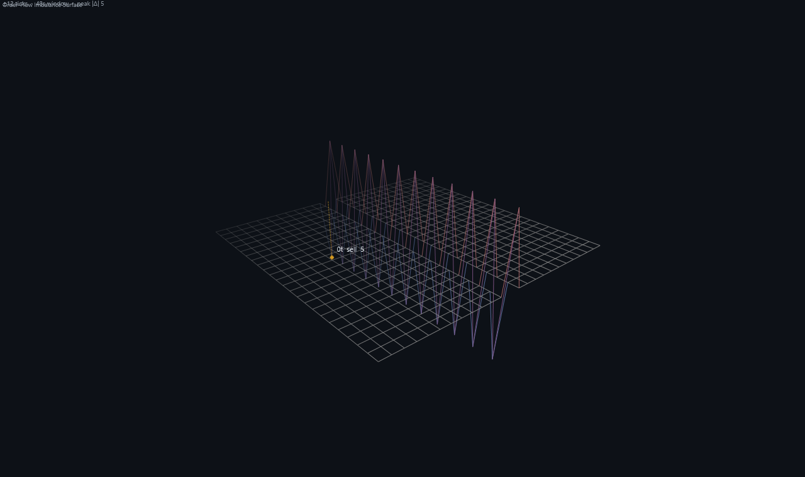
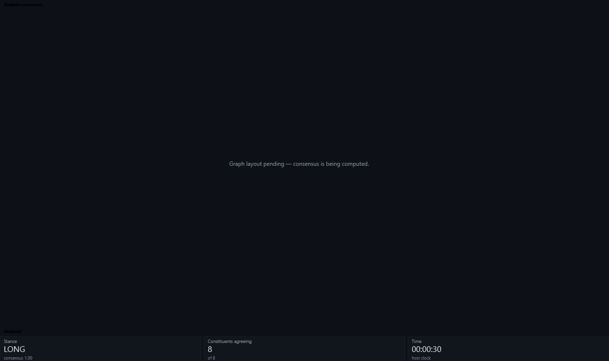

# Hyperion against the six hand-written windows

The goal names six windows as the bar: three strategies (SigmaIcFlow, ImbalanceHeatFront,
IndexRegimeGraph) and three visualizers (VolumeFootprint, OrderBook, a 3D surface graph). Each was
driven from **one line** of brief, on `minimax/minimax-m3:free` via OpenRouter, Standard effort.

Screenshots are in `docs/shots/`, and they are the point of this document — every claim below is
readable off one. They are rendered through `AuthoredUnitLayoutHost`, the control the real window uses,
after `SyntheticDrive` has fed the unit depth, a tape and 120 bars, so the picture is of a unit that has
actually seen data. The hand-written OrderBook window is rendered the same way, as a control.

## Results

| Window | Lines | Gens | Time | Ladder | Picture |
|---|---:|---:|---:|---|---|
| **SigmaIcFlow** | 584 | 2 | 27 m | **all 4** ✓ | blend + live weight table |
| **ImbalanceHeatFront** | ~560 | 1 | 27 m | **all 4** ✓ | a real 3D heat front |
| **IndexRegimeGraph** | ~330 | 3 | 5 m | **SchemaCoherence ✗** | empty — see below |
| **OrderBook** | ~380 | 2 | 11 m | 3 of 3 ✓ | heatmap · ladder · tiles |
| **SurfaceGraph** | ~350 | 2 | 13 m | 3 of 3 ✓ | 3D heightmap, peak marked |
| **VolumeFootprint** | — | 3 | 18 m | **did not compile** | — |

Four of six produce a window that clears every rung the ladder can apply. Two strategies also cleared
**Replay**, meaning they took positions on their own book.

## The pictures

**SigmaIcFlow** — the blend against its four components, and a live table of estimator / weight / IC /
value. The tile strip and the table collide; that is the panel-sizing finding below.



**ImbalanceHeatFront** — a real 3D heat front, projected per vertex and depth-ordered. Its title is
drawn twice, which is the harness finding below.



**OrderBook**, then the hand-written window it is measured against:





**SurfaceGraph** — a 3D heightmap with its largest spike marked, and **IndexRegimeGraph**, whose graph
panel is empty because the drive supplies one instrument:





## What is genuinely good

**SigmaIcFlow implemented the technique, it did not paraphrase it.** From its own header:

> *"for estimators v with sample covariance Σ and information-coefficient vector IC against the
> realised return, the linear combination with greatest IC per unit variance solves Σ · w = IC.
> Ledoit-Wolf shrinkage … keeps the solve from blowing up when two estimators are near-collinear —
> which is exactly the case for OFI at two speeds, and is why this kernel ships two: the matrix
> discovers the redundancy and discounts it rather than doubling up."*

That last clause is reasoning about its own design. The window shows the blend against its four
components with a legend, and a live table of estimator / weight / IC / value — the brief asked it to
"show the weights it chose", and it does.

**ImbalanceHeatFront and SurfaceGraph both built real 3D scenes**, using the `Projection3` maths that
shipped hours earlier: camera, per-vertex projection, `InFront` culling, painter's-algorithm ordering.
The surface graph marks its largest spike and labels it. Neither was told how.

## What is wrong, and whose fault it is

### The model's

- **`IndexRegimeGraph` declared `timeframe1/2/3` and never read them.** Rung 5 caught it, which is why
  rung 7 never ran.
- **Panels sized too small for the widget in them.** `SigmaIcFlow` gives its tile strip
  `SplitTop(40d)`; a `Tile` needs about 50 for label plus value, so the values collide with the table
  beneath. Every rung passes — the primitives are inside a panel, finite and theme-coloured. **Nothing
  automated can see this**, which is the argument for screenshots.
- **Camera framing is not fitted to the data.** Both 3D scenes drift out of the panel rather than
  filling it.

### The harness's

- **A doubled panel title on `ImbalanceHeatFront`** — "Order book heat front" printed twice, once by
  the host and once by the unit.

  I first wrote this up as my own regression on *both* strategies, and re-reading the screenshots to fix
  it showed **both halves of that were wrong**. `SigmaIcFlow` has one title per panel; what looks like
  doubling there is the tile-strip collision described above. And the exemplar I blamed,
  `DepthLandscapeVisualizer`, is only ever selected for *visualizer* briefs — both of these are
  strategies, so both got `MovingAverageCrossKernel`, which models the correct shape.

  The real mechanism is subtler and worse. All three layout-declaring exemplars split each panel into
  two overloads: `Draw` opens one panel and delegates to `DrawChart(surface, area)`, while the layout
  binds the one-line `DrawChart(surface)`. That split is what keeps the scope out of the panel callback,
  and **a model that collapses the two overloads into one moves the scope into the callback** — which is
  precisely the "copies the skeleton, drops the detail" behaviour the crosshair experiment measured.

  So this is not fixable by editing an exemplar; it was already correct. Rung 7 now checks the other
  direction — `draw.no-panel` when `Draw` opens none, `draw.double-panel` when a layout callback opens
  one — because the host's ownership of that region is a fact the ladder can check and prose cannot
  enforce.
- **`IndexRegimeGraph` cannot be measured here at all.** `SyntheticDrive` supplies **one instrument**,
  and the strategy needs index constituents, so its graph panel reads "Graph layout pending" forever.
  Same category as the frozen clock and the missing depth/tape before it: a drive that cannot reach the
  code cannot be evidence about the code.

### The teaching's — and this is the biggest finding

**`VolumeFootprint` failed to compile on `FeedQuality.Partial` / `.Complete`, members that do not
exist.** Chasing it found something systematic:

> **Not one market-data type is taught.** `OhlcvBar`, `Quote`, `TradePrint`, `DepthSnapshot`,
> `DepthLevel`, `FootprintBar` — **zero** of them appear in the generated surface.

`SdkSurfaceGenerator` reflects `typeof(IStrategyKernel).Assembly` — `DaxAlgo.Sdk` alone. Every one of
those types lives in `TradingTerminal.Core`, so a unit is shown the *signature*
`OnBarAsync(OhlcvBar bar, …)` and never told what an `OhlcvBar` contains.

It has been getting away with it because `bar.Close`, `quote.Bid` and `depth.Bids[i].Price` are
guessable. `FootprintBar` is not — and `Footprint.Draw(surface, IReadOnlyList<FootprintBar> bars)` is
printed in the surface, so the library asks for a type the surface never defines. The model reached
into `TradingTerminal.Core.MarketData` (which the compiler's ambient usings make *resolvable* though
not *taught*), guessed a neighbouring type, and invented its members.

The error it got — "`FeedQuality` does not contain a definition for `Partial`" — is worse than "no such
type", because it reads as though the type was the right choice.

Enums that *are* in the surface do list their members, so this is not a formatting gap. It is a
reflection-scope gap.

### Fixed, and re-run to prove it

`SdkSurfaceGenerator` now derives the Core types the SDK's own signatures hand to a unit, walking to a
**fixed point** — because printing a type prints its members, and a single pass taught `DepthSnapshot`
while omitting the `DepthLevel` its `Bids` return, which is the same defect one level down. 21 types are
taught, `FeedQuality` among them, for 9,950 unrationed characters.

Two rules keep that affordable. A handed-in type **sits where its referrer put it**, so `FootprintBar`
rides in the rationed drawing library beside the widget that takes it while anything a *contract*
mentions is never cut. And **Core's doc comments are not prompt copy**: the SDK is documented knowing a
model reads it, Core is documented for Core's maintainers, so `BrokerKind` arrived spending 4,501
unrationed characters on 47 venue names — one of which explains why an obsolete member cannot be deleted
without renumbering everyone's stored history. Past a budget a handed-in type keeps its lead sentence and
every member **name and signature**, and drops the commentary.

**Re-running the same brief on the same model settled it.** `FeedQuality.RealTape` on every generation —
a real member — and the unit compiled and cleared all three applicable rungs, where before it did not
compile at all.

### And the same defect one level deeper, which the re-run exposed

The retest still needed three generations, and the errors it burned them on were these:

> `'FootprintBar' does not contain a constructor that takes 15 arguments` · `'Tile' does not contain a
> constructor that takes 5 arguments` · `Property or indexer 'FootprintBar.TotalVolume' cannot be
> assigned to — it is read only`

**The surface printed every property of a positional record and never its primary constructor**, which
for a record *is* its shape. A unit is handed raw `TradePrint`s and `Footprint.Draw` wants
`FootprintBar`s, so constructing them is not optional — and there was no way to learn how. `Tile` shows
this was never only about the Core types.

`Mentions()` had carried a `ConstructorInfo` arm the whole time; `IsInteresting` filtered constructors
out before anything could reach it. Constructors are now printed as the **call**, which is what a unit
has to get right:

```csharp
new FootprintFeatureRow(double Price, long BuyVolume, long SellVolume, bool BidImbalance, …)
new Tile(string Label, string Value, string Detail = null, RenderThemeColor Tone = Text)
```

## Method note

Each screenshot is the unit's window **body**. The catalogue card and the surrounding chrome are the
shell's, identical for every unit, and not what distinguishes one of these from another.
