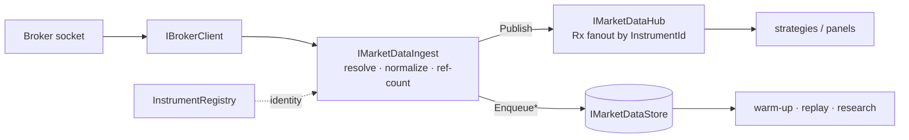

# Market data pipeline

> Last updated: 2026-06-18

The terminal keeps a broker-neutral copy of every normalized record (`Quote` / `TradePrint` / `OhlcvBar`) it sees, so strategies can warm up on history regardless of which broker is connected, and so the same instrument has one identity across brokers.

**Four backends** ship behind one `IMarketDataStore` seam:

| Backend (`MarketDataStore:Provider`) | When to use | Where it lives | Persists L2? |
|---|---|---|---|
| **`SqlitePerBroker`** (default) | Solo box, parallel writers, broker isolation, no bar-key collisions. | `%LOCALAPPDATA%\DaxAlgoTerminal\marketdata-{broker}-{bars\|l1\|trades\|l2}.db`, with canonical identity in the shared `marketdata.db`. WAL, epoch-µs. | ✅ `-l2.db` |
| **`Sqlite`** (single file) | One tidy file for everything. | `…\marketdata.db` (override via `MarketDataStore:DatabasePath`). WAL, epoch-µs. | ⬜ dropped |
| **PostgreSQL + TimescaleDB** | Hypertables, retention policies, a store shared across machines. | `docker-compose.yml` spins up `timescale/timescaledb:latest-pg16` on port 5432 (`db/user/pass = daxalgo`). Free + Apache-2. | ⬜ dropped |
| **QuestDB** (split) | A purpose-built time-series engine for the firehose. | The compose `questdb` service (`questdb/questdb:latest`, ports 9000 ILP/HTTP + 8812 PG-wire). High-volume L1/L2 (quotes, trades, depth) → QuestDB; **bars stay in SQLite** via a composite store. Free + Apache-2. | ✅ QuestDB side |

> **Depth (L2) is persisted only by the per-broker SQLite (`-l2.db`) and QuestDB backends.** On single-file SQLite and Postgres, `EnqueueDepth` is a deliberate no-op (depth is high-volume) and depth stays live-only on the hub. Pick `SqlitePerBroker` (default) or `QuestDb` if you need historical depth.

For the architectural rationale (canonical identity, ref-counted ingest, async writes, fanout via Rx), see [architecture.md](architecture.md). For all `MarketDataStore:*` keys, see [configuration.md](configuration.md).

> **Confused about which store holds what?** This page covers the *canonical* store and its pipeline. For a single map of **every** storage surface — the store, the tick recorder, the Parquet lake, the Telegram archive, and the DuckDB reader — see [storage.md](storage.md).

## Screenshots

> 🖼️ **Screenshot:** `images/data-archive-settings.png` — the Telegram archive-offloader settings (Data → Market data archive).
> 🖼️ **Screenshot:** `images/data-archive-history.png` — the archive history window (Data → Archive history).

## Pipeline at a glance



## Switching backends

Flip `MarketDataStore:Provider` to `Postgres` in `appsettings.json` (the default connection string already matches the compose service):

```powershell
docker compose up -d      # start TimescaleDB (Docker Desktop must be running)
docker compose down       # stop, keep data
docker compose down -v    # stop and wipe the data volume
```

If the network probe at startup can't reach the database, the pipeline **falls back to embedded SQLite** so the app always starts — logged at warning level:

```
Postgres unreachable — falling back to embedded SQLite store.
```

Nothing else changes. The in-memory live hub keeps fanning out either way.

### QuestDB (split L1/L2)

Set `MarketDataStore:Provider` to `QuestDb` and start the container:

```powershell
docker compose up -d      # starts both TimescaleDB and QuestDB
```

Quotes, trades, and depth then stream to QuestDB over ILP (port 9000); bars continue to SQLite. Schema and replay reads use the PG-wire port (8812). Unlike the Postgres path there is **no silent fallback**: if QuestDB is down at startup, L1/L2/depth persistence is disabled (logged at error level) and bars keep persisting to SQLite — the app still launches.

```
QuestDB unreachable (...) — L1/L2/trade persistence is DISABLED until QuestDB is up. ...
```

Tunables: `QuestDbIlpConfig`, `QuestDbPgConnectionString`, `DepthRetentionDays` (applied as a QuestDB partition TTL, best-effort). Browse the data at <http://localhost:9000>.

To disable persistence entirely without losing the live fanout, set `MarketDataStore:PersistLiveData: false`.

## The canonical pipeline

```
broker socket          ┌── canonical record ──► IMarketDataHub (Rx, in-memory fanout) ──► strategies / panels
   │                   │                                                                       (subscribe by InstrumentId)
   ▼                   │
IBrokerClient ──► IMarketDataIngest ── normalize ──► canonical Quote / TradePrint / OhlcvBar
                       │
                       └── batched async writes ──► IMarketDataStore ──► SQLite | Postgres/Timescale
                                                                         (warm-up, replay, research)
```

### Canonical identity

Every instrument has a surrogate `InstrumentId(int Value)`. Broker symbology resolves via `IInstrumentRegistry`:

```csharp
public interface IInstrumentRegistry
{
    Instrument? Get(InstrumentId id);
    InstrumentId? Resolve(BrokerKind broker, string brokerSymbol);
    InstrumentId ResolveOrCreate(Contract contract, BrokerKind broker);  // auto-registers on first sight
    string? ToBrokerSymbol(InstrumentId id, BrokerKind broker);
    void RegisterAlias(InstrumentAlias alias);
    IReadOnlyList<Instrument> All();
}
```

Strategies and the new persistence layer key on `InstrumentId`. The registry resolves broker `Contract`s to ids and back.

### Canonical records

Unlike the legacy quote-only `Tick`, every record carries provenance:

- `EventTimeUtc` — broker-reported timestamp.
- `IngestTimeUtc` — when the terminal saw it.
- `Source` — originating `BrokerKind`.
- `Sequence` — per-instrument monotonic counter.
- `EventTimeApproximate` — true when the broker only reports arrival time (IB, NT, cTrader stamp ticks with `DateTime.UtcNow` in their callbacks). In that case, `EventTimeUtc` is copied from `IngestTimeUtc` and the flag is set so consumers always know the timestamp isn't authoritative.

`TradePrint` fills the gap quote-only feeds left. Alpaca publishes trades; IB / NT / cTrader currently don't via the seam, so `TradePrint` ingest is unsourced for those three until a broker trade-stream is wired.

### Storage

`MarketDataStoreBase` owns the channel + batch + flush loop; concrete backends only spell out their schema and `INSERT` statements:

- `PerBrokerSqliteMarketDataStore` (default) — one SQLite file per broker per stream (`-bars` / `-l1` / `-trades` / `-l2`), WAL mode, `Microsoft.Data.Sqlite`, epoch-µs timestamps. Persists L2 depth.
- `SqliteMarketDataStore` — single embedded file, WAL mode, epoch-µs timestamps. Drops L2 depth.
- `NpgsqlMarketDataStore` — PostgreSQL with the free TimescaleDB extension over `Npgsql`. `timestamptz` columns; quotes / trades / bars are hypertables. Drops L2 depth.
- `QuestDbMarketDataStore` (+ `CompositeMarketDataStore`) — L1/L2/trades/depth over ILP to QuestDB; bars composited to SQLite.

`IInstrumentRegistry` likewise has both `SqliteInstrumentPersistence` and `NpgsqlInstrumentPersistence` behind one in-memory cached registry (the per-broker backend keeps identity in the shared `marketdata.db`).

Writes are non-blocking — `EnqueueQuote` / `EnqueueTrade` / `EnqueueBar` / `EnqueueDepth` push onto a channel that a background batch writer drains (`MarketDataStore:WriteBatchSize` records, or `MarketDataStore:FlushIntervalMs` ms, whichever fires first). Depth is persisted only by the per-broker SQLite and QuestDB backends; the others treat `EnqueueDepth` as a no-op.

Reads (`GetRecentBarsAsync` for warm-up, `ReadQuotesAsync` / `ReadTradesAsync` for replay / research) are async and stream.

### Ingest is ref-counted per instrument

N strategies subscribing to the same canonical id share one broker stream; the underlying `IBrokerClient` subscription stops when the last handle is disposed. This keeps the broker connection cap (especially relevant on cTrader's per-account limits) honest no matter how many strategies you open.

## Recording live ticks to parquet

Separate from the canonical store, the **Tools → Record live ticks** tab writes live ticks straight to a `.parquet` file (compatible with the backtest CLI's `--data` argument). This existed before the canonical pipeline landed; the two are independent surfaces today.

The follow-up to consolidate them lives at [project_recorder_parquet_followup](../CLAUDE.md) — once AI/ML/Research tabs migrate off `ParquetTickReader` and onto the store, the recorder's parquet path can be dropped.

## Querying Parquet with DuckDB

`IParquetQueryService` (backed by an embedded DuckDB engine) runs SQL directly over Parquet files — the recorder's tapes or the Parquet lake below — with predicate pushdown, so it never deserializes rows it doesn't need. It's a **reader, not a store**: it opens an in-memory database and reads the on-disk Parquet, so it can't accidentally mutate your tapes.

```csharp
// Time-filtered tick stream from a single file or a glob:
await foreach (var tick in parquetQuery.ReadTicksAsync(globPath, fromUtc, toUtc, ct)) { … }

// Resample ticks to OHLCV bars entirely in DuckDB (mid-price; TickCount, not trade volume):
var bars = await parquetQuery.AggregateBarsAsync(globPath, TimeSpan.FromMinutes(1));

// Ad-hoc research SQL (the caller references read_parquet('…') directly):
var result = await parquetQuery.QueryAsync("SELECT count(*) FROM read_parquet('…/*.parquet')");
```

## Parquet lake (local, queryable history)

The Telegram archive below ships data *off* the machine and prunes the local store, leaving nothing on disk to analyze. The **Parquet lake** is the complement: a scheduled, opt-in job that exports each *closed* period of the store to a local, partitioned Parquet tree that the DuckDB reader can scan directly.

```
%LOCALAPPDATA%\DaxAlgo Terminal\parquet-lake\
  quotes\instrument=<id>\<period>.parquet
  trades\instrument=<id>\<period>.parquet
  bars\instrument=<id>\size=<n>\<period>.parquet
```

Append-only and idempotent (an existing period file is never rewritten), it reuses the same Parquet row schema as the Telegram archive, so files are interchangeable. Off by default — enable via `MarketDataParquetLake:Enabled`. It runs independently of the Telegram offloader; enable both for local query *and* a pruned store. Full layout and config in [storage.md](storage.md).

## Market-data archive (Telegram offloader)

Long-running stores grow. The terminal ships a Telegram-backed archive offloader so the local store can prune safely:

- Weekly / monthly job (configurable).
- WTelegramClient.
- 2 GB parts (Telegram's per-file ceiling).
- SHA-256 verified each upload.
- Resumable.

Configure via **Settings → Market data archive**. Run status visible at **Settings → Archive activity**.

The archive offload is opt-in — by default, nothing leaves the local machine.

## Reading from the store in code

For strategies that want warm-up history regardless of which broker is connected:

```csharp
var bars = await store.GetRecentBarsAsync(
    instrumentId, BarSize.OneMinute, count: 200, ct);

await foreach (var quote in store.ReadQuotesAsync(instrumentId, fromUtc, toUtc, ct))
{
    // replay …
}
```

`IMarketDataHub` is the live counterpart — subscribe by `InstrumentId` for an Rx fanout of quotes / trades / bars / depth without going through the broker seam every time.

```csharp
using var sub = hub.Quotes(instrumentId)
    .Subscribe(q => /* react */);
```

See `Core/MarketData/IMarketDataHub.cs`, `IMarketDataStore.cs`, `IMarketDataIngest.cs`, and `IInstrumentRegistry.cs` for the full surface.
