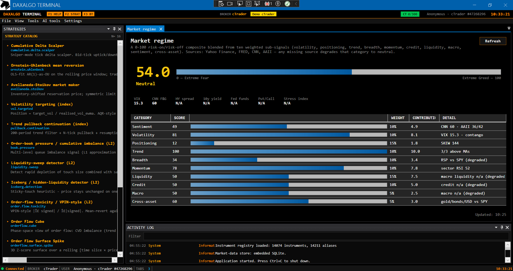
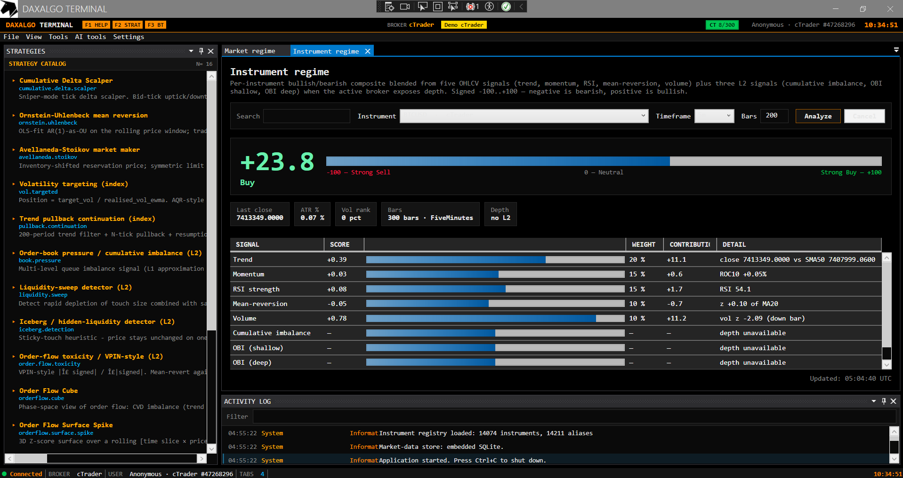

# Market regime composite

> Last updated: 2026-06-13

A broker-independent **risk-on / risk-off score** (0–100, five bands: Extreme Fear → Extreme Greed) blended from ten weighted sub-signals: volatility, positioning, trend, breadth, momentum, credit, liquidity, macro, sentiment, cross-asset. Inputs come from free public endpoints — nothing depends on which broker is connected.

For all `MarketRegime:*` keys, see [configuration.md](configuration.md). For how the gate interacts with the notification pipeline, see [notifications.md](notifications.md).

## Screenshots

| Composite regime | Per-instrument regime |
|---|---|
|  |  |

## Where to open it

**Tools → Market regime** opens a dockable panel showing the composite as a 0–100 gauge with the five bands, plus the per-category breakdown and a header strip of macro metrics (10Y yield, HY spread, Fed funds).

The panel shows "unavailable" until the first refresh lands. If every source fails, the composite degrades to neutral 50 with the same flag, rather than crashing.

## Inputs

| Source | What it powers | Notes |
|---|---|---|
| Yahoo Finance | VIX (volatility), price vs 200dma (trend), breadth, momentum, cross-asset | Yahoo v8 chart endpoint, always on, no key. |
| FRED | Credit, liquidity, macro categories + 10Y / HY spread / Fed funds header metrics | Free key required (`MarketRegime:FredApiKey`). Without it, those three categories degrade to a neutral 50; the composite still computes from Yahoo. |
| CNN Fear & Greed | Positioning, sentiment cross-check | Scraped dataviz endpoint, no key. Toggleable via `UseCnnFearGreed`. |
| AAII sentiment | Bull/bear survey | Scraped HTML. Lowest reliability, always non-blocking. Toggleable via `UseAaiiSentiment`. |

## Setup

1. **Optional but recommended.** Grab a free FRED API key at <https://fred.stlouisfed.org/docs/api/api_key.html> and paste it into `MarketRegime:FredApiKey` in `appsettings.json`. Without it, credit / liquidity / macro categories degrade to a neutral 50.
2. Tune `MarketRegime:RefreshMinutes` if you want a tighter cadence than the 30-minute default. The refresh loop floors at 5 minutes to stay polite to Yahoo.
3. Toggle `UseCnnFearGreed` / `UseAaiiSentiment` off if either scraped source starts misbehaving.

## Behaviour knobs

### Notify on regime change

```json
"MarketRegime": { "NotifyOnRegimeChange": true }
```

Fire a `NotificationKind.RegimeChange` alert when the band crosses (e.g. Greed → Fear). Goes out through the same Telegram / Discord pipeline as signals.

### Gate signals when risk-off

```json
"MarketRegime": {
  "GateSignalsWhenRiskOff": true,
  "RiskOffThreshold": 40
}
```

When on, outbound `Signal` notifications are suppressed while the composite is at or below the threshold (default 40). The signal still appears in the strategy's own window — only the outbound alert is dropped, with a one-line reason logged.

This installs `RegimeSignalGate` as the `ISignalGate` implementation in the dispatcher. See [notifications.md](notifications.md) for the gate mechanism.

## Code reference

```csharp
public interface IMarketRegimeProvider
{
    MarketRegimeSnapshot Current { get; }                          // never null; Empty before first refresh
    IObservable<MarketRegimeSnapshot> Updates { get; }             // hot, replays the latest to new subscribers
    Task<MarketRegimeSnapshot> RefreshAsync(CancellationToken ct = default);
}

public sealed record MarketRegimeSnapshot(
    double CompositeScore, RegimeState State, double? PreviousScore,
    IReadOnlyList<RegimeCategoryScore> Categories,
    RegimeHeaderMetrics Header, DateTime GeneratedAtUtc, bool Unavailable);
```

The actual math lives in `Core/Regime/MarketRegimeCalculator` — a pure function that takes a `RegimeInputs` bag and emits a snapshot. `MarketRegimeService` orchestrates the pulls with per-source graceful degradation, `RegimeRefreshLoop : IHostedService` recomputes on the cadence, and `RegimeSignalGate` is the optional notification gate.

## Bands

| Score range | State |
|---|---|
| 0–24 | Extreme Fear |
| 25–44 | Fear |
| 45–55 | Neutral |
| 56–74 | Greed |
| 75–100 | Extreme Greed |

The exact boundaries are in `RegimeStateMapper` (Core).

## Advanced market regime dashboard

**Tools → Advanced market regime…** opens a separate, per-instrument dashboard — a WPF port of a TradingView-style multi-timeframe indicator board, independent of the macro composite above.

- **18 indicator rows**: RSI, MACD, CCI, MA 9/21/50, 3-MA stack, VWAP, SuperTrend, ATR, ATR regression, STD, POC, TRD, delta, cumulative delta, volume buy/sell, and a composite **Trend** needle.
- **8 toggleable timeframe columns** from 1m to 1D, including aggregated 20m/30m buckets (timeframes are `TimeSpan` buckets aggregated from 1m + 1D bars, not broker `BarSize` requests).
- Row/column/display toggles, configurable indicator lengths, and auto-refresh.

Each cell is colored bullish / bearish / neutral so you can read trend agreement across timeframes at a glance. Data comes from `IMarketDataRepository` history — it works against any connected broker (or the local store).

Code: pure math + models in `Core/MarketData/AdvancedRegime/` (calculator, bar indicators, `BarTimeframeAggregator`), `AdvancedRegimeService` in Infrastructure, window in `src/TradingTerminal.AdvancedMarketRegime/`.

## Limitations

- This is a composite of free public data, not a proprietary signal. It's an input to risk management, not a strategy of its own.
- Scraped sources (CNN, AAII) can break when the upstream changes layout. They're non-blocking — if a scrape fails, the category falls back to neutral 50.
- FRED data updates daily / weekly, not intraday. The macro categories don't move on a sub-day timescale even with a tight refresh.
