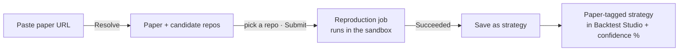

# Paper Lab — reproduce a research paper as a strategy

> Last updated: 2026-06-30

**Paper Lab turns a trading research paper into something you can actually run.** You paste a paper's
link, it finds the paper's published code, runs that code **safely in a sealed sandbox**, and — if it
works — turns the result into a backtestable strategy inside the terminal, complete with a
**confidence score** telling you how trustworthy the reproduction is.

Open it from **AI tools → Paper Lab** in the Windows desktop application.

> 🖼️ **Screenshot:** `images/ai-paperlab.png` — a paper URL resolved → repo candidates → a job
> running → the Save-as-strategy button + confidence readout.

> 🎬 **Video:** `images/video/paper-lab.mp4` — paper → reproduction job → save as strategy → backtest.

---

## In plain terms

Academic finance papers are full of promising-sounding trading ideas, but they're written in maths
and almost never come with a runnable, plug-and-play implementation. Even when the authors publish
code, getting it to run means cloning a stranger's repository, installing the right Python packages,
and trusting that code on your machine — which is both tedious and **risky** (you're running code you
didn't write).

Paper Lab automates that whole chore and removes the risk:

1. **You give it a paper** (e.g. an arXiv link).
2. **It finds the code** the authors (or others) published for that paper.
3. **It runs that code inside a locked-down sandbox** — a disposable container with no access to your
   files, your broker login, the internet (beyond a tiny allow-list), or your real market-data
   database. If the code is malicious or just broken, it can't touch anything that matters.
4. **It brings the result back** into the terminal as a normal, paper-tagged strategy you can
   backtest — and gives you a **replication confidence** percentage so you know how much to trust it.

Think of it as a quarantine lab: the experiment runs behind glass, and only the *results* (not the
untrusted code's reach) come out.

> **Inspired by** the "autoarxiv" idea of automated paper reproduction, scoped here to
> quant/trading papers. **Data and signals only** — a reproduced strategy raises signals and
> backtests; it never places a live order.

---

## What you need first

Paper Lab leans on two external helpers. If either is missing, the window still opens but tells you
it's unavailable — nothing crashes.

| Requirement | Why | How to enable |
|---|---|---|
| The **daxalgo-ml Python sidecar** | Resolves a paper URL → paper details + candidate code repos, and runs the static analysis that plans the reproduction. | **Settings → Research (Paper Lab)** — tick *enable* and point it at the loopback sidecar URL. The app can also auto-start the sidecar (see [ai-analyst.md](ai-analyst.md)). |
| **Docker** (Docker Desktop) | The sandbox that actually runs the paper's untrusted code, isolated from your machine. | Install Docker Desktop and start it. Paper Lab can ask Docker to start itself when a job runs. |

When the sidecar isn't reachable, the status line reads *"Paper-lab sidecar unavailable — enable in
Settings → Research."*

---

## The workflow (what the window does)

The window walks top-to-bottom through four steps. Each maps to a button.

### 1. Resolve

Paste the paper's link (an arXiv URL works best) and click **Resolve**. The sidecar returns the
paper's **title** and **arXiv id**, plus a list of **candidate code repositories** it found for that
paper. This step only *reads* metadata — no code is run yet.

### 2. Submit

Pick the repo that looks right (the first/best match is pre-selected) and click **Submit**. This
creates a **reproduction job**. Jobs are **cached**: if you (or anyone) already reproduced the exact
same paper + repo + configuration, you get an instant *cache hit* instead of re-running the
container.

### 3. Watch the job run

The job appears in the **Jobs** list and moves through states you can watch live:

`Queued → Resolving → Building → Running (minimal) → Succeeded` (or `Failed` / `Cancelled`).

Under the hood the sandbox first does a **static analysis** (reads the code to plan what packages and
entry points it needs), then runs it in a container constrained by a budget (it picks a *minimal* vs
*full* run based on the sandbox policy's resource budget). You can **Cancel** a running job.

### 4. Save as strategy

When a job reaches **Succeeded**, its **Save as strategy** button lights up. Clicking it **bridges**
the reproduction's output into a paper-tagged `BacktestStrategyOption` and registers it into the live
backtest catalog — so it shows up in **Backtest Studio** and the CLI like any other strategy. You can
then backtest the paper's idea on your own data.

It also computes a **replication confidence** score.

---

## Reading the confidence score

Reproductions are rarely perfect — code rots, data differs, details are under-specified. So instead
of pretending a reproduction is gospel, Paper Lab scores it **0–100 %** and breaks the score into
**components** (each shown as its own row in the readout panel). A high score means the reproduction
ran cleanly and its outputs line up with what the paper claimed; a low score is a warning to treat the
resulting strategy with suspicion. Use it as a trust dial, not a verdict.

---

## The safety model (why it's OK to run a stranger's code)

This is the part that matters most, so it's worth stating plainly. Paper code is **untrusted by
default**, and Paper Lab treats it that way:

- **It never runs in the app's own process.** Everything executes inside a separate sandbox
  (Docker, with WSL2/VM variants planned), so a crash or exploit can't take the terminal with it.
- **Deny-by-default.** The container starts with *nothing* allowed and is granted only the bare
  minimum: no mount of your canonical market-data store, no access to your saved broker credentials,
  no general internet — only a small **egress allow-list** (e.g. the package index it needs).
- **Hard quotas.** CPU, memory, process count, disk, and wall-clock time are all capped; a runaway
  job is killed (whole process tree) rather than allowed to hog the machine.
- **Disposable.** The container is torn down after the run; nothing it created persists on your host
  except the explicit result artifacts Paper Lab copies out.

If you're extending this subsystem, the rule is simple: **never weaken the isolation.** The security
playbook lives in the `untrusted-execution` skill, and the engineering detail in
[polyglot.md](polyglot.md).

---

## Under the hood (for contributors)

Paper Lab is a thin UI client over seams that already exist in `Core`/`Infrastructure`:

| Piece | Type | Role |
|---|---|---|
| Paper/repo resolution | `IPaperIngestClient` (Null / Http) | Resolves a URL → `PaperRef` + candidate `RepoRef[]` via the sidecar (subprocess + HTTP/JSON, `127.0.0.1` only). |
| Job lifecycle | `IReproOrchestrator` | Submits a `ReproSpec`, runs it in the sandbox, streams `ReproJob` status updates, caches by spec key. |
| Sandbox | `ISandboxRunner` + `SandboxPolicy`/`SandboxQuota` | The deny-by-default Docker runner with the egress allow-list and quotas. |
| Bridge → strategy | `IReproStrategyRegistrar` → `ReproducedSignalStrategyKernel` | Turns a succeeded `ReproResult` into a paper-tagged `BacktestStrategyOption` registered in the backtest registry, and scores replication confidence. |
| Cache/manifest | `ReproJobStore` (SQLite) | Job + artifact cache keyed by arXiv id + repo commit + config hash, with sha256 artifact refs and retention. |

The view-model (`PaperLabViewModel`) owns exactly one live resource — the orchestrator's
`JobUpdates` subscription — coalesced through a 250 ms buffer and disposed on close, so a busy job
stream can't churn the UI or leak. The DI entry points are `AddPaperResearch(configuration)` (seams)
and `AddPaperLab()` (the window).

Relevant skills: `paper-reproduction` (the pipeline), `paper-ingestion` (the arXiv seam),
`untrusted-execution` (the sandbox). See also [ai-analyst.md](ai-analyst.md) (the shared sidecar),
[polyglot.md](polyglot.md) (the subprocess + JSON design), and [backtesting.md](backtesting.md) (where
a saved reproduction runs).
