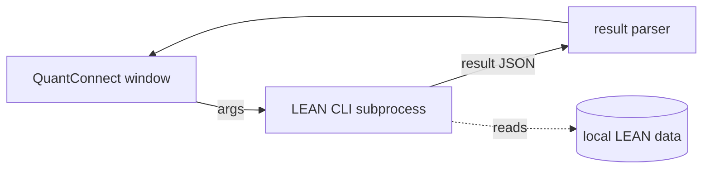

# QuantConnect / LEAN integration

> Last updated: 2026-06-19

A polyglot **backtest seam** to [QuantConnect](https://www.quantconnect.com/)'s open-source [LEAN](https://github.com/QuantConnect/Lean) engine, reached as a subprocess over a CLI + JSON contract — the same hermetic-build principle as the [C++ backtester and Python AI sidecar](polyglot.md). It is **not a broker** (it never appears in the login window or the `IBrokerClient` seam); it's a research/backtest tool with its own top-level menu.

> ⚠️ **Status: experimental / unverified.** The CLI argument shapes and result-JSON parsing have **not been verified against a live LEAN install**. Treat output as provisional until confirmed. A cloud-execution slot is planned but not wired.

> 🖼️ _Screenshot — coming soon_
> 🎬 _Video walkthrough — coming soon_

## Where to find it

The **QuantConnect / LEAN** top-level menu opens a single-instance window with four tabs; each menu item deep-links to a tab:

| Menu item | Tab | Purpose |
|---|---|---|
| Backtest runner… | Backtest | Configure and launch a LEAN backtest; render the result summary. |
| Projects… | Projects | Browse / select LEAN algorithm projects. |
| Data sync… | Data sync | Manage the local data the LEAN run reads. |
| Settings & status… | Settings | Point the integration at the LEAN CLI / install and check status. |

All four open the same window (`TradingTerminal.QuantConnect`) — re-selecting a menu item focuses the window and switches to that tab.

## How it works

- The C# side shells out to the LEAN CLI (`LocalCliLeanClient`), passing the project/backtest arguments, then parses the result JSON it emits.
- Like every polyglot seam, the bridge **degrades gracefully**: if the CLI isn't installed or a run fails, the window surfaces the error rather than crashing the shell.
- Nothing here places live orders — it's backtest/research only, consistent with the rest of the terminal (data/signals only).

## Relationship to the built-in backtester

The terminal already ships its own [tick-level backtest engine](backtesting.md) (`daxalgo-backtest` + Backtest Studio). QuantConnect/LEAN is a **separate, optional** path for users who already have LEAN algorithms or want LEAN's data/universe model — it does not replace the native engine.

## Code reference

| What | Where |
|---|---|
| Window + VM (4 tabs) | `src/windows/Tools/TradingTerminal.QuantConnect/` (`QuantConnectWindow`, `QuantConnectViewModel`) |
| LEAN CLI client | `src/windows/Tools/TradingTerminal.QuantConnect/LocalCliLeanClient.cs` |
| Shell wiring | `MainWindowViewModel.OpenQuantConnect(tab)` opens the single-instance window via `IServiceProvider` |

## See also

- [polyglot.md](polyglot.md) — the subprocess + JSON seam contract this follows.
- [backtesting.md](backtesting.md) — the built-in tick-level engine and CLI.
