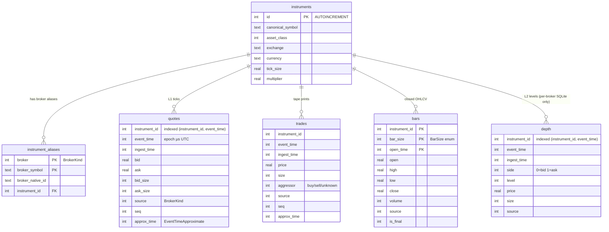

# Storage map — where every byte lives

> Last updated: 2026-06-18

The terminal has **several** storage surfaces, and it's easy to mix them up. This page is the single map: what each one holds, what format, where on disk, how long it lives, and how to read it back. **Data/signals only — none of this stores orders or fills; there is no live execution path.**

If you remember one thing: there is **one source of truth** (the canonical store) and everything else is either a *projection of it* (Parquet lake, Telegram archive) or an *independent capture* (the tick recorder). DuckDB is a *reader*, not a store.

---

## The one-screen overview

| # | Surface | Holds | Format / engine | Default location | Lifetime | On by default? |
|---|---|---|---|---|---|---|
| 1 | **Canonical store** (`IMarketDataStore`) | Quotes, trades, **closed** historical bars, L2 depth (per-broker SQLite only), instruments + broker aliases | Per-broker SQLite (default) · single-file SQLite · PostgreSQL + TimescaleDB · QuestDB | `%LOCALAPPDATA%\DaxAlgoTerminal\marketdata-{broker}-{stream}.db` (+ shared `marketdata.db` registry) | Until retention prunes / you delete | ✅ yes (per-broker SQLite) |
| 2 | **Archive manifest** | Index of what's been offloaded to Telegram (ranges, parts, sha256) | SQLite (separate file) | `%LOCALAPPDATA%\DaxAlgoTerminal\archive-manifest.db` | Forever (tiny) | ✅ created when archive runs |
| 3 | **Tick recorder** | Raw L1 ticks you manually capture | Parquet (one file per session) | `%LOCALAPPDATA%\DaxAlgo Terminal\recordings\*.parquet` | Until you delete | ⬜ manual (Tools → Record live ticks) |
| 4 | **Parquet lake** | Closed-period **copy** of store quotes/trades/bars | Parquet tree, partitioned | `%LOCALAPPDATA%\DaxAlgo Terminal\parquet-lake\…` | Forever (append-only) | ⬜ opt-in (`MarketDataParquetLake:Enabled`) |
| 5 | **Telegram archive** | Off-site **copy** of store data, so the local store can prune | Zip-of-Parquet, 2 GB parts | Your Telegram Saved Messages / a channel | Until you delete in Telegram | ⬜ opt-in (`MarketDataArchive:Enabled`) |
| 6 | **DuckDB query layer** | *(nothing — it's a reader)* | Embedded DuckDB over Parquet | in-memory, reads #3/#4 off disk | per-query | ✅ wired, used on demand |
| 7 | **Backtest CLI results** | `summary.json`, `trades.csv`, `equity.csv`, `fills.csv` | Files | `./bt-results/` (working dir) | Until you delete | ⬜ per CLI run |

> ⚠️ **Path quirk (real, in the code):** some folders use `DaxAlgoTerminal` (no space — the store and the archive manifest) and others use `DaxAlgo Terminal` (with a space — recordings, the lake, notifications). That's a historical inconsistency, not a typo in this doc. Override the store path with `MarketDataStore:DatabasePath` if it bothers you.

---

## 1. Canonical store — the source of truth

One seam, `IMarketDataStore`, **four interchangeable backends**:

| Backend (`MarketDataStore:Provider`) | Use it when | Timestamps | L2 depth |
|---|---|---|---|
| **`SqlitePerBroker`** (default) | Solo box, zero setup, parallel writers, broker isolation | epoch-microseconds (`INTEGER`) | ✅ persisted (`-l2.db`) |
| **`Sqlite`** (single file) | One tidy `marketdata.db` for everything | epoch-microseconds | ⬜ dropped |
| **PostgreSQL + TimescaleDB** | Hypertables, retention jobs, a store shared across machines | native `timestamptz` | ⬜ dropped |
| **QuestDB** | High-rate L1/L2 quote/trade/depth surfaces (bars still go to SQLite) | native `timestamp` | ✅ (QuestDB side) |

If `Postgres` is set but the DB is unreachable at startup, the app **silently falls back to SQLite** so it always launches. QuestDB does **not** silently fall back (it splits: L1/L2/trades/depth → QuestDB, bars → SQLite).

### Per-broker SQLite layout (the default)

To let multiple brokers write in parallel without lock contention or bar-key collisions, the default backend writes **one file per broker, per stream**, while canonical identity stays in one shared registry DB:

```
%LOCALAPPDATA%\DaxAlgoTerminal\
  marketdata.db                       ← shared: instruments + instrument_aliases (identity)
  marketdata-InteractiveBrokers-bars.db
  marketdata-InteractiveBrokers-l1.db
  marketdata-InteractiveBrokers-trades.db
  marketdata-InteractiveBrokers-l2.db    ← L2 depth (this backend only)
  marketdata-Binance-bars.db
  marketdata-Binance-l1.db
  …one set per connected broker
```

Store reads take an optional `BrokerKind? source` (null = all brokers merged). There's no migration tooling — switching backends starts fresh.

### Schema (ER diagram)

The canonical schema is identical in shape across the SQLite backends (timestamps are epoch microseconds UTC). The per-broker backend splits the time-series tables into separate files but keeps the same columns:



**Two rules that surprise people:**

- **Tick-primary ingest** — live bars are aggregated *downstream in the hub* and are **not** written to the store. Only ticks (quotes/trades), L2 depth (per-broker SQLite / QuestDB), and broker-supplied *historical* bars land here.
- **L2 depth is only persisted by the per-broker SQLite (`-l2.db`) and QuestDB backends** — the single-file SQLite and Postgres backends drop it. Depth is one row per book level per snapshot (`side`, `level`), regrouped into snapshots on read.

Writes are non-blocking (`Enqueue*` returns immediately; a background batch writer flushes on `WriteBatchSize` rows or `FlushIntervalMs`). Reads stream: `GetRecentBarsAsync`, `ReadQuotesAsync`, `ReadTradesAsync`, `ReadBarsAsync`.

**Retention** (Postgres only): `MarketDataStore:QuoteRetentionDays` / `TradeRetentionDays` / `BarRetentionDays` install TimescaleDB `add_retention_policy` jobs that run *inside the database* — there's no app-side cron. `0` = keep forever. SQLite has no automatic retention; prune via the Telegram archive (#5) or manually.

See [market-data.md](market-data.md) for the pipeline architecture.

---

## 2. Archive manifest

A small, separate SQLite file that records *what* has been offloaded to Telegram (the period ranges, the uploaded parts, and their sha256 hashes) so the offloader knows what's already safe to prune and how to reassemble a download. You don't query this directly; the **Settings → Archive activity** tab renders it.

---

## 3. Tick recorder — manual L1 capture

**Tools → Record live ticks** streams the live L1 feed for one instrument straight to a `.parquet` file. This pre-dates the canonical pipeline and is **independent** of it — it's the quickest way to build a clean tape you can feed to the backtest CLI (`daxalgo-backtest run --data <file>.parquet`).

Schema (`TickRecord`): `TimestampMicros, Bid, Ask, BidSize, AskSize`. L1 only — no depth.

---

## 4. Parquet lake — store history, on disk, queryable

The Telegram archive (#5) ships data *off* the machine and prunes the local copy, which means there's nothing left on disk to analyze. The **lake** fills that gap: a scheduled job exports each *closed* period of the store to a local, partitioned Parquet tree that DuckDB (#6) can scan directly.

```
%LOCALAPPDATA%\DaxAlgo Terminal\parquet-lake\
  quotes\instrument=<id>\<period>.parquet
  trades\instrument=<id>\<period>.parquet
  bars\instrument=<id>\size=<n>\<period>.parquet
```

- `<period>` is `yyyy-MM` (monthly, the default) or `yyyy-MM-dd` of the Monday (weekly).
- `size=<n>` is the `BarSize` enum value (`0`=1m, `1`=3m, `2`=5m, `3`=15m, `4`=1h, `5`=1D).
- **Append-only / idempotent** — an existing period file is never rewritten, so re-running is a safe no-op.
- Reuses the *same* Parquet row schema as the Telegram archive, so files are interchangeable between the two paths.

Opt-in and **off by default**. Config block (`MarketDataParquetLake`):

```json
{
  "MarketDataParquetLake": {
    "Enabled": false,
    "RootDirectory": "",
    "Period": "Monthly",
    "Tables": "Quotes, Bars, Trades",
    "DailyCheckHourUtc": 4
  }
}
```

It runs alongside the Telegram offloader — they're independent and don't conflict.

---

## 5. Telegram archive — off-site cold storage

Long-running stores grow. The offloader bundles a closed period to a zip-of-Parquet, splits it into ≤2 GB parts (Telegram's per-file ceiling), uploads to your Saved Messages or a channel via MTProto, sha256-verifies each part, and *then* (optionally) deletes those rows from the local store so it can stay small.

Opt-in and **off by default**. Configure at **Settings → Market data archive**; watch progress at **Settings → Archive activity**. Config block is `MarketDataArchive` (see [configuration.md](configuration.md)).

> Lake vs. archive, in one line: the **lake keeps a queryable copy on disk**; the **archive moves a copy off the machine and lets the local store prune**. Enable both if you want local query *and* a pruned store.

---

## 6. DuckDB query layer — the reader

`IParquetQueryService` is **not a store** — it's an embedded DuckDB engine that runs SQL directly over Parquet files (the recorder's #3 or the lake's #4), with predicate pushdown so it doesn't deserialize rows it doesn't need.

```csharp
// Stream L1 ticks from a recorder file or a lake glob, time-filtered:
await foreach (var tick in parquetQuery.ReadTicksAsync(
        @"...\parquet-lake\quotes\instrument=7\*.parquet", fromUtc, toUtc, ct)) { … }

// Resample ticks to 1-minute mid-price bars, entirely in DuckDB:
var bars = await parquetQuery.AggregateBarsAsync(globPath, TimeSpan.FromMinutes(1));

// Ad-hoc research SQL:
var r = await parquetQuery.QueryAsync(
    "SELECT count(*) FROM read_parquet('C:/…/bars/instrument=*/size=4/*.parquet')");
```

DuckDB ships native binaries for several OSes; the build keeps only the **win-x64** one (this is a Windows-only app) via `Directory.Build.targets`.

---

## "I want to… → look here"

| Goal | Where |
|---|---|
| Warm up a live strategy with recent history | Canonical store (#1) via `GetRecentBarsAsync` / hub |
| Replay a clean tape through the backtest engine | Tick recorder file (#3) or store (`--source LocalStore`) |
| Run ad-hoc SQL / resample over months of data | Parquet lake (#4) read by DuckDB (#6) |
| Keep the local DB from growing forever | Postgres retention (#1) and/or Telegram archive (#5) |
| Move data off the machine but keep it recoverable | Telegram archive (#5) |
| Inspect what's been archived | Archive manifest (#2) → Settings → Archive activity |

---

## See also

- [market-data.md](market-data.md) — the canonical pipeline (hub / ingest / store / registry) in depth.
- [configuration.md](configuration.md) — every `appsettings.json` key + persistence locations.
- [backtesting.md](backtesting.md) — how the engine consumes recorder files and the store.
- [architecture.md](architecture.md) — design rationale and the layering rules.
