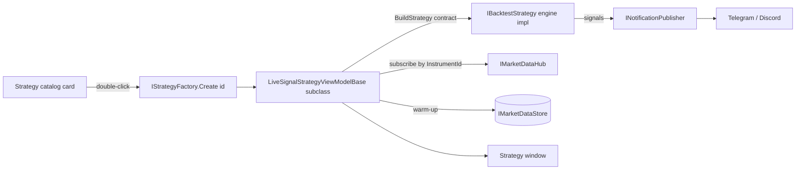

# Strategies

> Last updated: 2026-06-30

The terminal ships **12 live strategies** behind one `IBacktestStrategy` plug-in seam (plus three
buy-and-hold / mean-reversion / Donchian *engine demos* used for testing). This page is the
**catalog and the plain-English tour**; the exact formulas live in the
[Methods & math reference](math-reference.md#2-strategy-math), and the heaviest one (the Σ⁻¹·IC
optimizer) has its own [project README](../src/windows/Strategies/TradingTerminal.Strategies.SigmaIcFlow/README.md).

## In plain terms — what *is* a strategy here?

A "strategy" is a small program that watches the market and raises a **signal** — a flag that says
"my particular pattern just showed up; here's the direction (long/short) and how strongly I believe
it." **It does not place orders.** Think of each strategy as a specialist analyst staring at one
aspect of the market and shouting when they see their setup. Some are simple (a single moving
average of risk); some are committees of a dozen sub-signals.

Every strategy has **two halves**:

- **Engine side** (`IBacktestStrategy`) — the pure decision logic, fed one tick at a time. The same
  code runs in the backtester (so you can test it on history) and in live mode. Lives in
  `Infrastructure/Backtest/Strategies/`.
- **Live UI side** — a window + view-model that picks an instrument, lets you set parameters, draws
  the strategy's view, and turns signals into notifications. Lives in
  `src/windows/Strategies/<Name>/` (WPF) or `src/linux/Strategies/<Name>/` (Avalonia).

In the shell, every strategy opens as **its own window** — double-click a card in the strategy
catalog, or right-click → *Open* (or *Quick backtest*).

> These are **textbook reference implementations, not curve-fit production systems.** Their
> profitability is regime-dependent (and especially meaningless on the synthetic demo feed). Point
> them at real broker tick data through the same pipeline to evaluate anything seriously. **No
> strategy here trades real money — data and signals only.**

> 🖼️ **Screenshot:** `images/shell-strategy-card.png` — one catalog card, annotated, showing the data
> pills (L1/BAR/L2/TAPE) and classification pills (asset class · single/multi-asset · broker chips).

## How a live strategy is wired

## Reading the catalog cards

Each card carries two rows of coloured **pills** so you can tell at a glance what a strategy needs
and where it runs:

- **Data-requirement pills** — what feed it consumes: `L1` (best bid/ask), `BAR` (candles),
  `L2` (full order-book depth), `TAPE` (individual trades). If a strategy shows `NEEDS TAPE` or
  `NEEDS L2`, a broker that can't supply it simply won't drive that strategy.
- **Classification pills** — the asset class(es) it targets, whether it watches a **single** symbol
  or **many** at once (`SINGLE-ASSET` / `MULTI-ASSET`), and broker support (`ANY BROKER`, or chips
  for the specific brokers that supply the needed feed).
- A purple **RESEARCH PAPER** pill appears on paper-derived strategies and links to the source paper.

## Catalog (quick reference)

| # | Strategy | Id | Live project | Needs | One-liner |
|---|---|---|---|---|---|
| 1 | Volatility-Targeted baseline | `volTarget` | VolatilityTargeted | BAR | Size the position to keep risk constant. |
| 2 | Ornstein–Uhlenbeck mean reversion | `ornsteinUhlenbeck` | OrnsteinUhlenbeck | BAR/L1 | "Rubber-band" snap-back around a fitted centre. |
| 3 | Order-Flow Toxicity (VPIN) | `vpin` | OrderFlowToxicity | TAPE | Fade one-sided, "toxic" bursts of flow. |
| 4 | Cumulative Delta Scalper | *(live-only)* | CumulativeDelta | TAPE | Trade buy/sell-pressure divergences from price. |
| 5 | Filtered Order-Flow Imbalance | `filtered.orderflow.imbalance` | FilteredOrderFlow | TAPE | Paper strategy: trade *filtered* trade-imbalance regimes. |
| 6 | Order-Flow Cube (3D) | `orderFlowCube` | OrderFlowCube | TAPE | Accumulation/distribution as a 3D order-flow cube. |
| 7 | Order-Flow Surface Spike (3D) | `orderFlowSurfaceSpike` | OrderFlowSurfaceSpike | TAPE | Ride a confirmed volume "spike" on a 3D surface. |
| 8 | Imbalance Heat Front (3D) | `imbalanceHeatFront` | ImbalanceHeatFront | L2 | Ride or fade a wall of order-book pressure. |
| 9 | Index K-Score Surface (3D) | `indexKScoreSurface` | IndexKScoreSurface | BAR | Score every constituent of an index, combine. |
| 10 | Index Regime Graph | `index.regime.graph` | IndexRegimeGraph | BAR | A health board for a whole index, as a node graph. |
| 11 | 1-Minute Order-Flow Pressure Map | `orderflow.pressuremap` | OrderFlowPressureMap | L2 | Multi-stock grid flagging unusual 1-min volume. |
| 12 | Σ⁻¹·IC Order-Flow Optimizer | `sigma.ic.flow` | SigmaIcFlow | TAPE | Flagship: a 12-signal microstructure committee. |

The same engine ids are selectable in **Backtest Studio** and the `daxalgo-backtest` CLI.
**Cumulative Delta**, **Index Regime Graph**, and the **Pressure Map** ship as live-only windows (no
backtest id). The three engine demos — `buyAndHold`, `meanReversion`, `donchianBreakout` — exist
only in the backtester as smoke tests.

---

## The strategies, simplest first

Each entry below is **plain-English first**. The "→ math" link jumps to the exact formula.

### 1 · Volatility-Targeted baseline — `volTarget`

**In plain terms.** The simplest idea in the catalog: instead of always trading the same number of
contracts, trade *fewer* when the market is jumpy and *more* when it's calm, so your risk stays
roughly level. It's the "cruise control" of position sizing.

**How it decides.** It keeps a rolling estimate of how volatile recent returns have been, then sets
position size to `target_volatility ÷ recent_volatility`. Calm market (small denominator) → bigger
size; turbulent market → smaller size. → [math](math-reference.md#volatility-targeted--voltarget).

**Good for / caveats.** A clean baseline for index products and a building block, not an edge by
itself. Long-only as shipped.

**Needs:** candles (`BAR`). Single-asset, any broker.

> 🖼️ **Screenshot:** `images/strategy-volatilitytargeted-window.png`

### 2 · Ornstein–Uhlenbeck mean reversion — `ornsteinUhlenbeck`

**In plain terms.** Some prices behave like a **stretched rubber band** — pull them far from a "fair"
centre and they tend to snap back. This strategy continuously measures where that centre is and how
springy the band is, and bets on the snap-back when price is stretched far enough.

**How it decides.** It fits a mean-reversion model (an "AR(1)/OU" fit) over a rolling window to get a
centre and a typical spread, then converts the current price into a **z-score** (how many spreads
from centre). Far below centre → go long; far above → go short; back near centre → flatten. If the
fit says the series is *drifting* rather than springy, it refuses to trade. The **half-life** readout
tells you how many bars a typical snap-back takes.
→ [math](math-reference.md#ornsteinuhlenbeck--ornsteinuhlenbeck).

**Good for / caveats.** Range-bound / pairs-like instruments. Dangerous in a strong trend (the band
"breaks") — which is exactly why the drift check exists.

**Needs:** candles / L1. Single-asset, any broker.

> 🖼️ **Screenshot:** `images/strategy-ornsteinuhlenbeck-window.png`

### 3 · Order-Flow Toxicity (VPIN) — `vpin`

**In plain terms.** "Toxicity" is a measure of how **one-sided** recent trading has been — a proxy
for *informed* traders pushing hard in one direction. When flow gets extremely one-sided, this
strategy bets the burst will exhaust and **fades** it (sells into a buying frenzy, buys into a
sell-off).

**How it decides.** It computes VPIN — the absolute net flow divided by total flow, a number from 0
(perfectly balanced) to 1 (totally one-directional). Above a threshold, it takes the *opposite* side
of the prevailing aggressor and holds for a set time. → [math](math-reference.md#order-flow-toxicity-vpin--vpin).

**Good for / caveats.** Short-horizon exhaustion plays. The engine version uses an L1 approximation;
the "real" volume-bucket VPIN lives inside the Σ⁻¹·IC optimizer (#12).

**Needs:** trade tape (`TAPE`). Single-asset; brokers that supply trades (IB, Binance, Ironbeam).

> 🖼️ **Screenshot:** `images/strategy-orderflowtoxicity-window.png`

### 4 · Cumulative Delta Scalper — CumulativeDelta *(live-only)*

**In plain terms.** "Delta" is buys-minus-sells among aggressive traders; **cumulative** delta (CVD)
is the running total. The trick: don't trade the CVD *level* — trade **disagreements** between CVD
and price. If price makes a new high but CVD doesn't, the rally isn't backed by real buying
pressure — a warning.

**How it decides.** It signs each trade (who crossed the spread?), keeps the running total, and
watches the **slope** of CVD and its **divergence** from price, with footprint clusters for
price-acceptance context. → [math](math-reference.md#cumulative-delta--cumulativedelta-live-only).

**Good for / caveats.** Scalping turning points; best with a genuine trade feed. Live-only (no
backtest id).

**Needs:** trade tape (`TAPE`). Single-asset; tape-capable brokers.

> 🖼️ **Screenshot:** `images/strategy-cumulativedelta-window.png`

### 5 · Filtered Order-Flow Imbalance — `filtered.orderflow.imbalance` *(research paper)*

**In plain terms.** Count how many recent trades were buyer-initiated versus seller-initiated — that
ratio is "order-book imbalance over trades," OBI(T). The paper's insight (Anantha–Jain–Maiti 2025):
if you **filter out the tiny, fleeting trades** and keep only the meaningful ones, the remaining
imbalance predicts the next move *more sharply*. This strategy runs both the raw and the filtered
version side by side so you can *see* the filtering sharpen the signal.

**How it decides.** It buckets OBI(T) into 9 regimes from "heavy selling" to "heavy buying." When the
**filtered** imbalance enters a *strong* regime, it takes a same-direction position and holds for a
fixed event-time window or until the regime decays back to neutral.
→ [math](math-reference.md#filtered-order-flow-imbalance--filteredorderflowimbalance-research-paper).

**Good for / caveats.** A faithful, observable reproduction of a published finding. Carries the
**RESEARCH PAPER** pill linking to [arXiv:2507.22712](https://arxiv.org/abs/2507.22712).

**Needs:** trade tape (`TAPE`). Single-asset; tape-capable brokers.

> 🖼️ **Screenshot:** `images/strategy-filteredorderflow-window.png`

### 6 · Order-Flow Cube (3D) — `orderFlowCube`

**In plain terms.** Picture three dials describing the flow: (a) net buying vs selling, (b) how
aggressive buyers are, (c) whether trade sizes are unusually big. Plot them as the X/Y/Z of a point
inside a **cube**. Two corners matter: when all three say "strong buying" you're in the
**accumulation** corner (go long); the mirror corner is **distribution** (go short). Rendered as a
rotating 3D scatter with a fading trail.

**How it decides.** It measures the three flow axes over a recent window versus a longer baseline and
enters when all three clear their thresholds together; exits on a flow reversal or a time stop.
→ [math](math-reference.md#order-flow-cube-3d--orderflowcube).

**Good for / caveats.** Spotting institutional accumulation/distribution. (Note: two of the axes are
mathematically related, so it works best when they're measured over *different* windows — see the
math note.)

**Needs:** trade tape (`TAPE`). Single-asset; tape-capable brokers. HelixToolkit 3D view.

> 🖼️ **Screenshot:** `images/strategy-orderflowcube-window.png`

### 7 · Order-Flow Surface Spike (3D) — `orderFlowSurfaceSpike`

**In plain terms.** Lay recent trading out as a **heat-map surface**: time across one axis, price
levels up the other, and "how much signed volume happened here" as the height/colour. A sudden, tall
**spike** in the most recent slice means a burst of one-sided activity — ride it in its direction.

**How it decides.** It z-scores the whole surface (how unusual is each cell versus the rest?), finds
the hottest cell in the latest time slice, and enters if it's extreme **and** confirmed for a few
ticks in the same direction. Exits on fixed target/stop, spike fade, or a sign flip.
→ [math](math-reference.md#order-flow-surface-spike-3d--orderflowsurfacespike).

**Needs:** trade tape (`TAPE`). Single-asset; tape-capable brokers. HelixToolkit 3D view.

> 🖼️ **Screenshot:** `images/strategy-orderflowsurfacespike-window.png`

### 8 · Imbalance Heat Front (3D) — `imbalanceHeatFront`

**In plain terms.** Look at the order book and ask, at each distance from the current price, "is
there far more resting size on the bid or the ask?" A run of consecutive levels that all lean the
same way is a **pressure front** — a wall. You can either **ride** the wall (it's pushing price) or
**fade** it (one-sided walls often get absorbed and exhaust). The wall is drawn as a 3D pressure
surface.

**How it decides.** It builds a surface of per-distance imbalance, detects a **ridge** of consecutive
one-sided levels that persists, and — depending on mode — trades with it (momentum) or against it
(mean-reversion). → [math](math-reference.md#imbalance-heat-front-3d--imbalanceheatfront).

**Good for / caveats.** Needs genuine **L2 depth** (IB or cTrader). In the backtester, which is
L1-only, the ridge collapses to a single touch-level check — so backtest it knowing that limitation.

**Needs:** L2 depth (`L2`). Single-asset; depth-capable brokers. HelixToolkit 3D view.

> 🖼️ **Screenshot:** `images/strategy-imbalanceheatfront-window.png`

### 9 · Index K-Score Surface (3D) — `indexKScoreSurface`

**In plain terms.** For index trading (e.g. US30 / S&P 500), score **every member stock** on a
−1…+1 scale ("K-score") built from 15 indicators, then combine those scores, weighted by how big
each stock is in the index, into one direction for the index.

**How it decides.** It aggregates ticks into bars, computes a 15-indicator K-score per bar, and
enters in the direction of K when conviction is high enough (and enough constituents agree). The
engine variant is a single-instrument sanity check; the live window does the full cross-sectional
basket. → [math](math-reference.md#index-k-score-surface-3d--indexkscoresurface).

**Needs:** candles (`BAR`). Index / multi-asset, any broker. HelixToolkit 3D surface.

> 🖼️ **Screenshot:** `images/strategy-indexkscoresurface-window.png`

### 10 · Index Regime Graph — `index.regime.graph` *(live-only)*

**In plain terms.** A **health board for a whole index**. It runs the same 18-indicator ×
8-timeframe "Advanced regime" analysis (see [market-regime.md](market-regime.md)) on *every*
constituent stock, blends each stock's timeframes for the horizon you chose, weights by index
membership, and rolls it all up into a single up/down composite — drawn as an interactive
pan/zoom **node graph** (Index ← stocks ← timeframes ← indicators).

**How it decides.** Each leaf indicator votes bullish/bearish/neutral; votes blend up the tree to a
weighted index direction. → [math](math-reference.md#index-regime-graph--indexregimegraph-live-only).

**Needs:** candles (`BAR`). Index / multi-asset, any broker. Live-only.

> 🖼️ **Screenshot:** `images/strategy-indexregimegraph-window.png`

### 11 · 1-Minute Order-Flow Pressure Map — `orderflow.pressuremap` *(monitor)*

**In plain terms.** A **grid of the S&P 100/500**: rows are stocks, columns are recent minutes. A
cell lights up when that stock's volume in that minute is *unusually* high for it, and the colour
tells you whether price actually moved (a **breakthrough**) or stayed put despite the volume
(**absorption** — someone quietly soaking up the flow). It's a market-wide radar, not a single-symbol
trader.

**How it decides.** Per cell, it z-scores the current minute's volume against that stock's rolling
baseline, and splits absorption vs breakthrough using the volume-to-price-range ratio. Monitor only —
it flags, it doesn't signal entries. → [math](math-reference.md#1-minute-order-flow-pressure-map--orderflowpressuremap-monitor).

**Needs:** L2 / multi-asset. Many brokers. Live-only monitor window.

> 🖼️ **Screenshot:** `images/strategy-pressuremap-window.png`

### 12 · Σ⁻¹·IC Order-Flow Optimizer — `sigma.ic.flow` *(flagship)*

**In plain terms.** A **committee of twelve microstructure experts** voting on direction. The clever
part is *how the votes are weighted*: not by hand, but automatically, so that experts who have
recently predicted well get more say, and experts who merely echo each other get **discounted** (you
don't want twelve copies of the same opinion). The combined view is then sanity-checked: it only
fires if the expected edge beats the full round-trip cost (spread + fees + slippage) **and** passes a
"will the target be hit before the stop?" probability check, and the bet is sized with a cautious
**quarter-Kelly** rule.

**How it decides (the experts).** Twelve signals — bar **delta** & acceleration, **VPIN** toxicity,
**footprint** stacked imbalance, **tape speed** (a self-exciting "Hawkes" intensity), **Kyle-λ**
price-impact residual, a triple regression-line block (**initiative / control / wedge / value**),
**CVD** divergence, order-book **imbalance**, and a Kalman-filter **predicted-node** migration — each
emitted as a comparable −3…+3 score. They're blended with mean-variance-optimal weights
($w \propto \Sigma^{-1}\!\cdot IC$: reward predictive skill via the Information Coefficient, discount
redundancy via the inverse covariance), calibrated onto real forward returns, then gated.
→ Full derivation: the
[project README](../src/windows/Strategies/TradingTerminal.Strategies.SigmaIcFlow/README.md) ·
summary in [math-reference](math-reference.md#2-strategy-math).

**Good for / caveats.** The most complete strategy in the app — and the most demanding: it wants a
**real trade tape** (it degrades gracefully to a heavily-discounted synthetic-L1 mode otherwise) and
warms up in "bootstrap" mode until it has enough history to calibrate. Defaults target CME micro
futures (MES/MNQ) on 15s–1m candles. *(Formerly "APEX Microstructure Scalper v2"; the engine class is
still `ApexScalperStrategy`.)*

**Needs:** trade tape (`TAPE`), L1, bars; L2 optional. Single-asset; tape-capable brokers.

> 🖼️ **Screenshot:** `images/strategy-sigmaicflow-window.png`
> 🖼️ **Screenshot:** `images/strategy-sigmaicflow-settings.png`
> 🎬 **Video:** `images/video/order-flow-3d.mp4` — a live Σ⁻¹·IC / cube session.

---

## Adding a new strategy

Each strategy is its own project following the same six-file shape. The fastest path is to copy an
existing project, rename, and edit. **Remember the two trees** — a strategy you want on both Windows
and Linux must be added under `src/windows/Strategies/` *and* `src/linux/Strategies/`.

1. **Copy** the closest existing project (e.g. `src/windows/Strategies/TradingTerminal.Strategies.VolatilityTargeted`).
   Rename the directory, the `.csproj`, and the class prefix.
2. **Files in the new project:**
   - `MyStrategy.cs` — the `ITradingStrategy` descriptor (`Id` / `DisplayName` / `Description`, plus
     optional `ResearchPaperUrl`, `DataRequirement`, `SupportedBrokers`).
   - `MyStrategyViewModel.cs` — extends `LiveSignalStrategyViewModelBase` (in `TradingTerminal.UI`).
     Declare parameters as `[ObservableProperty]`s; override `BuildStrategy(Contract contract)` to
     return your engine-side `IBacktestStrategy`.
   - `MyStrategyWindow.xaml(.cs)` — the window (a MahApps `MetroWindow` on WPF; an Avalonia `Window`
     on Linux).
   - `DependencyInjection.cs` — one `AddMyStrategy()` extension registering the descriptor, VM, view,
     and a `StrategyFactoryRegistration`.
3. Put the **decision logic** in `Infrastructure/Backtest/Strategies/<Name>Strategy.cs` implementing
   `IBacktestStrategy`, and have the live VM construct it in `BuildStrategy(contract)`. This is what
   lets the same strategy run in both the backtester and live mode.
4. Register it: add a `<ProjectReference>` in the shell `.csproj`, a `services.AddMyStrategy();` line
   in `AddStrategyPlugins()`, an entry in `BacktestStrategyCatalog` (for Backtest Studio) and
   `ResolveStrategy` (for the CLI), and add the project to the `.slnx`.

The new strategy then appears in the catalog on next launch. The shared `Indicators` and
`Microstructure` modules already cover SMA/EMA/RSI/ATR/stdev, microprice, imbalance, slippage, etc. —
rarely roll your own. See the `add-strategy` skill and [contributing.md](contributing.md) for the
full recipe, and the **Strategy-vs-Tool rule**: anything that registers an `ITradingStrategy` is a
*strategy* project, never a *tool* project — even multi-symbol monitors like the Pressure Map.

### Prefer to ship it as a plug-in?

You don't have to fork the repo. A strategy can be packaged as an external **plug-in** built against
the **DaxAlgo SDK** and installed from the **Plugins** menu — see [plugins.md](plugins.md).

## Tuning a strategy's parameters

Every per-strategy view-model declares its parameters as `[ObservableProperty]`s with sensible
defaults from the engine's constructor. Change them at runtime in the strategy window's **Parameters**
panel before pressing **Start**, or edit the defaults in the VM. For systematic parameter searches,
use the CLI's `sweep` / `walkforward` subcommands — see [backtesting.md](backtesting.md).

## Where the live VM hooks into shared plumbing

`LiveSignalStrategyViewModelBase` (in `TradingTerminal.UI`) handles the boilerplate: the instrument
picker (`SignalInstrumentCatalog`), tick/bar/depth/trade subscription via `IMarketDataHub`, the
router lifecycle, the `SignalEntry` grid, and `INotificationPublisher` integration. The
`LiveStrategyHostServices` bundle (Repository + Hub + Ingest + Store + BrokerSelector + ActivityLog)
is injected into every per-strategy VM constructor — don't add ad-hoc dependencies to that ctor. Your
subclass only declares parameters and constructs the engine; read the base class first to see what
you already get for free.
