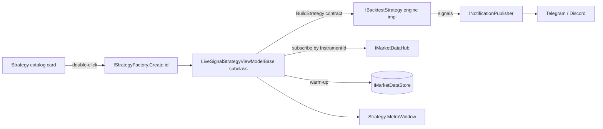
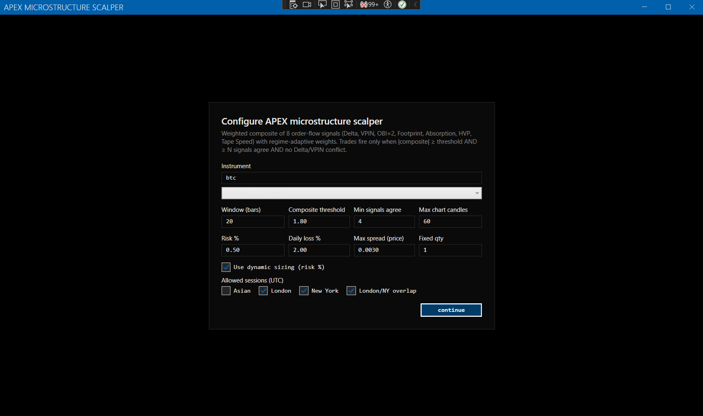
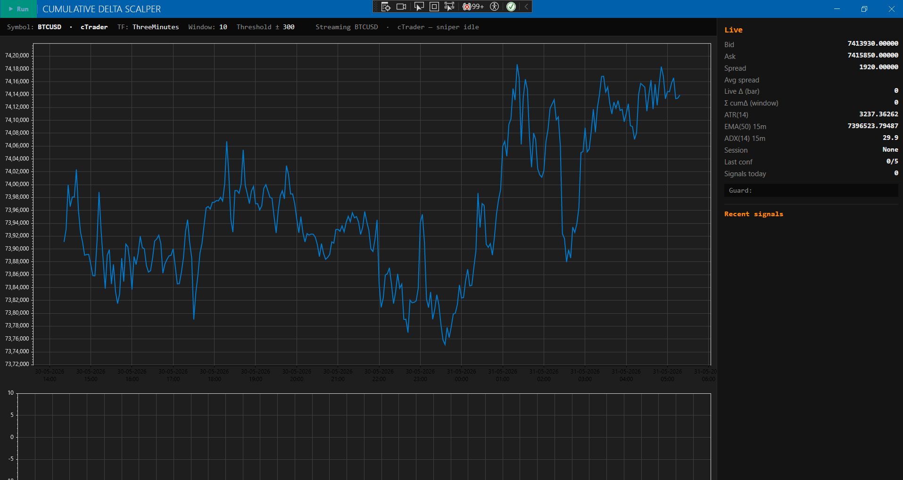
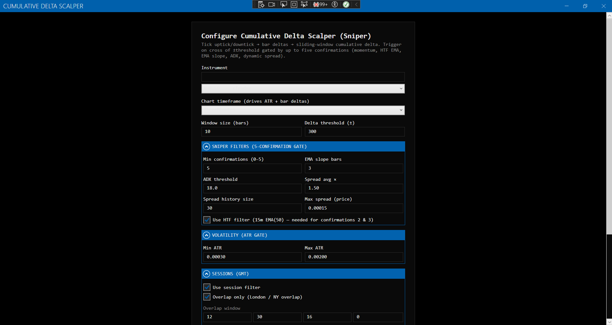
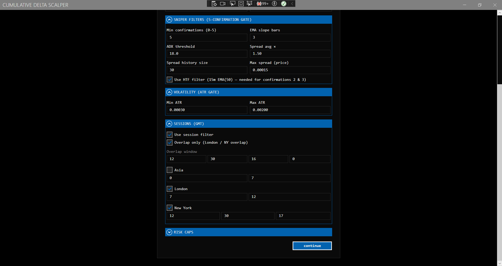
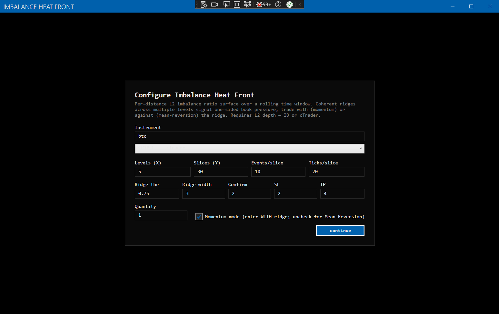
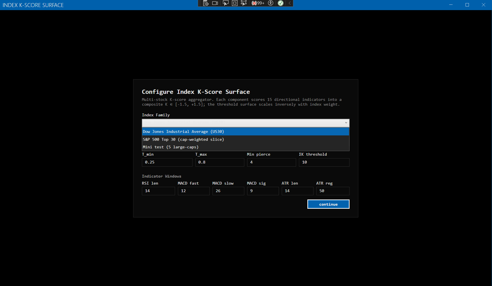

# Strategies

> Last updated: 2026-06-18

The terminal ships **12 live strategies** behind one `IBacktestStrategy` plug-in seam (plus buy-and-hold / mean-reversion / Donchian engine demos). Each strategy has two halves:

- **Engine side** (`IBacktestStrategy`) — pure tick-driven logic; runs in both the backtest CLI and the Tools → Backtest window. Lives in `Infrastructure/Backtest/Strategies/`.
- **Live UI side** — a `MetroWindow` + view-model that wraps the engine impl, picks an instrument, lets you set parameters, and surfaces signals as notifications. Lives in `src/TradingTerminal.Strategies.<Name>/`.

The split means the same logic powers backtest sweeps and live signal mode without duplication. In the shell, every strategy opens as **its own window** from the full-width strategy catalog (double-click a card).

> 📐 **Looking for the math?** Every strategy's formula — entry/exit rule, estimators, signal definitions — is written out in the [Methods & math reference](math-reference.md#2-strategy-math), grounded in the engine source. This page is the catalog; that one is the derivation.

## How a live strategy is wired

## Catalog (quick reference)

| Family | Strategy id | Live project | What it does |
|---|---|---|---|
| Demo | `buyAndHold` | *(engine only)* | Market-buy on the first tick, sell on the last. Engine smoke-test. |
| Demo | `meanReversion` | *(engine only)* | Rolling-mean reversion with fixed thresholds. |
| Demo | `donchianBreakout` | *(engine only)* | N-tick Donchian channel break, trailing-mid stop. |
| HFT | `ornsteinUhlenbeck` | OrnsteinUhlenbeck | Online AR(1)-fit OU process, z-score entry/exit bands. |
| Index | `volTarget` | VolatilityTargeted | Position sized to `target_vol / realized_vol_ewma` (AQR risk-parity overlay). |
| L2 / DOM | `vpin` | OrderFlowToxicity | VPIN-style order-flow toxicity (Easley, López de Prado, O'Hara 2012). |
| L2 / DOM | *(live-only)* | CumulativeDelta | Cumulative-delta scalper with footprint clusters. |
| Regime cube (3D) | `orderFlowCube` | OrderFlowCube | Order-flow regime cube — CVD × aggressor × size, Helix 3D scatter + trail. |
| Regime cube (3D) | `orderFlowSurfaceSpike` | OrderFlowSurfaceSpike | Z-score spike detector over a slice × price-bin matrix surface. |
| Regime cube (3D) | `imbalanceHeatFront` | ImbalanceHeatFront | L2 bid/ask pressure surface with mirror-book detection. |
| Index (3D) | `indexKScoreSurface` | IndexKScoreSurface | Per-component K-score surface for index baskets. |
| Index (graph) | `index.regime.graph` | IndexRegimeGraph | Advanced-regime indicator stack across every index constituent, blended over 8 timeframes, rendered as a pan/zoom node graph. |
| Composite | `sigmaIcFlow` | SigmaIcFlow | Σ⁻¹·IC Order-Flow Optimizer (formerly APEX microstructure scalper v2) — tape-primary 11-signal composite (Σ⁻¹·IC weights, isotonic g(C) entry gate, first-passage EV exits, ¼-Kelly sizing). Full math in the [project README](../src/TradingTerminal.Strategies.SigmaIcFlow/README.md). |
| Research paper | `filtered.orderflow.imbalance` | FilteredOrderFlow | Filtered Order-Flow Imbalance — trade-based OBI(T) regimes ([arXiv:2507.22712](https://arxiv.org/abs/2507.22712)). |
| Monitor | `orderflow.pressuremap` | OrderFlowPressureMap | 1-Minute Order Flow Pressure Map — S&P 100/500 ticker × time heatmap flagging unusual 1m volume and absorption vs. breakthrough. |

The same engine ids are selectable in the Backtest window and the `daxalgo-backtest` CLI. **Cumulative delta**, **Index Regime Graph**, and the **Pressure Map** ship as live-only windows (no backtest id).

> These are **textbook reference implementations, not curve-fit production systems**. Their PnL is regime-dependent, especially on the demo synthetic dataset. Pair them with real broker tick data through the same parquet pipeline to evaluate seriously.

Each catalog card also shows **data-requirement pills** (L1 / BAR / L2 / TAPE) and **classification pills** (asset class · single-vs-multi-asset · broker support), so you can tell at a glance what feed a strategy needs and where it runs.

## Strategy gallery

> Media slots below are reserved per strategy — existing screenshots are shown; video walkthroughs and any missing screenshots are marked _coming soon_.

### Σ⁻¹·IC Order-Flow Optimizer — `sigmaIcFlow`
Tape-primary 11-signal composite with inverse-covariance × IC weights, an isotonic entry gate, first-passage expected-value exits, and ¼-Kelly sizing. (Formerly "APEX microstructure scalper v2".)

> 🎬 _Video walkthrough — coming soon_

### Cumulative delta scalper — CumulativeDelta (live-only)
Cumulative buy/sell delta with footprint-cluster context.

> 🎬 _Video walkthrough — coming soon_

### Imbalance Heat Front (3D) — `imbalanceHeatFront`
L2 bid/ask pressure surface with mirror-book detection, rendered with HelixToolkit.

> 🎬 _Video walkthrough — coming soon_

### Index K-Score Surface (3D) — `indexKScoreSurface`
Per-component K-score surface for index baskets.

> 🎬 _Video walkthrough — coming soon_

### Ornstein-Uhlenbeck mean reversion — `ornsteinUhlenbeck`
Online AR(1)-fit OU process with z-score entry/exit bands and half-life readout.

> 🖼️ _Screenshot — coming soon_
> 🎬 _Video walkthrough — coming soon_

### Volatility-targeted index baseline — `volTarget`
Position sized to `target_vol / realized_vol_ewma` (AQR-style risk-parity overlay).

> 🖼️ _Screenshot — coming soon_
> 🎬 _Video walkthrough — coming soon_

### Order-flow toxicity (VPIN) — `vpin`
VPIN-style order-flow toxicity (Easley, López de Prado, O'Hara 2012).

> 🖼️ _Screenshot — coming soon_
> 🎬 _Video walkthrough — coming soon_

### Order-Flow Cube (3D) — `orderFlowCube`
Order-flow regime cube — CVD × aggressor × size as a Helix 3D scatter with a decaying trail.

> 🖼️ _Screenshot — coming soon_
> 🎬 _Video walkthrough — coming soon_

### Order-Flow Surface Spike (3D) — `orderFlowSurfaceSpike`
Z-score spike detector over a time-slice × price-bin matrix surface.

> 🖼️ _Screenshot — coming soon_
> 🎬 _Video walkthrough — coming soon_

### Index Regime Graph — `index.regime.graph`
Runs the Advanced Market Regime indicator stack across every index constituent, blends each stock's eight timeframes for a chosen horizon, weights by index membership, and sums to a composite direction — rendered as an interactive pan/zoom/drag node graph.

> 🖼️ _Screenshot — coming soon_
> 🎬 _Video walkthrough — coming soon_

### Filtered Order-Flow Imbalance — `filtered.orderflow.imbalance`
Research-paper strategy: trade-based order-book-imbalance OBI(T) regimes from [arXiv:2507.22712](https://arxiv.org/abs/2507.22712). Carries the RESEARCH PAPER pill in the catalog (links to the source paper).

> 🖼️ _Screenshot — coming soon_
> 🎬 _Video walkthrough — coming soon_

### 1-Minute Order Flow Pressure Map — `orderflow.pressuremap` (monitor)
Multi-ticker S&P 100/500 ticker × time heatmap that flags unusual 1-minute volume and distinguishes absorption from breakthrough. Live-only monitor window.

> 🖼️ _Screenshot — coming soon_
> 🎬 _Video walkthrough — coming soon_

## Adding a new strategy

Each strategy is its own project (`src/TradingTerminal.Strategies.<Name>/`) following the same six-file shape as the others. The fastest path is to copy an existing project, rename, and edit.

1. **Copy** the closest existing project under `src/`. Rename the directory, the `.csproj`, and the per-strategy class prefix (e.g. `VolatilityTargetedStrategy*` → `MyStrategy*`).
2. **Files in the new project:**
   - `MyStrategy.cs` — `ITradingStrategy` descriptor with `Id` / `DisplayName` / `Description` (and optional `ResearchPaperUrl`, `DataRequirement`, `SupportedBrokers`).
   - `MyStrategyViewModel.cs` — extends `LiveSignalStrategyViewModelBase` (in `TradingTerminal.UI`). Declare your parameters as `[ObservableProperty]`s, override `BuildStrategy(Contract contract)` to return your engine-side `IBacktestStrategy` impl.
   - `MyStrategyWindow.xaml(.cs)` — a `MetroWindow`. Surface parameter inputs, controls, and charts however you want.
   - `DependencyInjection.cs` — one `AddMyStrategy()` extension that registers the descriptor, VM, view, and a `StrategyFactoryRegistration`.
3. Add a `<ProjectReference>` to your new project in `TradingTerminal.App.csproj`.
4. Add `services.AddMyStrategy();` to `AppDependencyInjection.AddStrategyPlugins()`.
5. Add the project entry to `TradingTerminal.sln` (under the **Strategies** solution folder).

The new strategy shows up in the catalog on next launch and opens in its own window. See the `add-strategy` skill and [contributing.md](contributing.md) for the full recipe.

### Where to put the engine-side logic

If your strategy can be backtested (almost always — even live-only strategies benefit from offline replay), put the actual signal logic in `src/TradingTerminal.Infrastructure/Backtest/Strategies/<Name>Strategy.cs` implementing `IBacktestStrategy`. The live VM then constructs that same class inside `BuildStrategy(contract)`. This is what every shipped strategy does.

Register the engine impl in `BacktestStrategyCatalog` (for the UI dropdown) and `ResolveStrategy` (for the CLI). The shared `Indicators` (`Core/MarketData/Indicators.cs`) and `Microstructure` (`Core/MarketData/Microstructure.cs`) modules cover SMA, EMA, Wilder RSI, ATR, rolling stdev, microprice, queue imbalance, half-spread, cumulative imbalance, weighted mid, side depth, estimated slippage, and largest level gap — there is rarely a reason to roll your own.

### Generator for the boilerplate

If you're scaffolding many strategies at once, edit the manifest in `scripts/gen-strategy-projects.ps1` and re-run it. The script overwrites the generated files in each project, so customise *new* files in those projects (or fork the generator) rather than editing the ones it produces.

## Tuning a strategy's parameters

Each per-strategy project's `<Name>StrategyViewModel.cs` declares parameters as `[ObservableProperty]`s with defaults from the engine implementation's constructor. Edit the defaults in the VM, OR — more commonly — change them at runtime in the strategy window's Parameters panel before hitting Start.

For backtest parameter sweeps, use the CLI's `sweep` subcommand — see [backtesting.md](backtesting.md).

## Where the live VM hooks into shared plumbing

`LiveSignalStrategyViewModelBase` (in `TradingTerminal.UI`) handles the boilerplate: instrument picker via `SignalInstrumentCatalog`, tick subscription via `IMarketDataRepository` (or `IMarketDataHub` for new strategies), router lifecycle, `SignalEntry` grid wiring, and `INotificationPublisher` integration. The `LiveStrategyHostServices` bundle (Repository + Hub + Ingest + Store + BrokerSelector + ActivityLog) is injected into every per-strategy VM ctor — don't add ad-hoc deps to that ctor. Your subclass only declares parameters and constructs the engine. Read its source to see what the base class already gives you before adding fields.
