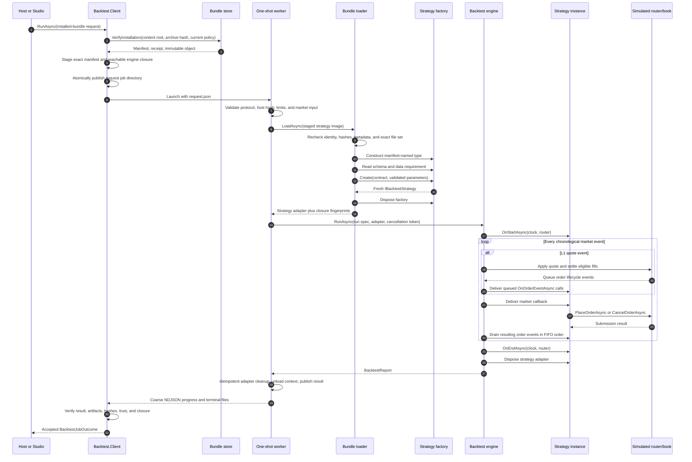

# Strategy-to-backtest engine communication

This guide follows one installed `.daxstrategy` from its build output to a verified backtest result.
It focuses on the Windows protocol-v2 worker path. Built-in kernels use a shorter native path, but both
ultimately run through `TradingTerminal.Backtest.Engine`.

> **Current integration status:** the bundle store, client protocol, worker activation, and execution
> path are implemented, but installed `.daxstrategy` execution is programmatic/test-only today. Backtest
> Studio lists native, legacy-plugin, and Python entries; only supported native entries use its worker
> request path, while other existing entries use their current fallback paths. Studio does not configure
> a bundle store/policy, enumerate activations, or call `CreateInstalledBundle` yet. That discovery and
> trust/parameter UI is the next integration step.

## The whole path

```mermaid
flowchart LR
    subgraph Build[Strategy build]
        Code[Factory plus one strategy implementation]
        Manifest[Canonical manifest<br/>factory type, roles, hashes]
        Bundle[Signed or local<br/>.daxstrategy]
        Code --> Manifest --> Bundle
    end

    subgraph Host[Terminal host]
        Store[Immutable StrategyBundleStore<br/>content plus archive evidence]
        Select[Host or future Studio picker<br/>select version, trust, parameters]
        Client[TradingTerminal.Backtest.Client<br/>verify and stage]
        Job[Atomic job directory<br/>request.json plus engine closure]
        Store --> Select --> Client --> Job
    end

    subgraph Worker[One-shot worker process]
        Validate[Validate request, input,<br/>host hash, manifest, and closure]
        Loader[BundleStrategyLoader]
        LoadContext[Collectible load context]
        Factory[Manifest-named<br/>IStrategyEngineFactory]
        Strategy[IBacktestStrategy]
        Adapter[BacktestStrategyKernelAdapter]
        Engine[BacktestEngine]
        Router[EngineOrderRouter<br/>and simulated order book]
        Portfolio[Portfolio and accounting]
        Result[Hashed result manifest<br/>plus backtest report]

        Validate --> Loader --> LoadContext --> Factory
        Factory -->|Create contract and parameters| Strategy
        Strategy --> Adapter --> Engine
        Engine <-->|orders, fills, order events| Router
        Engine <--> Portfolio
        Engine --> Result
    end

    Feed[Immutable synthetic or<br/>Parquet market input] --> Validate
    Bundle --> Store
    Job --> Validate
    Result -->|verify hashes, identity,<br/>trust, and closure| Client
    Client --> Outcome[Accepted outcome for host UI or API]
```



The important boundary is the job directory. The client does not send market ticks, strategy objects,
or CLR calls across the process boundary. It writes a versioned request and an exact strategy image,
then launches one worker. The worker reads market input directly, emits only coarse progress on stdout,
and publishes files only after the run reaches a terminal state.

## Contracts and ownership

| Layer | Contract | What crosses the seam |
|---|---|---|
| Strategy build | `IStrategyEngineFactory` | Parameter schema, data requirement, and `Create(Contract, StrategyParameters)` |
| Bundle | `StrategyBundleManifest` | Exact factory type, engine/dependency graph, SDK compatibility, roles, lengths, and SHA-256 values |
| Immutable install | `StrategyBundleInstallation` | Content root, archive hash, accepted publisher evidence, manifest, and immutable object paths |
| Host to worker | `BacktestJobRequest` | Run spec, typed activation parameters, input identity, deadlines/limits, trust evidence, and separate host/strategy hashes |
| Worker activation | `BundleStrategyLoader` | A fresh `IBacktestStrategy`, wrapped as an `IStrategyKernel` |
| Strategy runtime | `IBacktestStrategy` and `IOrderRouter` | Ordered market callbacks, order submissions/cancellations, and FIFO order events |
| Worker to host | `BacktestResultManifest` | Terminal status, report descriptor, input/parameter hashes, actual engine hashes, trust evidence, and staged assembly closure |

The factory is the plug-in point comparable to an Expert Advisor entry point in MetaTrader. The manifest
names one exact public, parameterless factory type. The worker never scans assemblies or asks for a
second backtest-specific implementation.

## What a packaged strategy implements

The v1 bundle factory exposes declarative metadata and constructs the strategy that contains the trading
logic:

```csharp
public sealed class ExampleFactory : IStrategyEngineFactory
{
    public StrategyParameterSchema Schema { get; } = new(
        StrategyParameter.Int("lookback", "Lookback", 20, min: 2, max: 500));

    public StrategyDataRequirement DataRequirement => StrategyDataRequirement.L1;

    public IBacktestStrategy Create(Contract contract, StrategyParameters parameters) =>
        new ExampleStrategy(contract, parameters.GetLong("lookback"));
}

public sealed class ExampleStrategy(Contract contract, long lookback) : IBacktestStrategy
{
    public Task OnStartAsync(IClock clock, IOrderRouter router, CancellationToken ct) =>
        Task.CompletedTask;

    public Task OnTickAsync(Tick tick, IClock clock, IOrderRouter router, CancellationToken ct)
    {
        // Update indicators and place or cancel orders only through router.
        return Task.CompletedTask;
    }

    public Task OnOrderEventAsync(OrderEvent evt, CancellationToken ct) =>
        Task.CompletedTask;

    public Task OnEndAsync(IClock clock, IOrderRouter router, CancellationToken ct) =>
        Task.CompletedTask;
}
```

The same parameter schema supplies defaults, validates single runs, and defines future optimizer inputs.
The worker requires the request to provide exactly the schema's keys and kinds. It checks numeric bounds
and allowed choices before calling `Create`. The strategy receives those values at construction, so it
does not parse UI text or worker JSON.

The strategy contract deliberately provides an `IOrderRouter`, not an `IBrokerClient`. Backtests bind
that interface to the simulated engine router. A future live `.daxstrategy` host could bind the same
strategy logic to a live router without changing the signal code; that bundle-loading path is not
implemented today.

## Build, install, and selection

1. The normal .NET compiler produces the headless engine assembly and any private managed dependencies.
   The current authoring template targets `net9.0-windows7.0` and SDK `0.2.0-alpha`; its SDK reference is
   compile-only (`ExcludeAssets="runtime"`). Host contract assemblies such as `DaxAlgo.Sdk` and
   `TradingTerminal.*` must not be copied into the bundle.
2. `daxalgo-bundle pack` writes a canonical manifest that names the factory and hashes every payload.
3. An optional publisher signature endorses the exact canonical content. It proves publisher control of
   the signing key, not that the code is safe or profitable.
4. `StrategyBundleStore.Install` verifies the archive under an explicit local-development or
   verified-publisher policy. It stores content by content-root hash and archive evidence by archive hash.
5. Activation publishes a small pointer from strategy id to an immutable content/archive pair. Resolving
   it always re-evaluates current SDK, host-version, and publisher policy.
6. A host selects one exact installation and builds an installed-bundle job request. Store filesystem
   paths never enter the protocol.

The isolated bundle route does not invoke `IStrategyPlugin`, `IPluginRegistrar`, or legacy `plugin.json`
registration at runtime. Those belong to the separate `.daxplugin` desktop-loading path. The worker
loads only the factory named by `bundle.manifest.json`.

The selected identity is a chain, not just a display id:

```text
publisher id + strategy id + version
    -> canonical content-root SHA-256
    -> exact archive SHA-256 and publisher evidence
    -> exact strategy-engine assembly SHA-256
    -> exact private dependency closure
    -> exact host Backtest.Engine assembly SHA-256
```

Changing any link causes preparation, worker validation, or result acceptance to fail closed.

## One job, step by step



Progress messages contain phases, counts, timestamps, warnings, and heartbeats. Individual market events
and orders do not travel over the control stream. This keeps high-volume simulation inside the worker
and makes the process boundary coarse and deterministic.

## Runtime callback mapping

The canonical engine speaks `IStrategyKernel`. Bundle factory v1 currently creates the older,
single-instrument `IBacktestStrategy`, so `BacktestStrategyKernelAdapter` maps between them:

| Engine action | Packaged strategy callback | Ordering guarantee |
|---|---|---|
| Start run | `OnStartAsync(clock, router, ct)` | Once, before market data |
| L1 quote | `OnTickAsync(tick, clock, router, ct)` | The simulated clock advances first; quote-triggered fills and their order events are visible before the strategy sees the quote |
| Trade print | `OnTradeAsync(trade, clock, router, ct)` | Forwarded when the feed supplies a trade event |
| Depth snapshot | `OnDepthAsync(depth, clock, router, ct)` | Forwarded when the feed supplies a depth event |
| Completed bar | No v1 `IBacktestStrategy` callback | `IStrategyKernel.OnBarAsync` is currently a no-op in the bundle adapter |
| Order transition | `OnOrderEventAsync(evt, ct)` | FIFO; transitions are fully drained before the engine advances to the next market event |
| End run | `OnEndAsync(clock, router, ct)` | Once after the final event; final orders are settled using the last known quote where possible |

When a fill occurs, the engine updates its portfolio before delivering the `OrderEvent`. A native
`IStrategyKernel` can therefore query a consistent `IStrategyContext.Portfolio`. Factory v1 returns
`IBacktestStrategy`, which does not receive that portfolio view, so a packaged v1 strategy tracks its
execution state from ordered `OrderEvent` values. Neither contract mutates engine accounting directly;
all changes originate from orders submitted through the router.

### Current packaged-v1 data limitations

- Installed bundle factories are restricted to single-instrument runs.
- The worker currently accepts only `L1` and `Bars` data-requirement flags.
- Its current synthetic and Parquet job feeds produce L1 quotes only, making quotes the fully connected
  packaged-strategy path.
- Trade/depth adapter methods exist, but installed bundles cannot declare those requirements and the
  one-shot worker has no trade/depth input schema yet.
- A bar can reach `IStrategyKernel`, but factory v1 returns `IBacktestStrategy`, which has no bar callback.
  A packaged strategy must not depend on direct bar delivery until the factory contract returns a kernel
  or the legacy contract gains an explicit bar method.

These are contract limitations, not reasons to write a second strategy. The intended evolution is to
widen the one shared engine contract while keeping the factory/manifest activation model unchanged.

## Order and fill round trip

1. Strategy code creates an `OrderRequest` and calls `IOrderRouter.PlaceOrderAsync`.
2. `EngineOrderRouter` routes it into the run's simulated order book.
3. The book evaluates working orders against L1 quote events and emits `OrderEvent` transitions.
4. On a fill, the engine updates cash, position, fees, liquidity classification, and the trade ledger.
5. The strategy receives the transition through `OnOrderEventAsync` before the next market event.
6. Fill-derived accounting, round-trip trades, equity, drawdown, metrics, attribution, and optional
   visuals become the final `BacktestReport`; it is not a raw fill-event list.

This feedback loop lets signal logic react to submission, fills, cancellation, and position changes
instead of assuming every signal became a trade. `OrderEvent` can represent partial fills and rejection,
but the current worker's L1 touch fill model fills the full remaining quantity and its router has no risk
rejection stage, so those two states are contract capacity rather than current worker behavior.

## Result acceptance

The worker publishes the result manifest last, using an atomic rename, plus a sibling hash of the manifest
itself. Each report artifact has its own relative path, length, and SHA-256. Before returning success, the
client checks:

- protocol, job, engine, SDK, and strategy-contract versions;
- the original request hash and parameter hash;
- input identity and artifact size/hash limits;
- actual host-engine and strategy-engine hashes;
- installed content root and archive hash;
- publisher key id, trusted-SPKI fingerprint, and signature algorithm when publisher-verified;
- the exact manifest-resolved strategy assembly closure.

A worker exit code, stdout message, or report file alone is never treated as a successful backtest.

## Failure boundaries

| Failure point | Host-visible outcome |
|---|---|
| Store policy, installation re-verification, or atomic preparation | The job does not launch; the client returns a specific protocol/start failure |
| Request, input, host hash, bundle identity, closure, schema, or factory activation | Worker publishes `ProtocolError` with a closed error code where possible |
| Strategy market/order callback throws | Worker publishes terminal `Failed`; the process still performs cleanup |
| User cancellation | `Cancelled`; the client terminates the worker process tree if cooperative cancellation does not finish |
| Deadline or host timeout | `TimedOut` |
| Working-set limit | Host returns `ResourceLimitExceeded` after terminating the worker tree |
| Process exits without a valid terminal result | `WorkerCrashed` or `ProtocolError`, depending on the observed evidence |
| Result hash, identity, trust, closure, or artifact check fails | Client rejects the output as `ProtocolError`; no successful report reaches the host |

## Lifecycle and security boundary

The factory is disposed immediately after it creates the strategy. `BacktestEngine` disposes the strategy
adapter in its run cleanup; bundle cleanup then idempotently disposes it again, unloads the collectible
assembly load context, and lets the one-shot process exit. Host-side timeouts, cancellation,
progress/artifact bounds, and a periodic root-process working-set monitor enforce host policy. The
Windows Job Object supplies kill-on-close process-tree cleanup; it is not a hard job-wide memory cap.

This is lifecycle and fault isolation, not an adversarial sandbox. Strategy code still runs with the
user's token and can technically use that account's filesystem, network, and framework permissions. A
publisher signature authenticates content; it does not make code safe. Marketplace execution therefore
remains trusted-publisher-only until a restricted token/AppContainer, VM, or separately constrained
signal-only strategy process is added.

## What strategy code does not communicate with

The supported contract does not give strategy code:

- a WPF window or view model;
- the bundle store or its local paths;
- the worker request/result publisher;
- a broker client or broker credentials;
- mutable portfolio accounting;
- arbitrary assemblies from the desktop terminal.

Optional Windows UI payloads and unrelated bundle resources are not staged into the worker. Only the
canonical manifest and graph-reachable headless engine/private-dependency closure cross into the job.

## Remaining Backtest Studio wiring

The existing Studio worker flow already provides run/cancel, bounded progress, and verified report
rendering. Connecting installed strategies requires the UI composition layer to:

1. configure the current bundle-store root and trust policy;
2. enumerate active immutable installations and display publisher/trust evidence;
3. obtain the factory schema through an isolated discovery call or a future signed manifest field, then
   render editors without instantiating strategy code inside the WPF process;
4. create a `BacktestInstalledBundleReference` and typed activation parameter list;
5. call `BacktestJobRequest.CreateInstalledBundle` with independent host and strategy hashes;
6. keep optimizer, walk-forward, and marketplace trust UX aligned with that same activation contract.

Until that is implemented, the diagrams describe the completed host API and worker route, not a clickable
installed-strategy picker in the current Studio build.

## Source map

- [`IStrategyEngineFactory`](../src/windows/Sdk/DaxAlgo.Sdk/IStrategyEngineFactory.cs)
- [`StrategyBundleManifest`](../src/windows/Sdk/DaxAlgo.Strategy.Bundle/StrategyBundleModels.cs)
- [`StrategyBundleStore`](../src/windows/Sdk/DaxAlgo.Strategy.Bundle/StrategyBundleStore.cs)
- [`BacktestJobRequest` and `BacktestResultManifest`](../src/windows/Backtest/TradingTerminal.Backtest.Protocol/BacktestJobContracts.cs)
- [`BacktestJobClient`](../src/windows/Backtest/TradingTerminal.Backtest.Client/BacktestJobClient.cs)
- [`WorkerApplication`](../src/windows/Backtest/TradingTerminal.Backtest.Worker/WorkerApplication.cs)
- [`BundleStrategyLoader`](../src/windows/Backtest/TradingTerminal.Backtest.Worker/BundleStrategyLoader.cs)
- [`BacktestStrategyKernelAdapter`](../src/windows/Backtest/TradingTerminal.Backtest.Engine/Kernels/BacktestStrategyKernelAdapter.cs)
- [`BacktestEngine`](../src/windows/Backtest/TradingTerminal.Backtest.Engine/BacktestEngine.cs)
- [`IStrategyKernel`](../src/windows/Core/TradingTerminal.Core/Backtesting/IStrategyKernel.cs)
- [`IOrderRouter`](../src/windows/Core/TradingTerminal.Core/Trading/IOrderRouter.cs)
- [`SampleStrategyEngineFactory`](../samples/DaxAlgo.SamplePlugin/SamplePlugin.cs)

See [backtesting.md](backtesting.md) for engine usage and metrics, and
[strategy-bundles.md](strategy-bundles.md) for packaging, signing, installation, and trust policy.
