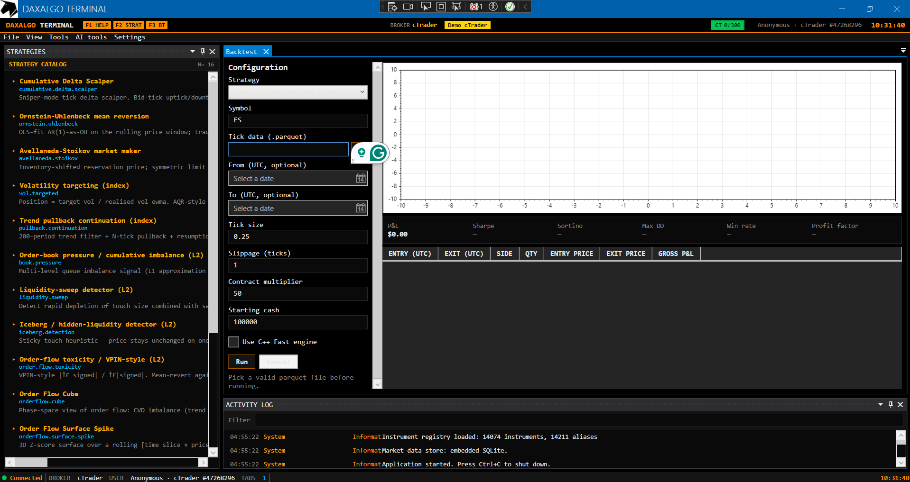
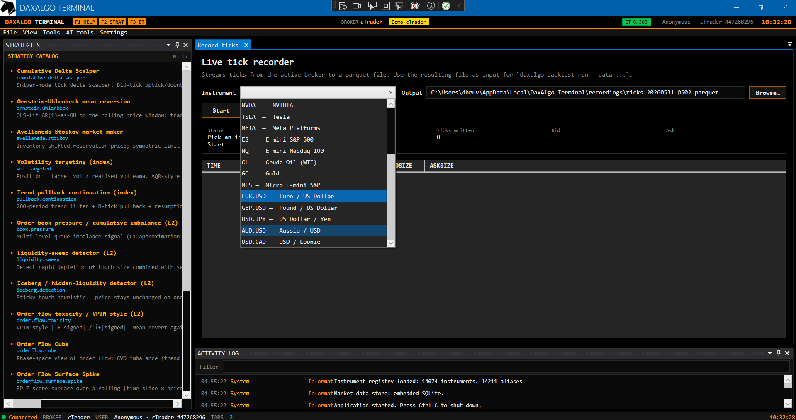
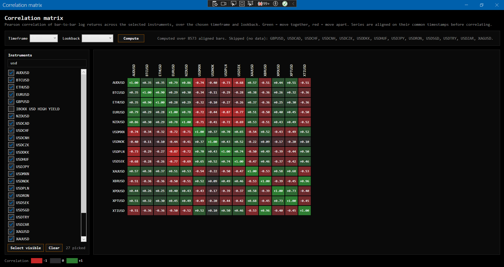

# User guide

> Last updated: 2026-06-13

A daily-use walkthrough for **using** the terminal. For installation and the first launch, see [getting-started.md](getting-started.md). For per-broker setup, see [brokers.md](brokers.md). For each feature in depth, follow the cross-links.

## Screenshots

| Backtest | Tick recorder | Correlation matrix |
|---|---|---|
|  |  |  |

## Launching

```powershell
dotnet run --project src/TradingTerminal.App
```

You see the **login window** with broker tiles: Interactive Brokers, NinjaTrader, cTrader, Alpaca, Ironbeam, London Strategic Edge, and the keyless Binance feed. Connect one or more — sessions are concurrent, and each instrument routes its data path (history, ticks, depth, tape, connection state) through the broker it belongs to.

Tick **Auto Connect** (bottom of the login window) to have every broker form fire its Connect with saved credentials as soon as the window opens. The flag persists across sessions, and each broker connects independently — one dead broker never blocks the rest.

After **Sign in**, the main shell opens. The status bar at the bottom shows connection state, your user/account, active broker, and tab count. If the login fails, watch the **Logs** pane — every broker error is logged there with enough detail to act on (IB error codes, cTrader `ProtoOAErrorRes`, NT `rc != 0` reasons).

## The main shell

```
+--------------------------------------------------------------+
| DAXALGO TERMINAL · F-keys · BROKER · MODE · USER · clock     |
| File View Tools Charts Machine-learning AI Data Settings     |
+----------------+---------------------------------------------+
|  STRATEGY      |  Document pane                              |
|  CATALOG       |   (each opened strategy or tool is a tab    |
|  - APEX        |    or window here)                          |
|  - CumDelta    |                                             |
|  - Toxicity    |                                             |
|  - ...         |                                             |
|                +---------------------------------------------+
|                |  LOGS                                       |
+----------------+---------------------------------------------+
| ●Connected  BROKER cTrader  USER dhruv  TABS 2  12:34:56 UTC |
+--------------------------------------------------------------+
```

- **Top header strip** — terminal wordmark, function-key tiles, active broker name + connection-mode badge (the broker's mode, e.g. *Interactive Brokers* / *Paper Alpaca* / *Simulated (synthetic)* — green when any connected broker is live, amber otherwise), signed-in user, UTC clock.
- **Strategies pane (left, full window height)** — list of every registered strategy. Double-click to open.
- **Document area (centre)** — tabs for tools (Backtest, Recorder, Factor Research, Market Regime, Notifications) and inline strategy panes. Strategies usually open as their own **floating window**, not as a tab.
- **Logs pane (bottom right)** — in-memory Serilog sink. Live tail of everything happening; turn on if a strategy isn't behaving.
- **Status bar (bottom)** — connection-state dot (green = connected), broker, signed-in user, open-tab count, UTC clock.
- **View menu** toggles the strategies pane and the logs pane on/off if you want a cleaner workspace.

## Running a strategy live (signal mode)

Every strategy opens as a separate window. The pattern is identical for all:

1. **Double-click** the strategy in the left pane. A `MetroWindow` opens with the strategy's title in its title bar.
2. **Pick an instrument** from the dropdown. The shared catalog (`SignalInstrumentCatalog` in `TradingTerminal.UI`) covers common ETFs, big-name US stocks, continuous futures, and spot FX. To trade something not on the list, edit the catalog (see [Customisations](#customisations)).
3. **Edit the parameters** in the "Parameters" panel. Each strategy exposes the knobs from its underlying logic (period, threshold, lookback, etc.) as text fields. Defaults are sensible but not optimised for any particular instrument.
4. **Hit Start.** The window subscribes to the live tick stream for the chosen contract via the active broker. The stats bar starts updating. Whenever the strategy would submit an order, a row appears in the **signal log grid** AND a `StrategyNotification` is published.
5. **Hit Stop** to flatten the strategy's internal state and stop receiving ticks. **Clear log** clears the in-window grid (notifications already sent stay sent).

**No order ever leaves the terminal.** Every strategy runs in "signal mode" — the underlying engine produces orders that the host's synthetic router intercepts and surfaces as notifications. Execution is delegated to whatever app you actually trade from (Bookmap, your broker's own platform, a custom OMS).

Closing the window resets the strategy's state. Re-opening it gives you a fresh instance. If you want to keep state across sessions, leave the window open.

For the full strategy catalog and the recipe to add a new strategy, see [strategies.md](strategies.md).

## Notifications

Every signal fired by any strategy goes through a single notification pipeline. **Tools → Settings → Notifications** opens the configuration tab with blocks for **Telegram**, **Discord**, **Ollama** (local LLM commentary), and **AI Market Analyst**.

- For Telegram and Discord setup steps and the Ollama enricher, see [notifications.md](notifications.md).
- For the AI Market Analyst, see [ai-analyst.md](ai-analyst.md).

## Market regime panel

**Tools → Market regime** opens a dockable panel with the current **risk-on / risk-off composite** (0–100 gauge, five bands). The score blends ten weighted sub-signals (volatility, positioning, trend, breadth, momentum, credit, liquidity, macro, sentiment, cross-asset) from Yahoo Finance, FRED, CNN Fear & Greed, and AAII sentiment.

Optional behaviour:

- Fire a `RegimeChange` notification when the band crosses.
- Gate outbound `Signal` notifications when the composite is risk-off (the signal still appears in the strategy's own window).

See [market-regime.md](market-regime.md) for setup, sources, and the gate mechanism.

Three more regime tools live under **Tools**: **Instrument regime** (per-instrument analyzer), **Markov regime** (transition-matrix model over historical bars), and **Advanced market regime** — a multi-timeframe dashboard with 18 indicator rows (RSI, MACD, CCI, MA stack, VWAP, SuperTrend, ATR, POC, delta/cum-delta, a composite Trend needle, …) across 8 toggleable timeframe columns from 1m to 1D. See [market-regime.md](market-regime.md#advanced-market-regime-dashboard).

## Charts & order-flow windows

The **Charts** menu hosts the market-microstructure visualizations. Each opens as its own window against any connected broker. Full per-window reference — inputs, parameters, read-outs, data requirements — in [charts.md](charts.md). In short:

- **Charts** — TradingView-style candlestick charting (WebView2-hosted).
- **Order book** — live L2 depth ladder for brokers that serve depth.
- **Volume footprint** — bid/ask cluster chart (see below).
- **Bookmap + VolBook** — one combined live microstructure window: L2 liquidity heatmap, trade dots (with large-lot/iceberg flags), session volume profile + VWAP + value area, a CVD panel, the live DOM, and pause/scrub playback with price zoom.

### Volume footprint

A bid/ask cluster chart built from the live trade tape (brokers without a native tape get a synthetic L1-derived fallback, flagged in the status line). Pick instrument, bar interval (15s–5m), tick size, and visible bar count. Each column shows per-price buy/sell volume cells, the total POC (yellow outline), and buy/sell POC connector lines; the floating stats panel tracks POC slopes, cumulative delta, ticks/sec, and the buy/sell split.

Two analytics layers sit on top:

- **Regression fits** — seven toggleable fit curves through each POC series (total / buy / sell): linear, quadratic, cubic, Theil–Sen (robust), exponential, logarithmic, and LOWESS. Checkboxes in the toolbar; each kind has its own dash pattern, colored by series.
- **Virtual predictor** — extrapolates every enabled fit *N* bars past the last column and draws the per-series **consensus** (mean of the selected fits) as ghost candles in a shaded forecast region: body spans the predicted buy↔sell POC, a dashed orange tick marks the predicted total POC, and the predicted price prints in the footer. Toggle with **Predicted candles**, set the horizon with **Bars ahead** (1–30). It is curve extrapolation, not a forecast model — robust fits (linear / Theil–Sen / LOWESS) extrapolate sanely; cubic and exponential can run away over long horizons by design.

## Machine Learning tools

The **Machine learning** menu hosts three offline time-series statistics windows that fit over historical bars from the store — no live subscription:

- **Stationarity & differencing** — ADF + KPSS verdict cards, ACF with white-noise band, rolling-moment bands, and a transform recommendation (none / log / diff / log-returns / fractional differencing).
- **ARIMA & GARCH** — AIC order search, price forecast with a 95% band, GARCH(1,1) conditional volatility vs the long-run level.
- **Kalman filter** — local level / local linear trend / dynamic regression (time-varying pairs hedge β with spread z-score), with a Q/R responsiveness knob and innovation-whiteness diagnostics.

See [machine-learning.md](machine-learning.md) for each window in depth and the `Core/Quant/TimeSeries` math reference.

## Local market-data store

Every tick / quote / bar / trade the terminal sees from any broker is written to a local store, so strategies can warm up on history and you can replay later. Two backends — SQLite (default, zero-config) or PostgreSQL + TimescaleDB (via the repo-root `docker-compose.yml`).

If you set `Provider: Postgres` but the database isn't reachable at startup, the app falls back to SQLite automatically — logged at warning level. Nothing else changes; the in-memory live hub keeps working either way.

See [market-data.md](market-data.md) for the pipeline architecture and the optional Telegram archive offloader.

## Backtesting

The terminal ships a tick-level backtest engine that runs strategies against historical parquet files.

1. **Generate or obtain tick data.** The simplest path is the CLI's `synth` subcommand for a mean-reverting random walk. For real data, use the **Live tick recorder** below.
2. **Open Tools → Backtest.** Pick a strategy from the dropdown, set the symbol, point the **Data** path at your parquet file. Configure tick size, slippage, contract multiplier, starting cash.
3. **Hit Run.** The engine replays every tick through the strategy and the simulated order book. The equity curve plots live; trades and stats populate as fills come in.
4. After the run, the results dir (`./bt-results/` by default) contains `summary.json`, `trades.csv`, `equity.csv`, `fills.csv`.

For the full CLI cheat sheet and engine internals, see [backtesting.md](backtesting.md).

## Recording live ticks

Build a proprietary tick archive on your account that you can replay through the backtest engine later.

1. **Tools → Record live ticks.**
2. Pick an instrument.
3. Click **Browse** to pick an output `.parquet` path (default lives in `%LOCALAPPDATA%\DaxAlgo Terminal\recordings\`).
4. Hit **Start.** The tab streams the live tick feed from the active broker into the parquet writer. The grid shows the most recent 30 ticks; the stats row shows elapsed time, total ticks written, current bid/ask.
5. **Stop** flushes the writer and closes the file. The resulting parquet is directly usable as `--data` for `daxalgo-backtest run` or the Backtest tab.

L1 only today — depth recording (cTrader's L2) needs a separate columnar format and isn't wired yet. Tickers like ES (CME), spot FX through cTrader, stocks through IB all work.

## Factor research

Inspect microstructure features and gauge their predictive shape — the day-to-day quant researcher loop.

1. **Tools → Factor research.**
2. **Browse** for a parquet tick file (synth or recorded).
3. Set **BarTicks** (ticks per aggregated bar), **VolWindow** (rolling vol estimator window in bars), **ForwardBars** (decile-sort horizon).
4. **Compute.** The tab populates:
   - **Pairwise correlation matrix** between standard features (`LogReturn`, `RollingVol`, `MicropriceDev`, `QueueImbalance`, `Spread`). Look for redundant features (|ρ| > 0.7) you should drop.
   - **Decile sort** of the selected feature against forward N-bar returns. A monotone shape = predictive; flat = no edge at this horizon. Change the **Feature** dropdown or **ForwardBars** to re-run instantly.

## AI Market Analyst

A multi-agent LangGraph analyst that runs an indicator → pattern → trend → decision flow and returns a structured verdict (Long / Short / NoCall) with annotated charts. Requires a Python sidecar and an API key for OpenAI / Anthropic / Qwen / MiniMax.

**AI tools → Market analyst** opens the pane. Type a symbol, pick a timeframe and bar count, hit **Analyze**.

For setup, per-notification enrichment, and graceful-degradation behaviour, see [ai-analyst.md](ai-analyst.md).

## Customisations

### Add an instrument to the catalog

The shared signal-strategy instrument list lives at `src/TradingTerminal.UI/TradeableInstrument.cs` (class `SignalInstrumentCatalog`). Add a row to `All` following the existing pattern; instruments appear in every strategy's and tool's picker on next launch (all windows share the one catalog via the global `InstrumentPicker` control).

### Tune a strategy's parameters

Each per-strategy project's `<Name>StrategyViewModel.cs` declares parameters as `[ObservableProperty]`s with defaults from the engine implementation's constructor. Edit the defaults in the VM, or — more commonly — change them at runtime in the strategy window's Parameters panel before hitting Start.

### Add a new strategy, broker, or notifier

See [contributing.md](contributing.md) for the recipes and layering rules.

## CLI cheat sheet

The backtest engine is also a headless CLI for scripting, cron, or CI. Build it once:

```powershell
dotnet build src\TradingTerminal.Backtest.Cli
```

Then call `daxalgo-backtest.exe <command>`. Full subcommand list and a worked end-to-end pipeline in [backtesting.md](backtesting.md#cli-subcommand-reference).

## Troubleshooting

For symptom → fix tables across every subsystem, see [troubleshooting.md](troubleshooting.md). The most common pitfalls:

- TWS isn't running, or its socket port doesn't match `appsettings.json`. Default TWS Paper is 7497.
- NT 8 isn't running, or **Tools → Options → AT Interface → AT Interface enabled** isn't ticked.
- cTrader access token has expired (~30 days). Re-run the OAuth refresh.
- Alpaca key was minted for a different environment (paper key against live, or vice versa). Re-check the live toggle.
- Postgres set as the store provider but Docker isn't running. The app falls back to SQLite — check the Logs pane.
